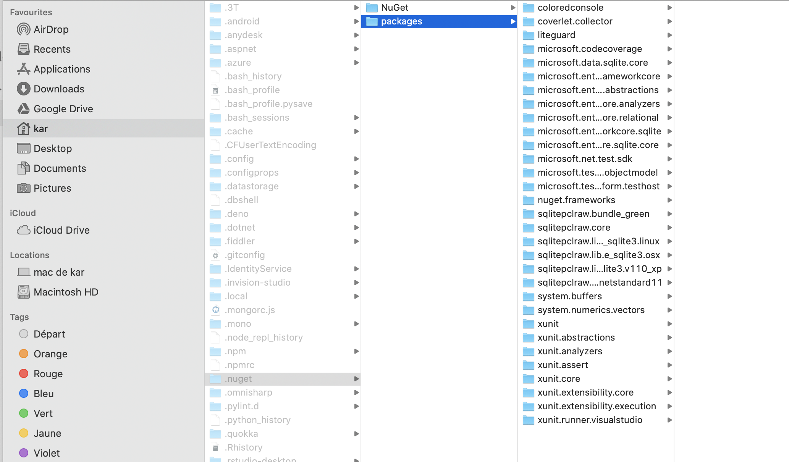

# CC Les NuGet

Il sont installés dans `~/.nuget/packages`:

La référence est stockée dans le fichier `.csproj`.

Dans notre projet les `assembly` (`dll`) sont copiées dans le dossier `bin/Debug/netcoreapp3.1`.

Si notre projet ne trouve pas l'`assembly` dans `bin/Debug/netcoreapp3.1` il va la chercher dans `.nuget/packages`

## `dotnet restore`

En se basant sur le fichier `.csproj`, `dotnet restore` va télécharger l'`assembly` dans le dossier `~/.nuget/packages`.

## `dotnet build`

Va copier les fichiers `assembly` renseignés dans le fichier `.csproj` dans le dossier `bin/Debug/netcoreapp3.1`.
