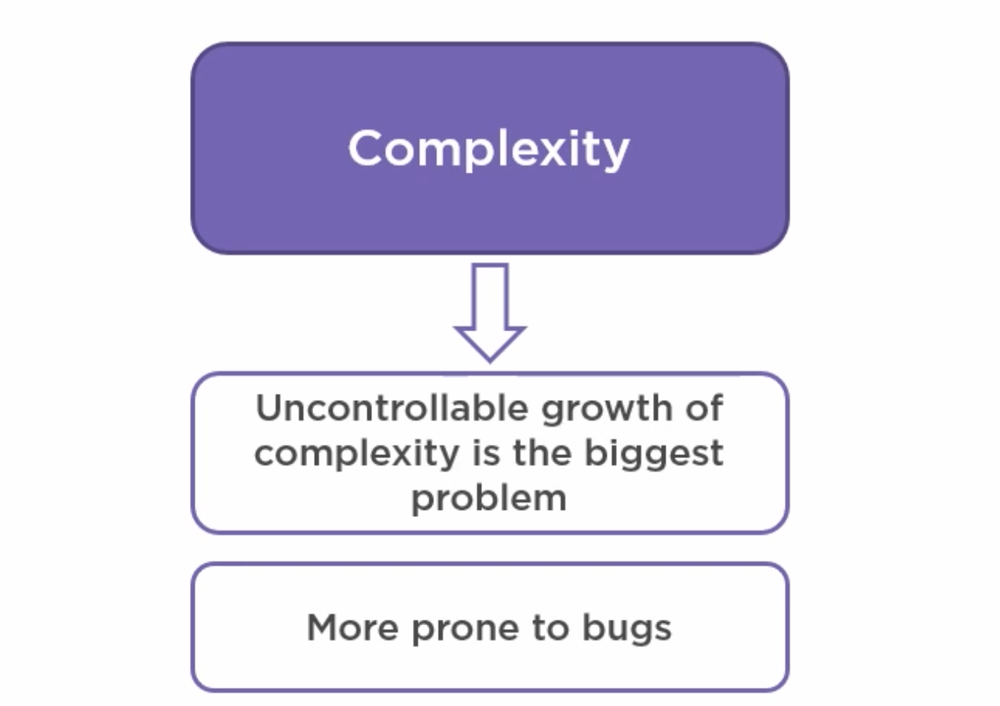
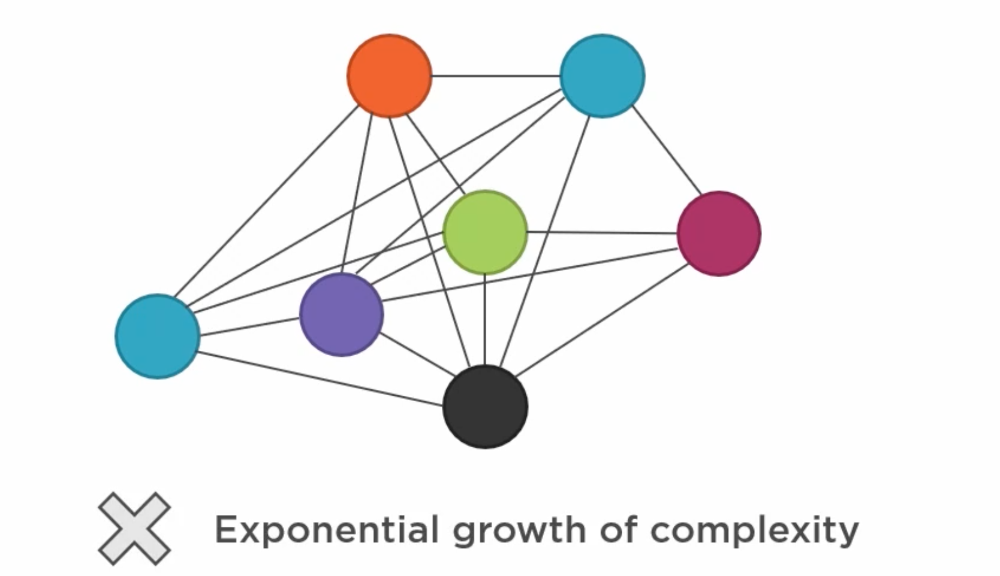
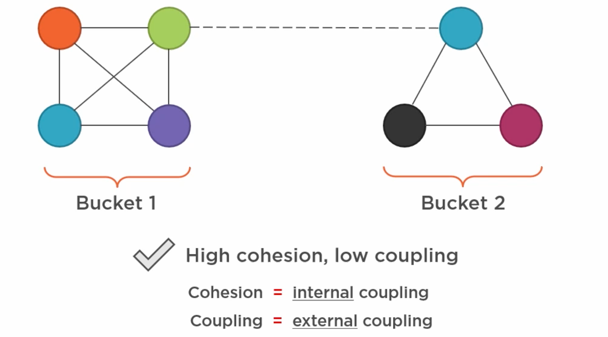
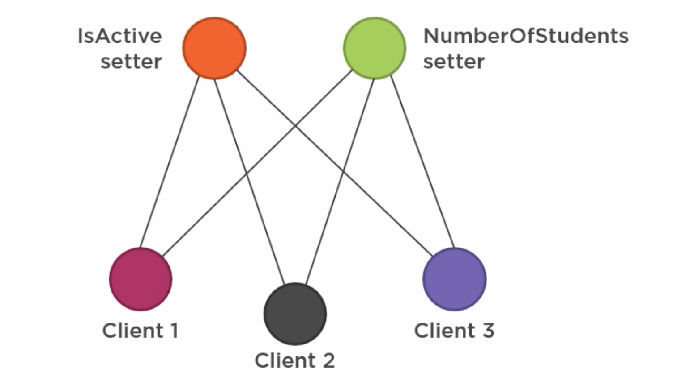
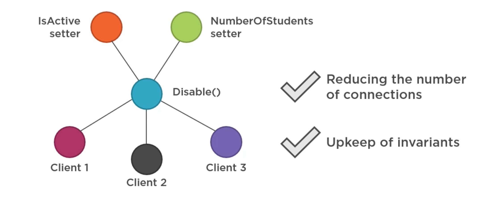

# 01 `DDD` et `EF Core` : Vladimir Khorikov

## Deux concepts

- `Encapsulation`
- `Separation Of Concerns`


## `Encapsulation`

C'est un acte qui permet de protéger l'intégrité des données.

- caché l'implémentation => éviter d'exposer les détails aux utilisateurs de la classe
- Lier les données et les opérations => exécuter les contrôles de validité avant de modifier les données.


## `Separation Of Concerns`

C'est la même chose que `Single Responsability` mais à l'échelle de l'architecture et non pas d'une classe.

On essaye de géré la monté en complexité.


## Complexité



La croissance en complexité génère aussi plus de `bugs`.

### La complexité émerge du couplage entre les éléments

Plus il y a d'élément et plus il y a de liens entre ces éléments, plus l'application grossit en complexité.



La croissance de la complexité est alors exponentiel.

### Réduire le couplage



On garde de la cohésion entre certain éléments dans un même groupe (`bucket`), mais on découple les groupes logiques entre eux.

Il est alors plus simple de réfléchir sur un petit groupe autonome que sur l'application entière.


## `Separation Of Concerns` exemple

```cs
pyblic class Course
{
    [Column("Is_active", TypeName="char(1)")]
    public bool IsActive { get; set; }
    
    [Column("Student_enrolled", TypeName="int")]
    public int NumberOfStudents { get; set; }
}
```

- Viol le principe de `Separations Of Concerns` (séparation des responsabilités/préoccupations)
- La modélisation du `Domain` et le mapping de l'`ORM` sont dans la même classe.

Ne jamais utiliser les `mapping attributes`.

### Utiliser `fluent mapping` à la place :

```cs
// DbContext
protected override void OnModelCreating(ModelBuilder modelBuilder)
{
    modelBuilder.Entity<Course>(x => {
        x.Property(p => p.IsActive)
            .HasColumnName("Is_active");
        x.Property(p => p.NumberOfStudents)
            .HasColumnName("Student_enrolled");
    });
}
```

`override` : redéfinition de la méthode (≠ `overload` : surcharge (nouvelle signature)).

`DTO` sert de conteneur aux données envoyées par une source externe à son application.


## `Encapsulation` exemple

```cs
public class Course
{
    public bool IsActive { get; set; }
    public int NumberOfStudents { get; set; }
}
```

Cette classe n'est pas assez encapsulée. On peut très bien mettre `IsActive` à `false` et `NumberOfStudents` à `25` par exemple, ce qui n'a pas de sens.

On doit créer une version mieux **encapsulée** :

```cs
public class Course
{
    public bool IsActive { get; private set; }
    public int NumberOfStudents { get; private set; }
    
    public void Disable()
    {
        IsActive = false;
        NumberOfStudents = 0;
    }
}
```

On réduit l'`api` accessible d'une classe et on encapsule ainsi sa logique métier.

La cohérence des données est ainsi garantie.

Cela simplifie les interactions :



Ici chaque client doit interagir avec chaque propriétés.



En refactorant, on réduit le nombre de connexions et on évite aussi l'incohérence de données.

