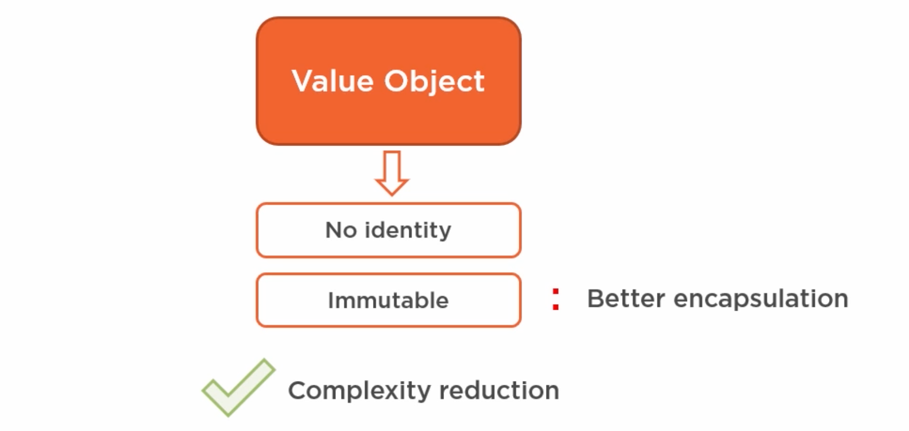
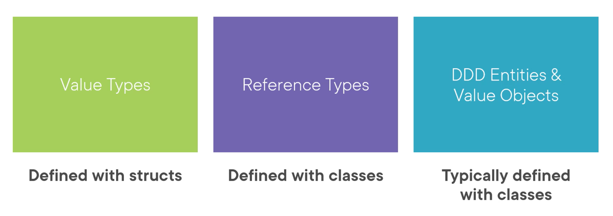
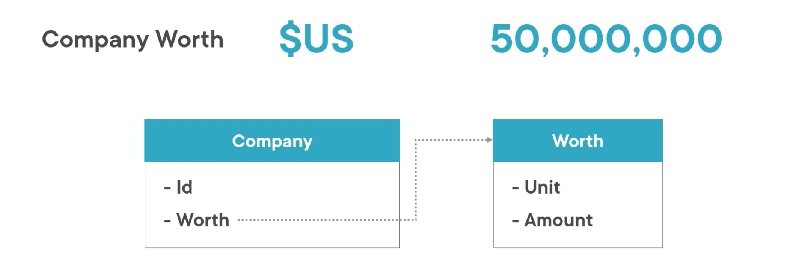

# 2 Value Object



Les `Value Object` n'ont pas d'identité (`id`) et son immuable.

On peut les comparer aux `int`, un `5` et interchangeable avec un autre `5`, il n'a pas d'identité propre.

En comparaison un `John Smith` n'est pas forcement le même qu'un autre `John Smith`, même s'ils avait le même âge.

## `Value Object` et persistence

De préférence un `Value Object` se retrouve dans la même table que l'entité qui le contient.

On ne crée pas une table pour un enregistrer un `5`, de même pour un `Value Object`.

## Les caractéristiques d'un `Value Object`

- Mesure, quantifie ou décrit quelque chose dans le `Domain`
- On peut l'identifier en composant ses valeurs
- immuable
- La comparaison se fait par valeur
- Il n'a pas d'effet de bord



la monnaie est un bon candidat.

Les `string` sont une forme de `Value Object`.



Si la valeur monétaire était diviser en deux champs, on pourrait changer la devise indépendamment du montant et perdre l'intégrité des données.

Les `Dates` ou `Range Date` sont aussi de bons candidat.


## `ClientId Value Object`

Souvent l'`Id` d'une `entity` est un `int` ou un `guid`. Il est alors possible de substituer un `ClientId` avec un `PatientId` par exemple.

On peut donc ajouter du sens et de l'intégrité en créant un `ClientId` qui est un `Value Object` :

```cs
public class ClientId // Value Object
{
    public readonly Guid Id;
    
    public ClientId()
    {
        Id = Guid.NewGuid();
    }
    
    public ClientId(Guid id)
    {
        Id = id;
    }
}
```

Imaginons une méthode dans un `service` :

```cs
public class SomeService
{
    public void CreateAppointmentFor(ClientId clientId, PatientId patientId)
    {
        // ...
    }
}
```

Cela permet ici de ne pas intervertir les `id` par mégarde.

Ajouter des `Value Object` permet d'éviter des problèmes métier compliqués de manière élégante et simple.


## `TimeRange` exemple

```cs
public class DateTimeRange : ValueObject
{
    public DateTime Start { get; private set; }
    public DateTime End { get; private set; }
    
    // Ardalis.GuardClauses
    public DateTimeRange(DateTime start, DateTime end)
    {
        // check if start < end or not
        Guard.Against.OutOfRange(start, nameof(start), start, end);
        Start = start;
        End = end;
    }
    
    public DateTimeRange(DateTime start, TimeSpan duration)
    {
        
    }
}
```

