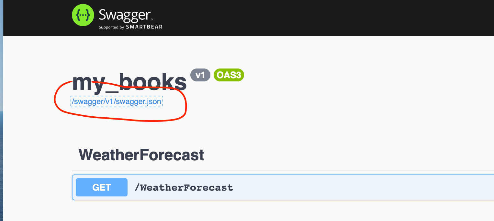

# 01 Getting Started


## Création d'un nouveau projet

nom du projet `my-books`.

Nom de la solution `my-books`.

```bash
dotnet new webapi -n my-books
```


## Création du fichier de solution

```bash
dotnet new sln -n my-books
```

Ajouter le projet à la solution

```bash
dotnet sln add my-books
```

Dans `my-books.sln`

```bash
# ...
Project("{FAE04EC0-301F-11D3-BF4B-00C04F79EFBC}") = "my-books", "my-books\my-books.csproj", "{F9223842-28C7-42C9-8B60-5C5BA0E2B2CE}"
EndProject
# ...
```

### Ouvrir dans `VSCode` :

```bash
cd my-books && code -r .
```


## `appsettings.json`

Va contenir les configurations de l'application :

- le `connection string` pour la `BDD`
- Les `API Key`
- Etc


## `Startup.cs`

Configure les services (enregistre les services) et défini le `pipeline` de la requête `HTTP`.


## Lancement du projet

```bash
dotnet run -p my-books
```


## `Swagger`

On a un lien vers le schéma `openapi` en json :



```json
{
    "openapi": "3.0.1",
    "info": {
        "title": "my_books",
        "version": "v1"
    },
    "paths": {
        "/WeatherForecast": {
            "get": {
                "tags": [
                    "WeatherForecast"
                ],
     // ...
```

