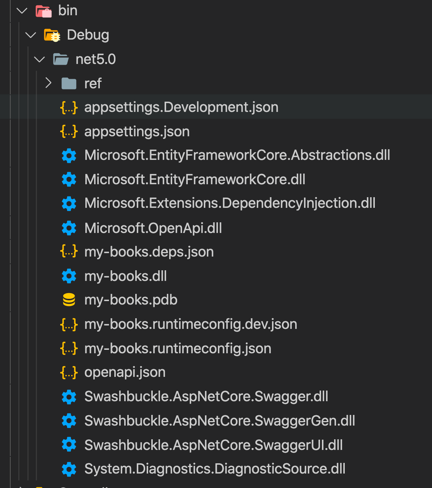
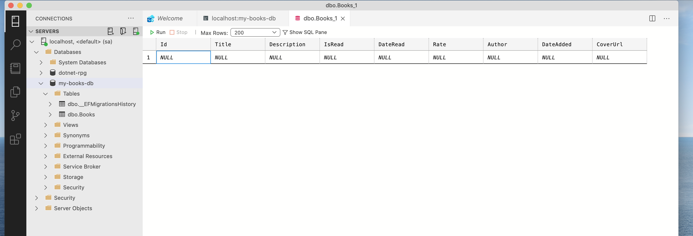

# 03 `EF Core`

## `Data Context`

La classe `Data Context` est la classe la plsu imporatnte d'`entity framework`.

Elle crée le pont entre les classes d'entité de l'application et les tables `SQL` de la base de données.


## Ajout `Entity Framework Core`

```bash
dotnet add package Microsoft.EntityFrameworkCore --version 5.0.5
```

 Ajouter le `package` au projet `my-book`.

On peut retrouver la trace de toutes nos dépendances dans le dossier `bin` :




## Création du `Context`

Dans le dossier `Data`, on va créer la classe `AppDbContext`:

```cs
namespace my_books.Data
{
    public class AppDbContext : DbContext
    {
      public AppDbContext(DbContextOptions<AppDbContext> options) : base(options)
      {
        
      }
      
      public DbSet<Book> Books { get; set; }
        
    }
}
```

Le constructeur passe les `options` au constructeur de `base`.

`DbSet` représente la table `SQL` en base de données.


## Ajout du `Connection String` dans `appsettings.json`

```json
{
  // ...
  
  "AllowedHosts": "*",
  "ConnectionStrings": {
    "DefaultConnectionString": "fake-db-connection"
  }
}
```

On mettra plus tard un vrai `connection string`.

`"ConnectionStrings"` est le nom **obligé** pour pouvoir après appeler la méthode `GetConnectionString`.

`"DefaultConnectionString"` est le nom qu'on donne à son `Connection String`.


## récupérer le `Connection String` dans `Startup.cs`

```cs
public class Startup
{
  public string ConnectionString { get; set; }
  public Startup(IConfiguration configuration)
  {
    Configuration = configuration;
    ConnectionString = Configuration.GetConnectionString("DefaultConnectionString");
  }
```

#### `Configuration.GetConnectionString("NameConnectionString")`

### Injection du service

Maintenant dans la méthode `ConfigureServices` on va ajouter notre `context` comme service.

On peut faire ça grâce à la méthode `services.AddDbContext<Type>`.

Ici le `<Type>` est `<AppDbContext>` défini précédemment.

```cs
public void ConfigureServices(IServiceCollection services)
{

  services.AddControllers();
  services.AddDbContext<AppDbContext>(options => options.UseSqlServer(ConnectionString));
```

`SQL Server` n'est pour l'instant pas disponible, il faut ajouter un package :

```bash
dotnet add package Microsoft.EntityFrameworkCore.SqlServer --version 5.0.5
```


## `EF Core Migration`

Fournis une manière de mettre à jour de manière incrémentale le schéma de la base de données de façon synchrone avec le modèle de données de l'application tout en préservant les données déjà dans la base de données.


### `Microsoft.EntityFrameworkCore.Tools`

Tester si déjà installé :

```bash
dotnet ef

                     _/\__       
               ---==/    \\      
         ___  ___   |.    \|\    
        | __|| __|  |  )   \\\   
        | _| | _|   \_/ |  //|\\ 
        |___||_|       /   \\\/\\

Entity Framework Core .NET Command-line Tools 5.0.5
```

> Sinon voire note `BB` du dossier `dotnet-cli`

### Ajouter le package `Microsoft.EntityFrameworkCore.Design`

Il faut aussi ajouter (cette fois au projet) ce `package` :

```bash
Install-Package Microsoft.EntityFrameworkCore.Design -Version 5.0.5
```


## `Connection String`

On va créer une base de données `my-books-db` :

```json
"Server=localhost,1433; Database=my-books-db; User=sa; Password=huk@r2Xmen99"
```

`user` : `sa`

`pwd` : `huk@r2Xmen99`

Dans `appsettings.json`

```json
"ConnectionStrings": {
  "DefaultConnectionString": "Server=localhost,1433; Database=my-books-db; User=sa; Password=huk@r2Xmen99"
}
```


## Ajouter une `Migration`

```bash
dotnet ef migrations add InitialDatabaseMigration
```

Un dossier `Migrations` est créé avec dedans la migration, un fichier dit `Designer` (?) et un fichier `AppDbContextModelSnapshot.cs` qui sert à calculer la différence entre la base de données et le modèle pour les prochain `update` de la `bdd`.


## Mettre à jour la `BDD`

```bash
dotnet ef database update
```



