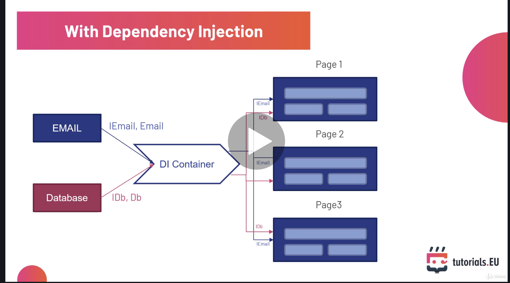
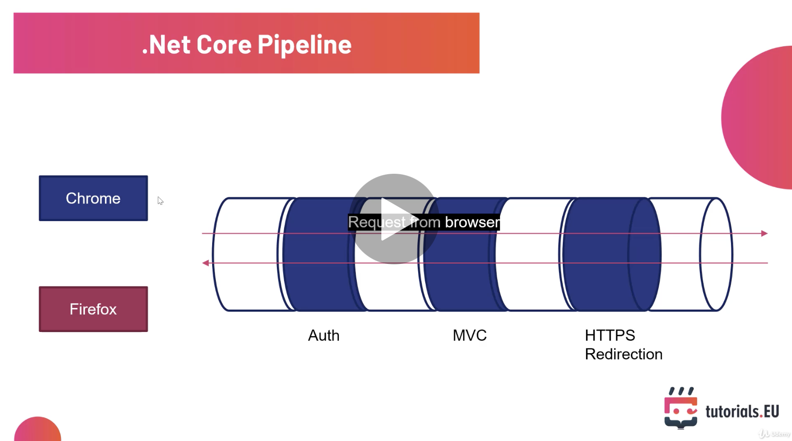
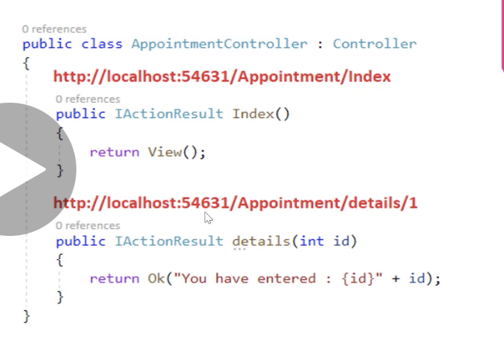
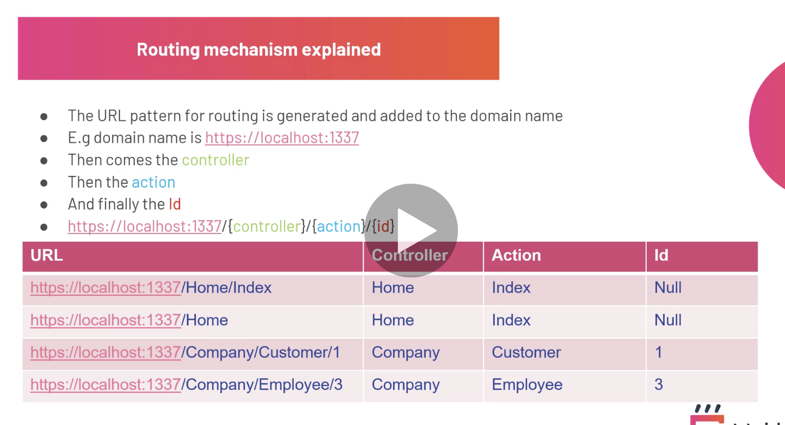
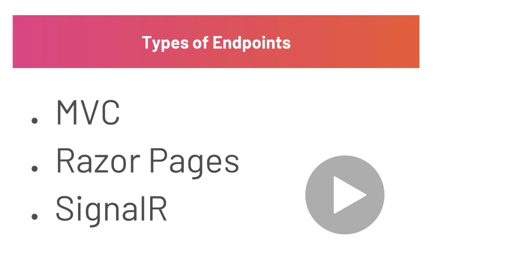
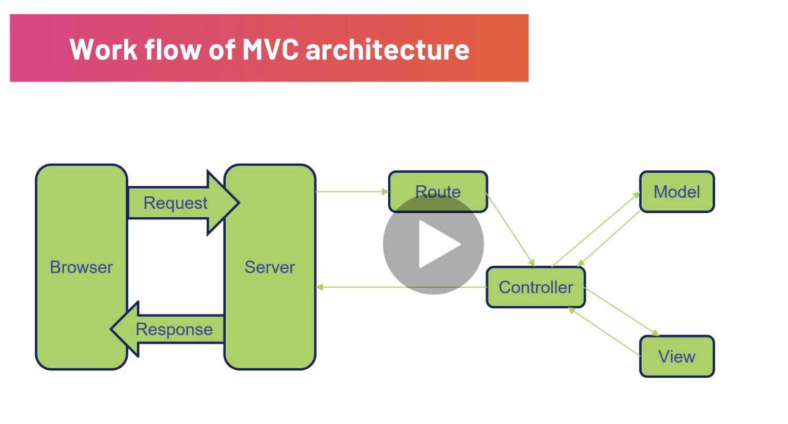
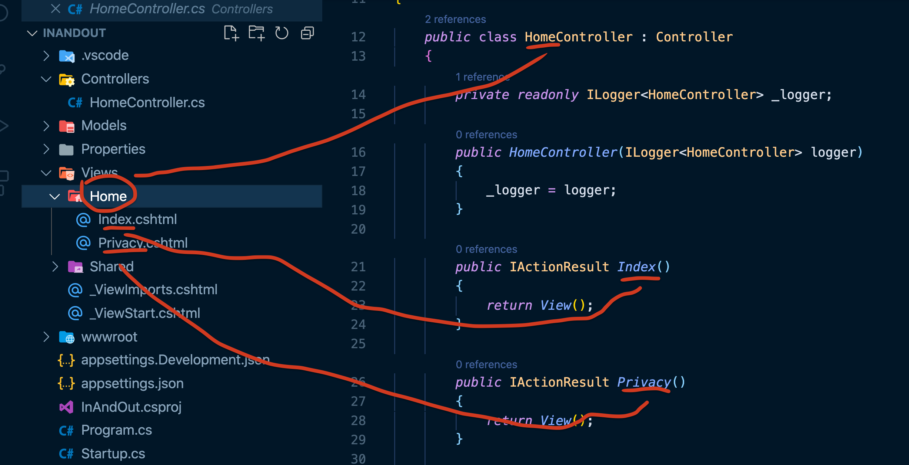
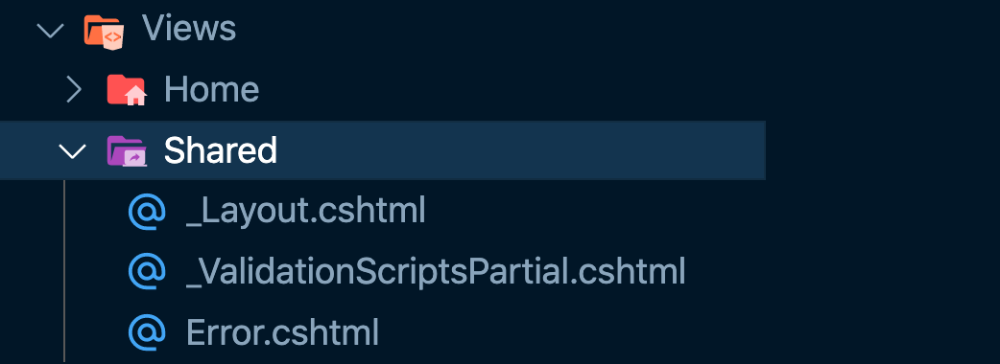

# 02 Revue de la structure du projet


## `Program.cs`

C'est une application `console` qui va créer une application `web` par défaut en utilisant le fichier `Startup.cs`.


## `Startup.cs`

C'est une classe avec deux méthodes `ConfigureServices` et `Configure`.

### `ConfigureServices`

`ConfigureServices` est appelée par le `runtime` avant `Configure`.

`ConfigureServices` est le conteneur d'injection de dépendances.



```cs
public void ConfigureServices(IServiceCollection services)
{
  services.AddControllersWithViews();
}
```

Le premier `service` qu'on y ajoute est `Controller With View`.

`ConfigureServices` est le `DI Container` du schéma.


### `Configure`

```cs
public void Configure(IApplicationBuilder app, IWebHostEnvironment env)
{
  if (env.IsDevelopment())
  {
    app.UseDeveloperExceptionPage();
  }
  else
  {
    app.UseExceptionHandler("/Home/Error");
    // The default HSTS value is 30 days. You may want to change this for production scenarios, see https://aka.ms/aspnetcore-hsts.
    app.UseHsts();
  }
  app.UseHttpsRedirection();
  app.UseStaticFiles();

  app.UseRouting();

  app.UseAuthorization();

  app.UseEndpoints(endpoints =>
                   {
                     endpoints.MapControllerRoute(
                       name: "default",
                       pattern: "{controller=Home}/{action=Index}/{id?}");
                   });
}
```

`Configure` va gérer deux chose : 

- l'`app` pour ajouter des `middlewares` au pipeline de l'application.
- l'`env` pour définir des comportement suivant que l'on soit en `dev` ou en `prod`.

Le `pipeline` est construit de `middleware` qui vont chacun utiliser puis passer la requête (ou la réponse) au prochain `middleware`.



Au bout de la chaîne il y a le `EndPoint`.


## `Routing`

Le `routing` associe une `URL` avec un `controller` et une `action`.



On a donc le contrôleur `Appointment` et les actions `Index` et `Details`.



On défini la route par défaut dans `Configure` :

```cs
app.UseEndpoints(endpoints =>
                 {
                   endpoints.MapControllerRoute(
                     name: "default",
                     pattern: "{controller=Home}/{action=Index}/{id?}");
                 });
```

Si le contrôleur n'est pas renseigné, on utilise `Home`.

Si l'action n'est pas renseignée, on utilise `Index`.

`id` est optionnel.

Il y a différents types de `Endpoint` :




## `appsettings.json`

C'est dans ce fichier que l'on met les données nécessaires à l'application, par exemple le `connection string`.


## `Properties/launchSettings.json`

C'ezst ici que sont définis les `profiles`.


## `wwwroot`

C'est ici que sont stockés les fichiers statiques.

Ce dossier est disponnible grâce à ce `middleware` :

```cs
// Startup.cs

app.UseStaticFiles();
```


## `MVC` Pattern




## `View -Controller`

On a dans notre dossier `Controllers` le `HomeController.cs`.

Dans le dossier `Views` un dossier portant le nom du contrôleur `Home` contient les différentes vues associées aux différentes actios du contrôleur.



On retrouve la même structure dans les `URL` :

```bash
https://localhost:5001/Home/Privacy
```

```
https://localhost:5001/Controller_Name/Action_Name
```


## `Views/Shared`



C'est ici qu'on va trouver les fichiers de vue utilisés à travers toute l'application.

le `_` signifie que c'est un `partial template`, une partie d'un `template`.


### `_Layout.cshtml`

```html
<!DOCTYPE html>
<html lang="en">
<head>
    <meta charset="utf-8" />
    <meta name="viewport" content="width=device-width, initial-scale=1.0" />
    <title>@ViewData["Title"] - InAndOut</title>
    <link rel="stylesheet" href="~/lib/bootstrap/dist/css/bootstrap.min.css" />
    <link rel="stylesheet" href="~/css/site.css" />
</head>
<body>
    <header><!-- ... --></header>
    <div class="container">
        <main role="main" class="pb-3">
            @RenderBody()
        </main>
    </div>

    <footer class="border-top footer text-muted"><!-- ... --></footer>
    <script src="~/lib/jquery/dist/jquery.min.js"></script>
    <script src="~/lib/bootstrap/dist/js/bootstrap.bundle.min.js"></script>
    <script src="~/js/site.js" asp-append-version="true"></script>
    @await RenderSectionAsync("Scripts", required: false)
</body>
</html>
```

C'est le squelette où sera rendu les `pages` grace à `@RenderBody()`.

### `_ViewImports.cs`

Gère et centralize les imports des `Razor Pages`.

```cs
@using InAndOut
@using InAndOut.Models
@addTagHelper *, Microsoft.AspNetCore.Mvc.TagHelpers
```

Les `TagHelpers` permettent d'utiliser des `bindings ` de type :

```html
<a class="navbar-brand" asp-area="" asp-controller="Home" asp-action="Index">InAndOut</a>
```

`asp-area`, `asp-controller` et `asp-action`.

