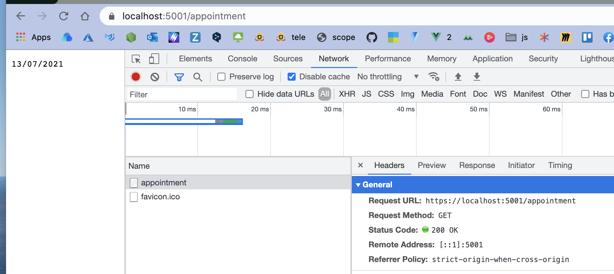
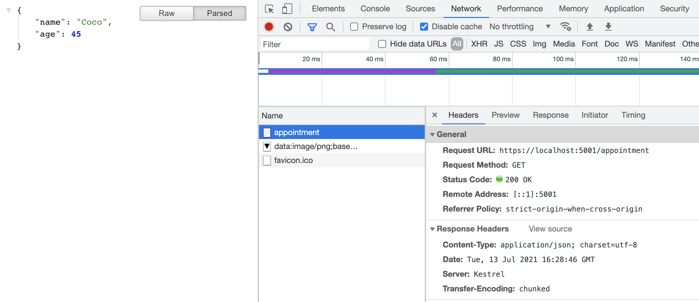
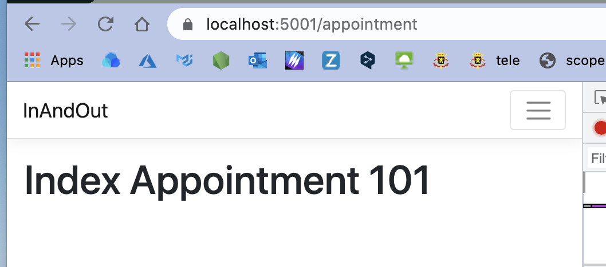
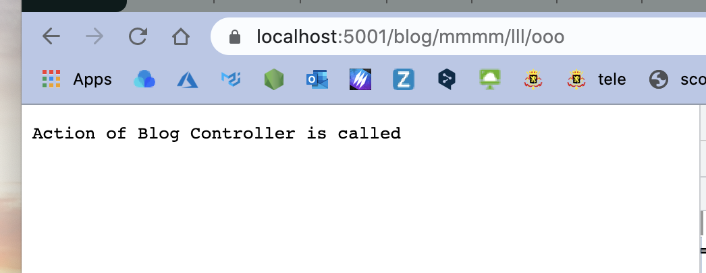
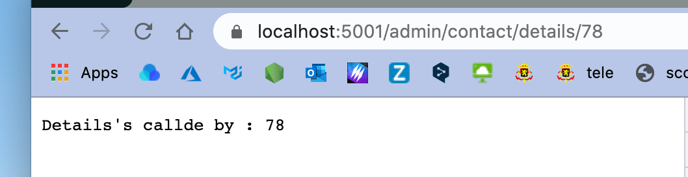
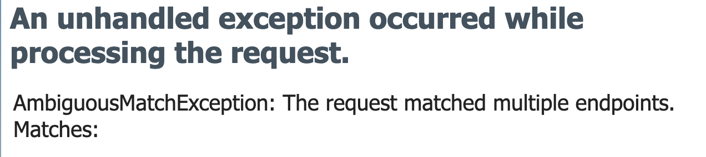
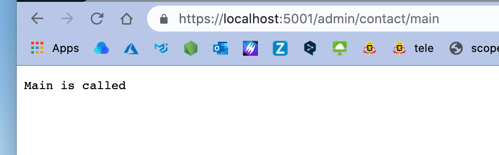

# 03 Contrôleur et routage

## créer un contrôleur `AppointmentController`

```cs
using System;
using Microsoft.AspNetCore.Mvc;

namespace InAndOut.Controllers
{
    public class AppointmentController : Controller
    {
        public IActionResult Index()
        {
            string todayDate = DateTime.Now.ToShortDateString();
            return Ok(todayDate);
        }
    }
}
```



Ici cela renvoie du `text/plain`, mais il est tout aussi facile de renvoyer du `json` :

```cs
public IActionResult Index()
        {
            var responseJSON = new { Name = "Coco", Age = 45 };
            return Ok(responseJSON);
        }
```



Ici on voit que le `Content-Type` est `application/json`.


## Créer une `View` pour un `Controller`

On créer un dossier du nom du contrôleur : `Views/Appointment`.

Dans ce dossier on créer une vue du nom de l'action : `Index.cshtml`.

L'extension des vues est `cshtml`.

```cs
// Views/Appointment/Index.cshtml
@{
  ViewData["title"] = "Index";
}

<h1>Index Appointment 101</h1>
```



Pour rappel l'`action` par défaut est défini dans `Startup.cs` par `app.UseEndpoints` est c'est `Index` :

```cs
app.UseEndpoints(endpoints =>
                 {
                   endpoints.MapControllerRoute(
                     name: "default",
                     pattern: "{controller=Home}/{action=Index}/{id?}");
                 });
```

`localhost:5001/appointment` == `localhost:5001/appointment/index`.


## `Routing`

Le routage est le processus par lequel l'application associe l'`URL` de la requête avec le `Controller` et l'`Action` qui lui sont associés.

### `https://localhost:5001/appointment/index`

```cs
public class AppointmentController : Controller
{
  // https://localhost:5001/appointment/index
  public IActionResult Index()
  {
    return View();
  }
}
```
### `https://localhost:5001/appointment/details/1`

Avec paramètre : ` id`

```cs
public class AppointmentController : Controller
{
  // https://localhost:5001/appointment/details/1
  public IActionResult Details(int id)
  {
    return Ok($"You have enterred {id}");
  }
}
```


## Types de `Routing`

On peut définir le `routing` de deux manières :

- Par convention
- Grâce aux `Attribute` de `routing`

On peut bien sûr utiliser les deux manières ensemble.


## Le `routing` par convention

La première partie de l'`URL` est relié au nom du `contrôleur` : `{controller=Home}`.

La deuxième partie est le nom de l'`Action` : `{action=Index}`.

La troisième partie est un paramètre `{id?}`, le `?` rend optionnel le paramètre.


### Un `routing` par convention dédicacé

Dans `Startup.cs`

```cs
app.UseEndpoints(endpoints => {
  endpoints.MapControllerRoute(
  	name: "blog",
    pattern: "blog/{*article}",
    defaults: new { controller = "Blog", action = "Article" }
  );
  
  endpoints.MapControllerRoute(
  	name: "default",
    pattern: "{controller=Home}/{action=Index}/{id?}"
  );
});
```

Ce `endpoint` correspond avec les `urls` suivante

`blog/`

`blog/article`

`blog/article/everythingyouwantafter`

mais aussi :

`blog/l/m/n/o/p` par exemple.



On crée le contrôleur associé :

```cs
using Microsoft.AspNetCore.Mvc;

namespace InAndOut.Controllers
{
    public class BlogController : Controller
    {
        public IActionResult Article()
        {
            return Ok("Action of Blog Controller is called");
        }
    }
}
```


## `Attribute Based Routing`

Le routage basé sur les `attribute`.

Le routage est réalisé en ajoutant un `attribute` au niveau du `controller` ou de l'`action`.

C'est une alternative au `convention-based routing`.

Les routes sont évaluées dans l'ordre où elles apparaissent dans le code.

```cs
public class BlogController : Controller
{
  [Route("Blog")]
  [Route("Blog/Index")]
  [Route("Blog/Index/{id?}")]
  public IActionResult AnyActionName(int id)
  {
    return Ok($"Action of Blog Controller is called : {id}");
  }  
}
```


### `Attribute` au niveau du `controller`

```cs
[Route("Admin/[controller]")]
public class ContactController : Controller
{
  [Route("Main")]
  public IActionResult Index()
  {
    return Ok("Action index called");
  }
  
  [Route("Details/{id?}")]
  public IActionResult SomeActionName(int id)
  {
    return Ok($"Details is called : {id}");
  }
}
```




## Problème en mélangeant `Attribute Routing` et `Conventional Routing`

On peut avoir des problèmes si on mélange un `controller` avec un `attribute routing` et des `actions` régit par `conventional routing`, voilà ce que dit la documentation :

> https://docs.microsoft.com/en-us/aspnet/core/mvc/controllers/routing?view=aspnetcore-5.0#routing-mixed-ref-label
> Les `actions` sont soit `conventional routing`, soit `attribute routing`. Le fait de placer une route sur le `contrôleur` ou bien sur l'`action` le rend `attribute routing`. Les `actions` qui définissent des routes par `attribute` ne peuvent pas être atteintes par les `routes conventionnelles` et vice-versa. Tout `attribute` de route sur le contrôleur rend toutes les `actions` du contrôleur `attribute routing`.

En clair le code suivant :

```cs
[Route("Admin/[controller]")]
public class ContactController : Controller
{
  public IActionResult Index()
  {
    return Ok("Main is called");
  }

  public IActionResult Toto(int id)
  {
    return Ok($"Details's called by : {id}");
  }
}
```

Génère cette erreur :



### Correction du problème

```cs
[Route("Admin/[controller]")]
public class ContactController : Controller
{
  [Route("Main")]
  public IActionResult Index()
  {
    return Ok("Main is called");
  }

  [Route("toto/{id?}")]
  public IActionResult Toto(int id)
  {
    return Ok($"Details's called by : {id}");
  }
}
```



### ! ne pas mélanger `conventional routing` et `attribute routing` dans le même `controller`.


