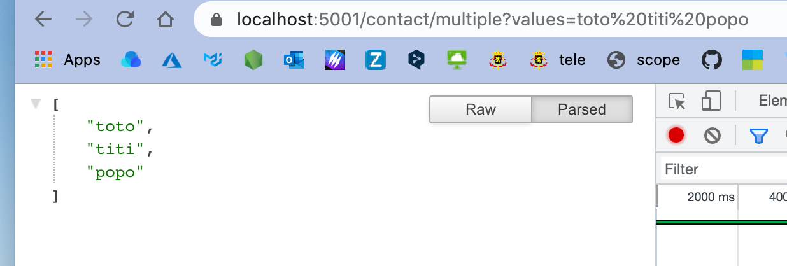
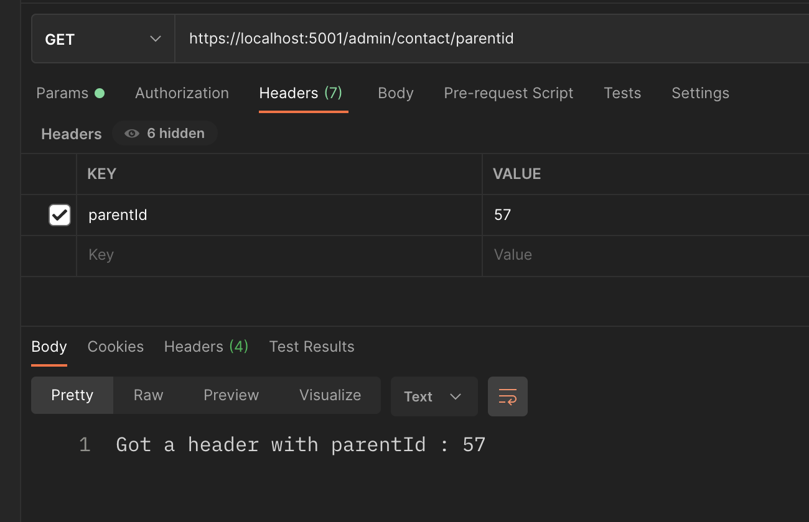
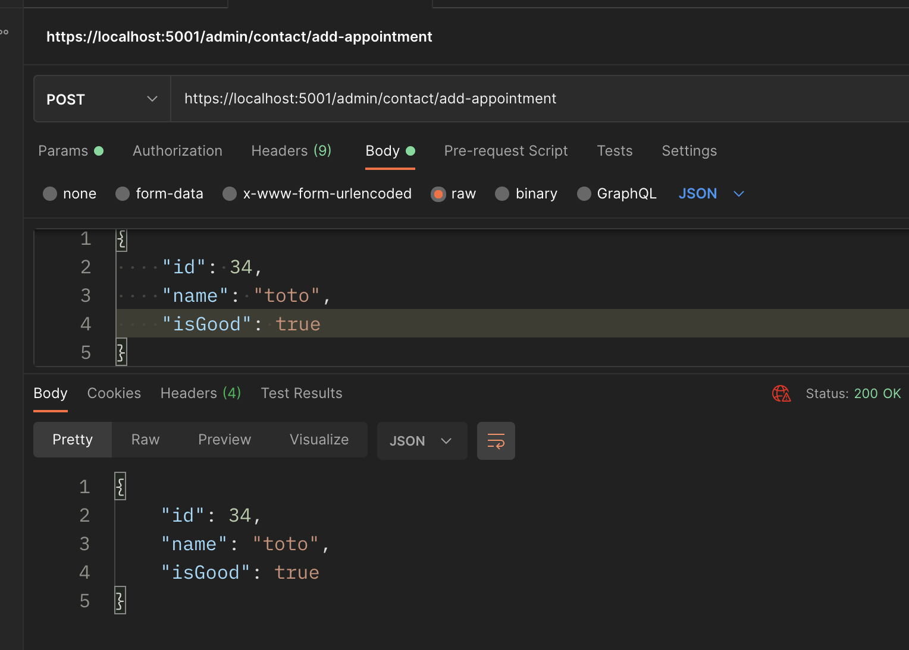
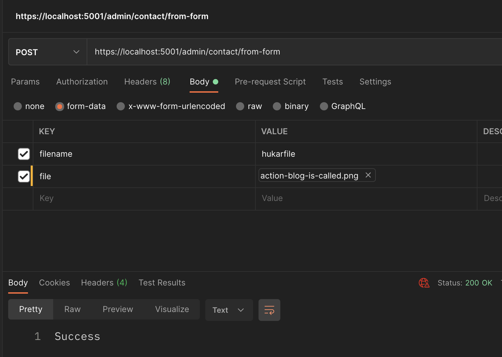
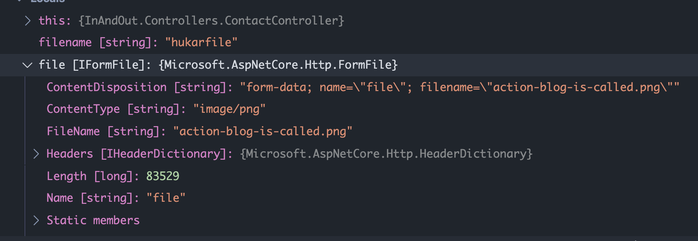

# 04 Les `actions` de `controller`

Les `actions` de `controller` sont des méthodes utilisées pour récupérer les requêtes `HTTP` , la traiter et retourner une `view` ou un autre résultat (`text`, `json`).

- N'importe quelle méthode du contrôleur est une `action`.
- `Action Result` est le résultat d'une `action ` ou son type de retour.
- Une `Action Method` ne peut pas être overloadée dans le `Controller`.
- Une `Action Method` ne peut pas être `static`.


## `Action Result`

`IActionResult` défini un contrat représentant le résultat d'une `Action Method`.

`IActionResult` et `ActionResult` s'utilisent comme des conteneur des résultats de l'`action`.

`IActionResult` est une interface, `ActionResult` est une classe abstraite de laquelle différent `action result` héritent.

### Il y a `5` sortes majeures de `Action Results` :

- les résultats de `Status Code`
- `Status Code` avec `Object Result`
- `Redirect Result`
- `File Result`
- `Content Result`


## Passer un paramètre à une `Action`

Différentes manières de passer un paramètre :

- Comme partie de l'`URL`
- Avec les `Query String`
- Avec le `Header` de la requête
- Avec le `Body` de la requête
- Dans un formulaire : `Form`


### Par convention

Si la `route` contient un paramètre, par convention l'`action` va le recevoir dans ses paramètres :

```cs
[Route("{id}")]
[HttpGet]
public IActionResult Get(int id)
{
  return Ok($"You enterring id : {id}");
}
```

### En utilisant explicitement l'attribut `[FromRoute]`

Ce n'est en fait pas nécessaire,  car c'est le comportement par défaut.

```cs
[HttpGet]
public IActionResult Get([FromRoute] int id)
{
  return Ok($"You have enterred : {id}");
}
```


## Passer les paramètres par `Query String` : `[FromQuery]`

### `/admin/contact/multiple?values=titi%20toto%20popo`

Cette méthode ne nécessite pas de changer le `routing` pour passer des paramètres.

```csharp
public IActionResult Multiple([FromQuery] string values)
{
  string[] tabOfValues = { };
  if (values is not null)
  {
    tabOfValues = values.Split(' ');
  }

  return Ok(tabOfValues);
}
```




## Passer les paramètres par le `Header` : `[FromHeader]`

```cs
public IActionResult PostFromTheParent([FromHeader] int parentId)
{
  return Ok($"Got a header with parentId : {parentId}");
}
```




## Passer les paramètres dans le `Body` de la requête

```cs
[HttpPost("add-appointment")]
public IActionResult AddAppointment([FromBody] Object appointment)
{
  return Ok(appointment);
}
```




## Passer les paramètres par un `formulaire` : `[FromForm]`

```cs
[HttpPost("from-form")]
public IActionResult FromForm([FromForm] string filename, [FromForm] IFormFile file)
{
  Console.WriteLine($"file : {filename}");
  return Ok("success");
}
```



On récupère un objet `file` :




## les `Action Result` expliqués

`.net` a un lot de `Action Result` pour faciliter la création et le formatage des données en réponse.


### Les types de `Result`

- Status Code `result`
- Status Code W/ Object `result`
- Redirect `result`
- File `result`
- Content `result`


### Status Code `Result`

```cs
// 200 Ok
public IActionResult OkResult() => Ok();
```

```cs
// 201 Created
public IActionResult CreatedResult() 
  => Created("http://example.org/myitem", new { name = "newitem" });
```

```cs
// 204 No Content
public IActionResult NoContentResult() => NoContent();
```

```cs
// 400 Bad Request 
public IActionResult BadRequestResult() => BadRequest();
```

```cs
// Unauthorized 401
public IActionResult UnauthorizedResult() => Unauthorized();
```

```cs
// 404 Not Found
public IActionResult NotFoundResult() => NotFound();
```

```cs
// 415 Unsupported Media Type
// Regarde le ontent-Type, le Content-Encoding 
// ou les données entrentantes directement
public IActionResult UnsupportedMediaTypeResult()
  => UnsupportedMediaTypeResult();
```


### Status Code w/ Object `Result`

```cs
public IActionResult OkObjectResult()
{
  var result = new OkObjectResult(
  	new { message = "200 OK", currentDate = DateTime.Now }
  );
  
  return result;
}
```

```cs
public IActionResult CreatedObjectResult()
{
  var result = new CreatedAtActionResult(
  	"createdobjectresult",
    "statuscodeobjects",
    "",
    new { message = "201 Created", currentDate = DateTime.Now }
  );
  
  return result;
}
```

```cs
public IActionResult BadRequestObjectResult()
{
  var result = new BadRequestObjectResult(
  	new { message = "400 Bad Request", currentDate = DateTime.Now }
  );
  
  return result;
}
```

```cs
public IActionResult NotFoundObjectResult()
{
  var result = new NotFoundObjectResult(
  	new { message = "404 Not Found", currentDate = DateTime.Now }
  );
  
  return result;
}
```


### Redirect `Result`

```cs
public IActionResult RedirectResult() => Redirect("https://www.google.com");
```

Redirection Locale :

```cs
public IActionResult LocaleRedirectResult() 
  => LocaleRedirect("/redirects/target");
```

Redirection vers une `action` spécifique :

```cs
public IActionResult RedirectToActionResult() 
  => RedirectToAction("actionName", "controllerName");
```


### File `Result`

```cs
public IActionResult fileResult() 
  => new File("~/downloads/pdf-sample.pdf", "application/pdf");
```
depuis un tableau de `bytes` :

```cs
// Comme un tableau de bytes
public IActionResult FileContentResult()
{
  // récupérer le tableau de bytes du document
  var pdfBytes = System.IO.File.ReadAllBytes("wwwroot/downloads/pdf-sample.pdf");
  
  // FileContentResult a besoin d'un tableau de bytes
  // et renvoie un fichier avec le type spécifié
  return new FileContentResult(pdfBytes, "application/pdf");
  
}
```

Depuis une adresse virtuelle (Définit par l'`host`, `wwwroot` par exemple) :

```cs
public IActionResult VirtualFileresult()
  => new VirtualFileResult("downloads/pdf-sample.pdf", "application/pdf");
```

Depuis une adresse physique (on utilise `_IHostingEnvironment.ContentRootPath`) :

```cs
public IActionResult PhysicalFileResult()
  => new PhysicalFileResult(
  	$"{_IHostingEnvironment.ContentRootPath}/wwwroot/downloads/sample-pdf.pdf", 
  	"application/pdf"
	);
```


### Content `Result`

```cs
public IActionResult Index => View();
```

Une portion de vue :

```cs
public IActionResult PartialViewResult() => PartialView();
```

Du `JSON` :

```cs
public IActionResult JsonResult()
{
  return Json(new {
    message = "This is JSON result.",
    date = DateTime.Now
  });
}
```

Du contenu brut `text` ou `html` :

```cs
public IActionResult ContentResult() => Content("Here's the Content Result.");
```


