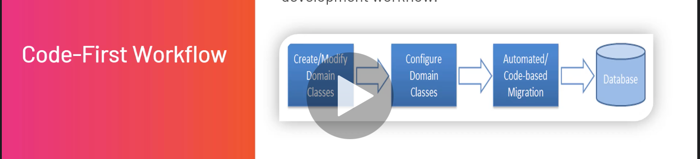
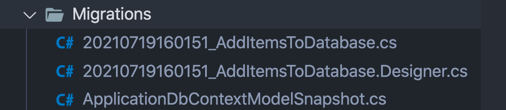
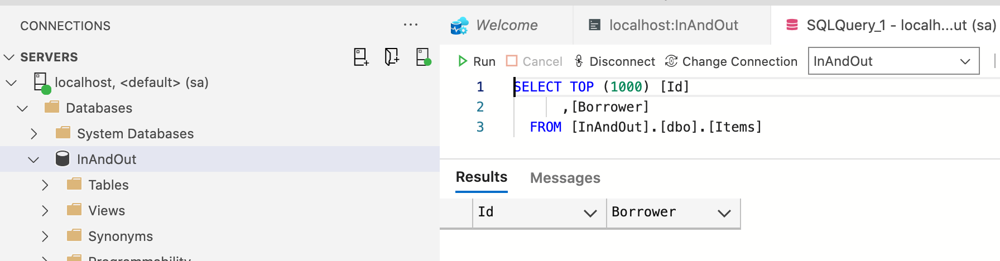
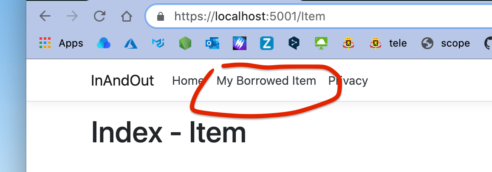

# 05 `Model` et `database`


## Créer son premier `Model`

Le `Model` représente la forme que prennent les données.

### `Item.cs`

```cs
using System.ComponentModel.DataAnnotations; 

namespace InAndOut.Models
{
    public class Item
    {
      // pas obligatoire utilise les annotations :
      	[Key]
      	public int Id { get; set; }
      	public string Borrower { get; set; }
    }
}
```

`borrower` : emprunteur

`lender` : prêteur


## `Code First Approach` et `Migrations`

C'est le code qui induit (créé) la base de données.

Dans cette approche, on commence par écrire nos entités (`domain classes`) et notre `context` avant, puis on crée la `DB` en utilisant la commande de `migration`.

`Code Firts` est utilisé par ceux qui suivent les principes `DDD` (`Domain-Driven Design`).




## `Migration`

- Le modèle change souvent avec les nouvelles demandes.
- La `DB` doit restée synchronisé avec le `modèle`.
- Les `migrations` permettent de synchroniser les changement du `modèle` avec la `DB`.
- Les `migrations` sont disponnibles par défaut avec `EF Core`.

### Commandes `CLI`

| `dotnet ef migrations add <MigrationName>`    | Ajoute une `migration`                                     |
| --------------------------------------------- | ---------------------------------------------------------- |
| `dotnet ef migrations remove`                 | Supprime la dernière `migration`                           |
| `dotnet ef database update`                   | Met à jour la `DB` par rapport à la dernière `migration`   |
| `dotnet ef migrations script [<From>] [<To>]` | Génère un script `sql` depuis une `mugration` à une autre. |


## Ajouter le `Connection String`

On le met dans le fichier `appsettings.json` :

```json
"ConnectionStrings": {
  "HukarConnection": "Server=localhost,1433; Database=InAndOut; User=sa; Password=huk@r2Xmen99"
}
```


## Installer `EF Core`

```bash
dotnet add package Microsoft.EntityFrameworkCore.SqlServer --version 5.0.8
```


On va créer un nouveau dossier `Data` et dedans une classe `ApplicationDbContext` :

```cs
using Microsoft.EntityFrameworkCore;

namespace InAndOut.Data
{
    public class ApplicationDbContext : DbContext
    {
				public ApplicationDbContext(DbContextOptions<ApplicationDbContext> options) : base(options)
        {

        }
      
      public DbSet<Item> Items { get; set; } 
    }
}
```

La seule chose à faire ici est de passer les `options` au constructeur de `base`.

Le `DbSet` est une représentation de la table `Items` en mémoire et en `DB`.


### Injection de `EF Core`

On veut injecter le service de notre `DbContext` dans l'application.

Cela se fait dans `Startup.cs` :

```cs
public void ConfigureServices(IServiceCollection service)
{
  services.AddDbContext<ApplicationDbContext>(options => options.UseSqlServer(
  	Configuration.GetConnectionString("HukarConnection")
  ));
	// ...
```

On retrouve les `options` passées au constructeur de base dans `ApplicationDbContext`.

C'est ici qu'on définit quelle `DB` utiliser et comment se connecter.

`Configuration.GetConnectionStrings` va chercher les infos dans `appsettings.json`.


## Installer les `EF Core Tools` (mettre à jour)

Pour réaliser les migrations on doit installer un package en plus :

```bash
dotnet ef --version
Entity Framework Core .NET Command-line Tools 5.0.7

# mise à jour de l'outil
dotnet tool update --global dotnet-ef
Tool 'dotnet-ef' was successfully updated from version '5.0.7' to version '5.0.8'.
```

Il me faut aussi le package `EfCore.Design` :

```bash
dotnet add package Microsoft.EntityFrameworkCore.Design --version 5.0.8
```


### Création de notre première `migration`

```bash
dotnet ef migrations add AddItemsToDatabase 
```



Maintenant il faut `updater` la `database` :

```bash
dotnet ef database update
```




## Création du `controller` : `ItemController`

```cs
using Microsoft.AspNetCore.Mvc;

namespace InAndOut.Controllers
{
    public class ItemController : Controller
    {
        public IActionResult Index() => View();
    }
}
```


## Création de la vue `Item`

On crée un dossier `Views/Item` et dedans un fichier `Index.cshtml`

```html
@{
	ViewData["Title"] = "Index";
}

<h1>
  Index - Item
</h1>
```


## Créer un lien vers une `action`

dans le fichier `Views/Shared/_Layout.cshtml` on ajoute un lien au menu :

```html
<a class="nav-link text-dark" asp-area="" asp-controller="Item" asp-action="Index">
  My Borrowed Item
</a>
```

On a `asp-controller` pour spécifier le nom du `controller`.

Et `asp-action` pour spécifier le nom de l'`action`.




## Injection de dépendances : `DbContext`

Le receveur de l'objet est appelé `client`, tandis que l'objet injecté est appelé `service`.

On va passer le `service` de `DbContext` à notre `controller` en utilisant l'injection de dépendances.

Premièrement on défini un champ privé et en lecture seul pour recevoir l'instance du service :

```cs
private readonly ApplicationDbContext _db;
```

C'est `.net mvc` qui instancie et injecte les services des `controller`, pour ça le `controller` doit ajouter la dépendances dans sont constructeur :

```cs
public ItemController(ApplicationDbContext db)
{
  _db = db;
}
```

On peut maintenant utiliser le `context` dans les `actions` du `controller` :

```cs
public IActionResult Index()
{
  IEnumerable<Item> objList = _db.Items;
  
  return View(objList);
}
```


