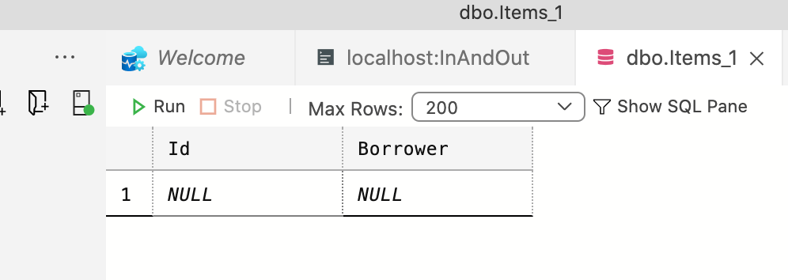
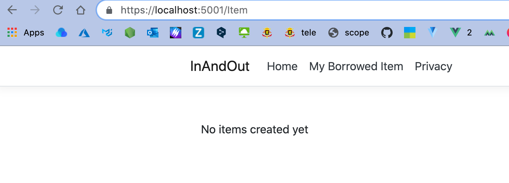
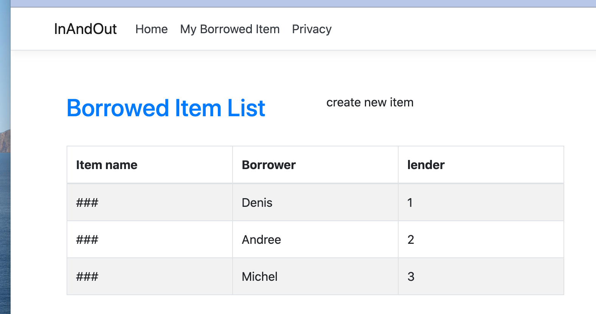

# 06 Afficher les données dans la vue

```html
@{
    ViewData["Title"] = "Index - Item";
}

@model IEnumerable<InAndOut.Models.Item>

<div class="container p-3">

    <div class="row pt-4">
        <div class="col-6">
            <h2 class="text-primary">Borrowed Item List</h2>
        </div>
        <div class="col-6">
						Create new item
        </div>

    </div>
    <br>
    @if (Model.Count() > 0)
    {
        <table class="table table-bordered table-striped" style="width:100%">
            <thead>
                <tr>
                    <th>Item name</th>
                    <th>Borrower</th>
                    <th>lender</th>
                </tr>
            </thead>
            <tbody>
                @foreach (var item in Model)
                {
                    <tr>
                        <td width="30%">###</td>
                        <td width="30%">@item.Borrower</td>
                        <td width="30%">@item.Id</td>
                    </tr>
                }
            </tbody>
        </table>
    }
    else
    {
        <p>No items created yet</p>
    }
</div>
```

Si je n'ai pas encore de données :





Et avec des entrées :




## Ajouter des colonnes dans la `DB`

On modifie le modèle (`Code First`) :

```cs
public class Item
{
  [Key]
  public int Id { get; set; }
  public string Borrower { get; set; }
  public string Lender { get; set; }
  public string ItemName { get; set; }
}
```

On ajoute une `migration`

```bash
dotnet ef migrations add AddLenderAndItemNameColumns
```

On `update` la `DB` :

```bash
dotnet ef database update
```

Cela conserve les anciennes données, mais ajoute des colonnes ayant comme valeur `null`.

On modifie le template pour afficher les bonnes données :

```html
@foreach (var item in Model)
{
<tr>
  <td width="30%">@item.ItemName</td>
  <td width="30%">@item.Borrower</td>
  <td width="30%">@item.Lender</td>
</tr>
}
```

