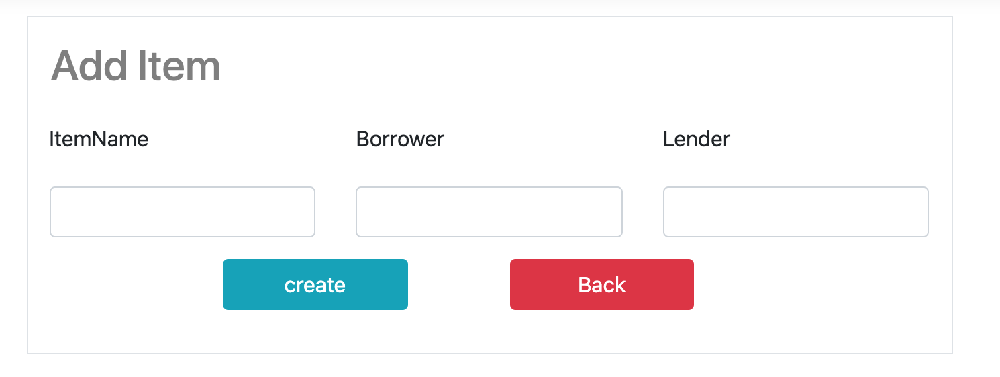
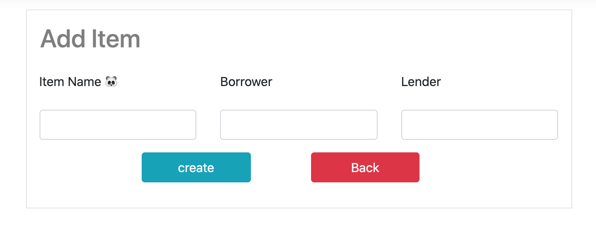

# 07 Créer un formulaire

## Créer un bouton

Comme ce bouton emmène à une autre page, on va utiliser une ancre : `<a>`

```html
<a class="btn btn-primary" asp-controller="Item" asp-action="Create">
  create new item
</a>
```

On va créer une nouvelle `action` dans notre `ItemController` :

```cs
@{
    ViewData["Title"] = "Create Form";
}
@model InAndOut.Models.Item

<form method="post" asp-action="Create">
    <div class="border p-3">
        <div class="form-group row">
            <h2 class="text-black-50 pl-3">Add Item</h2>
        </div>
        <div class="row">
            <div class="col-12">
                <div class="form-group row">
                    <div class="col-4">
                        <label asp-for="ItemName"></label>
                    </div>
                    <div class="col-4">
                        <label asp-for="Borrower"></label>
                    </div>
                    <div class="col-4">
                        <label asp-for="Lender"></label>
                    </div>
                </div>
                <div class="form-group row">
                    <div class="col-4">
                        <input asp-for="ItemName" class="form-control" />
                    </div>
                    <div class="col-4">
                        <input asp-for="Borrower" class="form-control" />
                    </div>
                    <div class="col-4">
                        <input asp-for="Lender" class="form-control" />
                    </div>
                </div>
                <div class="form-group row">
                    <div class="col-8 offset-2 row">
                        <div class="col">
                            <input type="submit" class="btn btn-info w-75" value="create" />
                        </div>
                        <div class="col">
                            <a asp-action="Index" class="btn btn-danger w-75">Back</a>
                        </div>
                    </div>
                </div>

            </div>
        </div>
    </div>
</form>
```

`@model InAndOut.Models.Item` va créer un objet `Model` dans la vue ayant comme type `Item`.

On utilise `<label asp-for="ItemName"></label>` pour afficher le nom des propriétés de l'objet `Item`.



Le problème c'est qu'on préférerait un affichage plus `user friendly` de type `Item Name` séparé.

On peut utiliser les anotations dans le `Model` pour cela :

```cs
// Models/Item.cs
[DisplayName("Item Name 🐼")]
public string ItemName { get; set; }
```



Pour les `input` on utilise aussi `asp-for` :

```html
<input asp-for="ItemName" class="form-control" />
```

Le bouton `Create` est un `input` de type `submit`, tandis que le bouton `back` est un lien vers la `Index page` du même `controller`.

Si `asp-controller` n'est pas spécifié, comme ici, alors c'est une `action` du même `controller`.


## Créer une entrée

On a une action `Create` pour une requête `GET`, on veut maintenant une action `Create` pour la méthode `POST` du formulaire.

```cs
// Post-Create
[HttpPost]
[ValidateAntiForgeryToken]
public IActionResult Create(Item obj)
{
  _db.Items.Add(obj);
  _db.SaveChanges();
  
  return RedirectToAction("Index");
}
```

`[ValidateAntiForgeryToken]` permet d'empêcher les requête de personne non logguées.

Forgery : falsification

### `RedirectToAction`


## Exercice

### Type `decimal`

Type suggéré pour gérer les montants d'argent.

```cs
[Column(TypeName = "decimal(18,2)")]
public decimal amont { get; set; }
```

L'annotation permet d'éviter une erreur de `migration` et permet de mapper `decimal` avec un type disponnible en `DB`.


