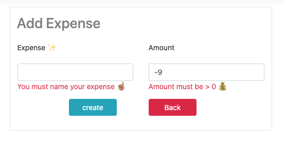
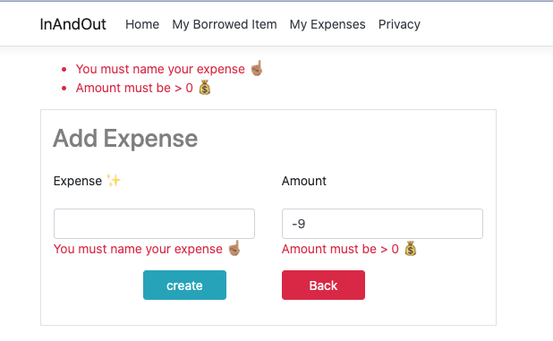
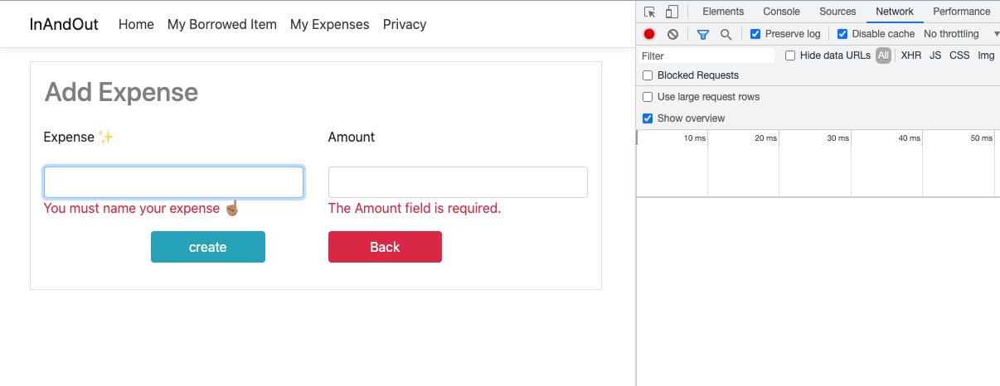
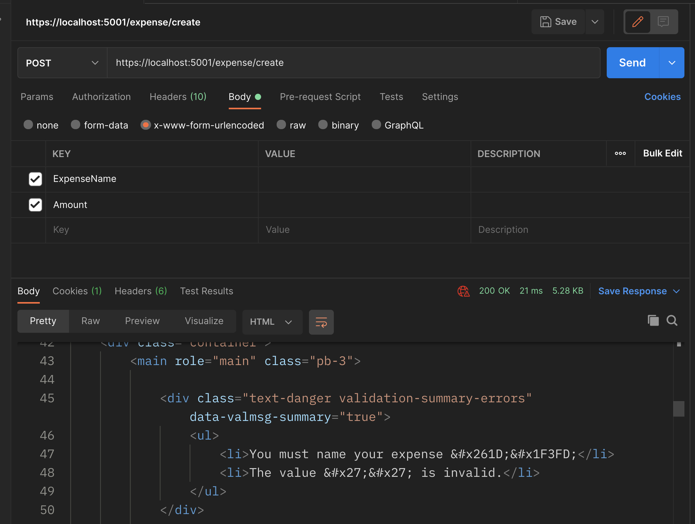

# 08 `Validation`

## Server Side `Validation`

### Ajout des `annotations` dans le `Model`

On va utiliser les `annotations` dans le `Model` pour gérer la validation :

```cs
public class Expense
{
  [Key]
  public int Id { get; set; }
  
  [DisplayName("Expense ✨")]
  [Required]
  public string ExpenseName { get; set; }
  
  // [Column(TypeName = "decimal(18,2)")] si on utilise le type decimal pour la monnaie
  [Required]
  [Range(1, int.MaxValue, ErrorMessage = "Amount must be greater than zero")]
  public int Amount { get; set; }
}
```


### Modification de la `View`

Dans le fichier `Views/Expense/Create.cshtml` on peut visionner les erreurs de validation :

```html
<div asp-validation-summary="ModelOnly" class="text-danger"></div>
```

Pour chaque élément de formulaire on va ajouter :

```html
<div class="col-6">
    <input asp-for="ExpenseName" class="form-control" />
    <span asp-validation-for="ExpenseName" class="text-danger"></span>
</div>
```

et 

```html
<input asp-for="Amount" class="form-control" />
<span asp-validation-for="Amount"></span>
```


### Ajout de la validation dans le `controller`

On doit voire si le `model` est valide avant de sauver en `DB` les données reçues :

```cs
[HttpPost]
[ValidateAntiForgeryToken]
public IActionResult Create(Expense obj)
{
    if(ModelState.IsValid)
    {
        _db.Add(obj);
    	_db.SaveChanges();
        
        return RedirectToAction("Index");
    }
    
    return View(obj);
}
```



Si on veut un résumé de toutes les erreurs dans la `div` du haut :

```html
<div asp-validation-summary="All" class="text-danger"></div>
```




Ici la validation demande une requête au serveur qui renvoie la page avec les erreurs.


## Validation Client Side

Il suffit d'ajouter ces lignes dans le template `Create.cshtml` :

```html
<!-- ... --> 
</form>

@section Scripts{
    @{ <partial name="_ValidationScriptsPartial" />}
}
```

Maintenant la validation n'engendre plus de requête vers le serveur directement.



Bien entendu la validation reste active côté serveur comme on peut le tester avec `Postman` :



> Pour pouvoir requêter notre `action` `Create` depuis **Postman** , il faut désactiver `ValidateAntiForgeryToken` :
>
> ```cs
> [HttpPost]
> // [ValidateAntiForgeryToken]
> public IActionResult Create(Expense obj)
> {
>     if (ModelState.IsValid)
>     { // ...
> ```

