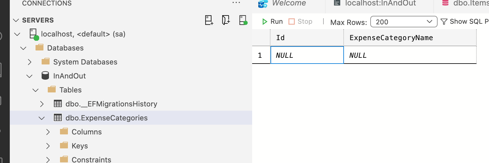
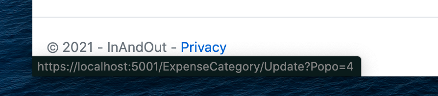

# 09 bis Création de `ExpenseCategory`

## 1. Crée le modèle

`ExpenseCategory.cs`

```cs
namespace InAndOut.Models
{
    public class ExpenseCategory
    {
        public int Id { get; set; }
        public string ExpenseCategoryName { get; set; }
    }
}
```

On doit maintenant tracker `ExpenseCategory` avec `EF Core` :

`Data/ApplicationDbContext.cs`

```cs
public class ApplicationDbContext : DbContext
{
  public ApplicationDbContext(DbContextOptions<ApplicationDbContext> options) : base(options)
  {

  }

  public DbSet<Item> Items { get; set; }
  public DbSet<Expense> Expenses { get; set; }
  public DbSet<ExpenseCategory> ExpenseCategories { get; set; }
}
```

Maintenant on crée une `migration` et on met à jour la `DB` :

```bash
dotnet ef migrations add AddExpenseCategoryTable

dotnet ef database update
```




## 2. Création du Contrôleur : `ExpenseCategoryController`

1. hériter de `Controller` et ajouter le `using` pour `Microsoft.AspNetCore.Mvc`

   ```cs
   public class ExpenseCategoryController : Controller
   ```

   

2. Injecter le `context` (la `db`) dans le constructeur

   ```cs
   private readonly ApplicationDbContext _db;
   public ExpenseCategoryController(ApplicationDbContext db)
   {
     _db = db;
   }
   ```

3. Implémenter les `actions` du `CRUD`

   ```cs
   // GET READ
   public IActionResult Index() => View(_db.ExpenseCategories)
   ```

4. Pour chaque `actions` créer une vue associée dans un dossier `ExpenseCategory`


## 3. Création des vues

Dans le `_Layout` on ajoute un lien vers la page :

```html
<li class="nav-item">
  <a class="nav-link text-dark" asp-area="" asp-controller="ExpenseCategory"
     asp-action="Index">Expense Categories</a>
</li>
```


1. Renseigner le titre de la page

   ```cs
   @{
       ViewData["Title"] = "List - Expense Category";
   }
   ```

2. Définir le type du modèle de la page

   ```cs
   @model IEnumerable<InAndOut.Models.ExpenseCategory>
   ```

3. Utiliser la syntaxe `Razor` et le `HTML` pour définir la vue


### Un lien

```html
<a asp-action="Update" asp-route-Id="@category.Id"
```

`asp-action` définit l'`action` du même contrôleur qui est appelé.

Si c'est une `action` d'un autre contrôleur, on utilise `asp-controller="Item"` par exemple.

`asp-route-Id="@item.Id"` définit un `query string` et lui transmet une valeur.

On pourrait appeler ce `query string` comme bon nous semble :

```html
<a asp-action="Update" asp-route-Popo="@category.Id">Update</a>
```



```cs
public IActionResult Update(int? popo)
{
  if (popo == null || popo == 0)
  {
    return NotFound();
  }

  var category = _db.ExpenseCategories.Find(popo);
  // ...
```


## Create

### Ajout de la validation sur le `Model`

```cs
public class ExpenseCategory
{
  public int Id { get; set; }
  [Required(ErrorMessage = "You must have a Name 👍")]
  [MinLength(3, ErrorMessage = "The name must be longer then 3 letters")]
  [MaxLength(65, ErrorMessage = "The name must be smaller than 65 letters")]
  public string ExpenseCategoryName { get; set; }
}
```

Il est alors nécessaire d'ajouter une `migration` :

```bash
dotnet ef migrations add ValidationRulesForExpenseCategory

Build started...
Build succeeded.
An operation was scaffolded that may result in the loss of data. Please review the migration for accuracy.
```

```bash
dotnet ef database update
```


### `Action`

```cs
// GET CREATE
public IActionResult Create() => View();

// POST CREATE
[HttpPost]
[ValidateAntiForgeryToken]
public IActionResult Create(ExpenseCategory category)
{
  if (ModelState.IsValid)
  {
    _db.Add(category);
    _db.SaveChanges();

    return RedirectToAction("Index");
  }
  return View(category);
}
```


### `Create.cshtml`

```html
@{
    ViewData["Title"] = "Expense Category - Create";
}

@model InAndOut.Models.ExpenseCategory

<form method="post">
    <label asp-for="@Model.ExpenseCategoryName"></label>
    <input type="text" asp-for="@Model.ExpenseCategoryName">
    <span asp-validation-for="@Model.ExpenseCategoryName"></span>
    <p><button>Create</button> - <a asp-action="Index">Back</a></p>
</form>

@section Scripts
{
<partial name="_ValidationScriptsPartial" />
}
```


## `Update`

```cs
// GET UPDATE
public IActionResult Update(int? id)
{
  if (id == null || id == 0)
  {
    return NotFound();
  }


  var category = _db.ExpenseCategories.Find(id);

  if (category == null)
  {
    return NotFound();
  }

  return View(category);
}

// POST UPDATE
[HttpPost]
[ValidateAntiForgeryToken]
public IActionResult Update(ExpenseCategory category)
{
  if (ModelState.IsValid)
  {
    _db.Update(category);
    _db.SaveChanges();

    return RedirectToAction("Index");
  }

  return View(category);
}
```

```html
@{
    ViewData["Title"] = "Expense Category - Update";
}

@model InAndOut.Models.ExpenseCategory

<form method="post">
    <label asp-for="@Model.ExpenseCategoryName"></label>
    <input type="text" asp-for="@Model.ExpenseCategoryName" />
    <span asp-validation-for="@Model.ExpenseCategoryName"></span>
    <p><button>Update</button> - <a asp-action="Index">Back</a></p>
</form>

@section Scripts
{
<partial name="_ValidationScriptsPartial" />
}
```


## `Delete`

```cs
// GET DELETE
public IActionResult Delete(int? id)
{
  if (id == null || id == 0)
  {
    return NotFound();
  }

  var category = _db.ExpenseCategories.Find(id);

  if (category == null)
  {
    return NotFound();
  }

  return View(category);
}

// POST DELETE
[HttpPost]
[ValidateAntiForgeryToken]
public IActionResult Delete(ExpenseCategory category)
{
  _db.Remove(category);
  _db.SaveChanges();

  return RedirectToAction("Index");
}
```

```html
@{
    ViewData["Title"] = "Expense Category - Delete";
}

@model InAndOut.Models.ExpenseCategory

<form method="post">
    <label asp-for="@Model.ExpenseCategoryName"></label>
    <input type="text" asp-for="@Model.ExpenseCategoryName" disabled>
    <p><button>Delete</button> - <a asp-action="Index">Back</a></p>
</form>
```

#### ! pour les méthodes `POST` on doit utiliser l'attribut de sécurité `[ValidateAntiForgeryToken]`

