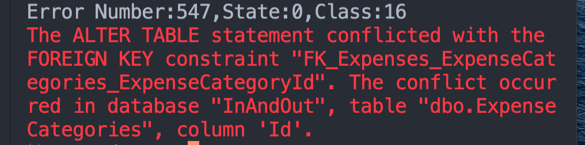
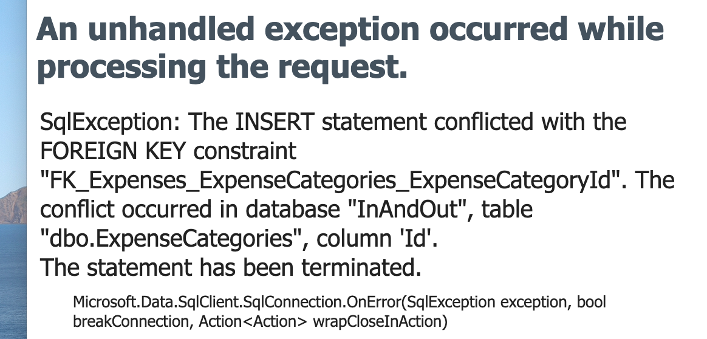
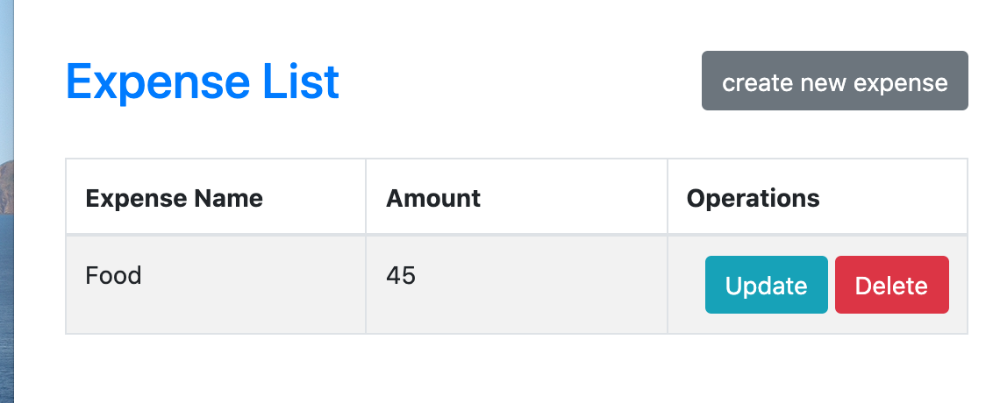
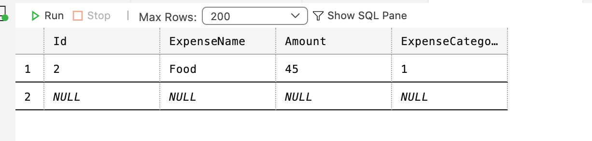

# 10 Foreign Key

## Modification du `Model`

```cs
public class Expense
{
  [Key]
  public int Id { get; set; }

  [DisplayName("Expense ✨")]
  [Required]
  public string ExpenseName { get; set; }

  [Required]
  [Range(1, int.MaxValue, ErrorMessage = "Amount must be greater than zero")]
  public int Amount { get; set; }
  
  [DisplayName("Expense Category")]
  public int ExpenseCategoryId { get; set; }
  
  [ForeignKey("ExpenseCategoryId")]
  public virtual ExpenseCategory ExpenseCategory { get; set; }
}
```

> `virtual` permet aux classes filles d'`override` les méthodes parentes, ici le `getter` et le `setter`.
>
> Je ne sais pas à quoi ça sert dans ce cadre ?

On ajoute ensuite une `migration`.

À ce stade une erreur de conflit est affichée si on essaye de mettre à jour la `DB` :



On doit vider le contenu de la table `Expenses`.

Maintenant si on essaye de créer une nouvelle `expense` on a aussi une erreur :



On doit donner une valeur de `Foreign Key`.

Pour résoudre temporairement ce problème on va manuellement ajouter une `FK` par défaut :

```cs
[HttpPost]
[ValidateAntiForgeryToken]
public IActionResult Create(Expense obj)
{
  if (ModelState.IsValid)
  {
    obj.ExpenseCategoryId = 1; // <= ici
    _db.Add(obj);
    _db.SaveChanges();

    return RedirectToAction("Index");
  }

  return View(obj);
}
```





On voit la valeur par défaut `1` dans `ExpenseCategoryId`.

