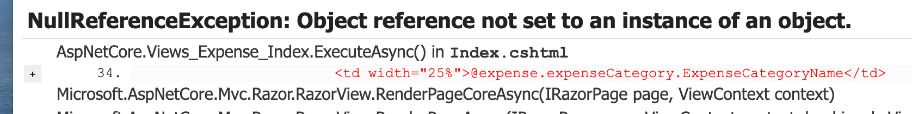
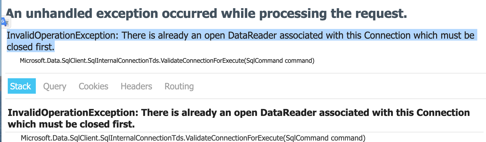
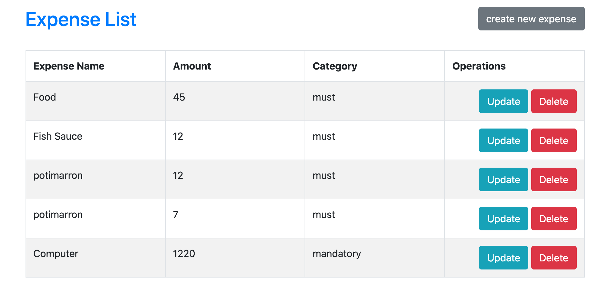

# 14 Afficher les `Category`

```html
@model IEnumerable<InAndOut.Models.Expense>

  <table class="table table-bordered table-striped">
    <thead>
      <tr>
        <th>Expense Name</th>
        <th>Amount</th>
        <th>Category</th>
        <th>Operations</th>
      </tr>
    </thead>
    <tbody>
      @foreach (var expense in Model)
      {
      <tr>
        <td width="25%">@expense.ExpenseName</td>
        <td width="25%">@expense.Amount</td>
        <td width="25%">@expense.expenseCategory.ExpenseCategoryName</td>
        <td width="25%">
            <a asp-action="Update" asp-route-Id="@expense.Id">Update</a>
            <a asp-action="Delete" asp-route-Id="@expense.Id">Delete</a>
        </td>
      </tr>
      }
    </tbody>
  </table>

```

Pour l'instant cela ne peu fonctionner car `ExpenseCategoryName` est sur une autre table.



On doit aussi charger le contenu de `ExpenseCategories` :

```cs
public IActionResult Index()
{
  IEnumerable<Expense> expenses = _db.Expenses;
  
  foreach(var expense in expenses)
  {
    expense.ExpenseCategory = _db.ExpenseCategories.FirstOrDefault(i => i.Id == expense.ExpenseCategoryId);
  }

  return View(expenses);
}
```

> J'obtiens une erreur :
>
> 
>
> ```
> InvalidOperationException: There is already an open DataReader associated with this Connection which must be closed first.
> ```
>
> Apparemment cela arrive lorsqu'on itère sur le résultat d'une `query` pour exécuter une nouvelle `query`.
>
> Il suffit d'ajouter `MultipleActiveResultSets=true` à son `query string` :
>
> ```json
> "ConnectionStrings": {
>         "HukarConnection": "Server=localhost,1433;Database=InAndOut;User=sa;Password=huk@r2Xmen99;MultipleActiveResultSets=true"
>     },
> ```
>
> 

On peut aussi simplifier la syntaxe avec `Find` :

```cs
public IActionResult Index()
{
  IEnumerable<Expense> expenses = _db.Expenses;

  foreach (var expense in expenses)
  {
    expense.ExpenseCategory = _db.ExpenseCategories.Find(expense.ExpenseCategoryId);
  }

  return View(expenses);
}
```

On peut encore simplifier avec `Include` et même retirer `MultipleActiveResultSets=true` de `appsetting.json` :

```cs
public IActionResult Index() => View(_db.Expenses.Include(e => e.ExpenseCategory));`
```

