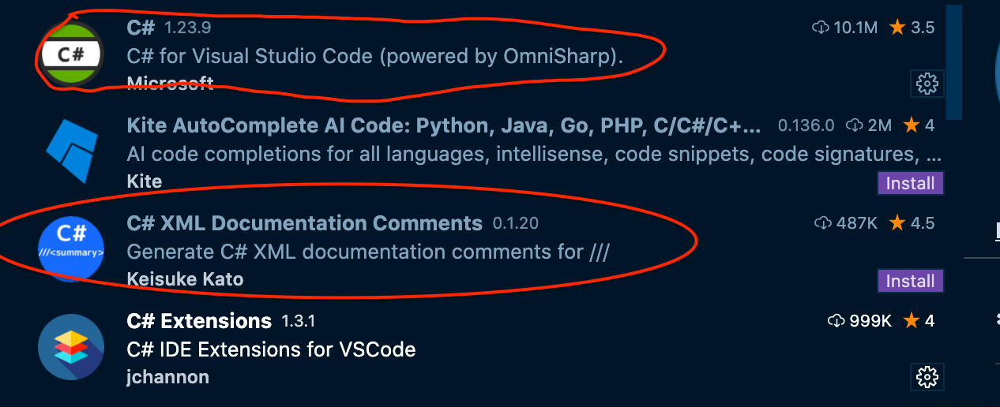
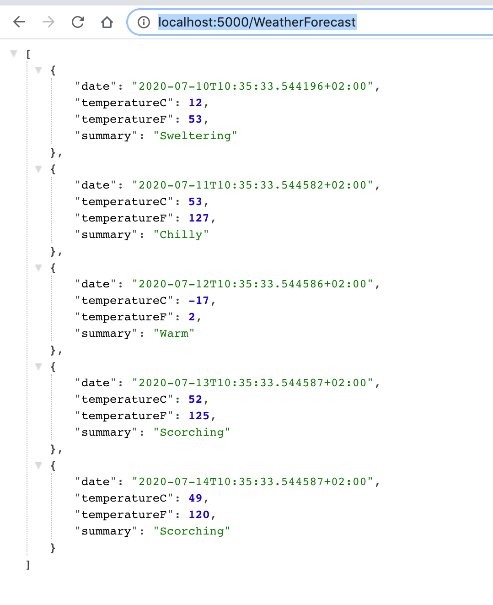
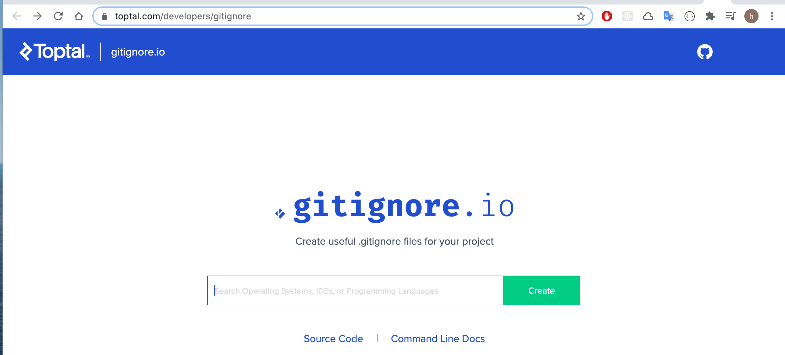
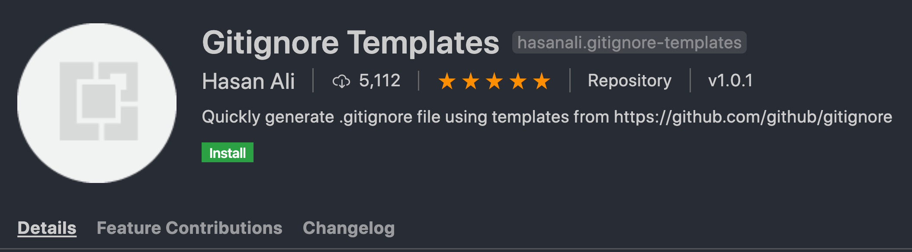
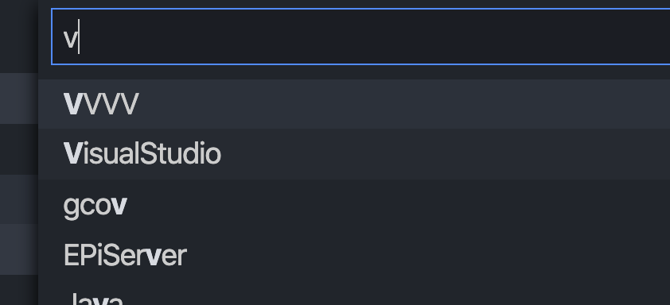

# 01 Introduction

## VSCode extension



## dotnet cli

```bash
dotnet -h

# ...
  new               Create a new .NET project or file.
# ...
  run               Build and run a .NET project output.
# ...
  watch             Start a file watcher that runs a command when files change.
```

`new` `run` et `watch` nous intéressent pour le moment.

### Tous les templates

```bash
dotnet new -h

# ...
ASP.NET Core with Angular                         angular                  [C#]              Web/MVC/SPA
ASP.NET Core with React.js                        react                    [C#]              Web/MVC/SPA
ASP.NET Core with React.js and Redux              reactredux               [C#]              Web/MVC/SPA
Razor Class Library                               razorclasslib            [C#]              Web/Razor/Library/Razor Class Library
ASP.NET Core Web API                              webapi                   [C#], F#          Web/WebAPI
ASP.NET Core gRPC Service                         grpc                     [C#]              Web/gRPC
dotnet gitignore file                             gitignore                                  # ...
```

On va utiliser `webapi`.

```bash
dotnet new webapi
```

## Commenter la redirection

Dans le fichier `Startup.cs` il y a une redirection vers `https` qu'il faut commenter :

```csharp
public class Startup
{
    public Startup(IConfiguration configuration)
    {
        Configuration = configuration;
    }

    public IConfiguration Configuration { get; }

    // This method gets called by the runtime. Use this method to add services to the container.
    public void ConfigureServices(IServiceCollection services)
    {
        services.AddControllers();
    }

    // This method gets called by the runtime. Use this method to configure the HTTP request pipeline.
    public void Configure(IApplicationBuilder app, IWebHostEnvironment env)
    {
        if (env.IsDevelopment())
        {
            app.UseDeveloperExceptionPage();
        }
		 // Ici on doit commenter
        // app.UseHttpsRedirection();

        app.UseRouting();

        app.UseAuthorization();

        app.UseEndpoints(endpoints =>
                         {
                             endpoints.MapControllers();
                         });
    }
}
```

Les méthodes commençants par `Use` sont des `middleware`.

## Démarrage de l'application

```bash
dotnet run

info: Microsoft.Hosting.Lifetime[0]
      Now listening on: http://localhost:5000
```

### `watch`

```bash
dotnet watch run
```

Pour accéder à l'`API`, l'adresse doit contenir le nom du contrôleur de démonstration `WeatherForecast`.

#### ! Ce n'est pas sensible à la `case` : `weatherforecast` correcte

```
http://localhost:5000/WeatherForecast
```



## GIT

On peut utiliser `gitignore.io`



```
# Created by https://www.toptal.com/developers/gitignore/api/dotnetcore
# Edit at https://www.toptal.com/developers/gitignore?templates=dotnetcore

### DotnetCore ###
# .NET Core build folders
bin/
obj/

# Common node modules locations
/node_modules
/wwwroot/node_modules

# End of https://www.toptal.com/developers/gitignore/api/dotnetcore
```

On peut utiliser une extension VSCode pour avoir un template.



`cmd + shift + p` dans la palette `generate gitignore` et on choisie Visual studio.



### Ou en ligne de commande

```bash
dotnet new gitignore
```

