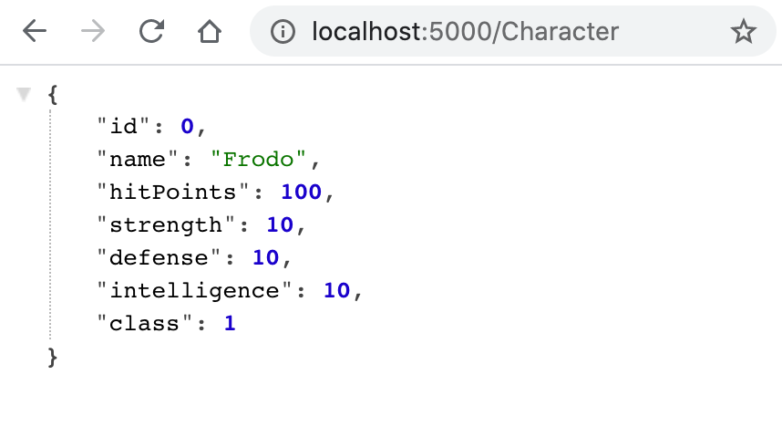
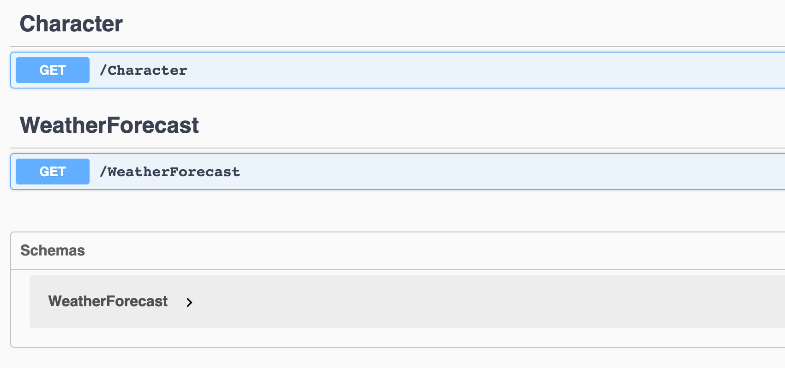
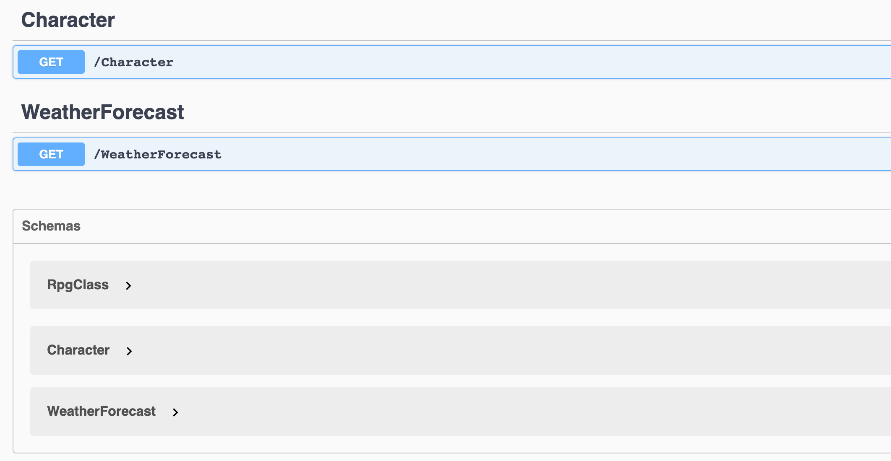
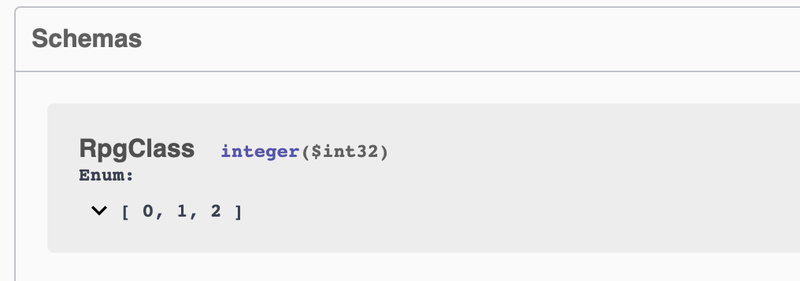
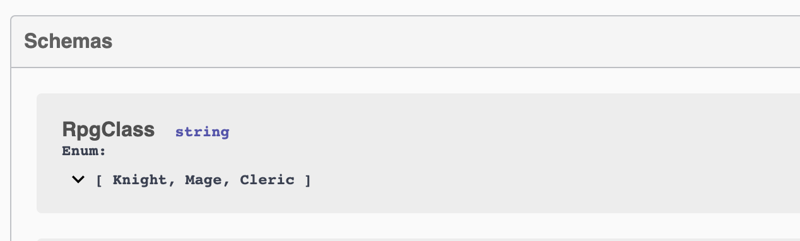
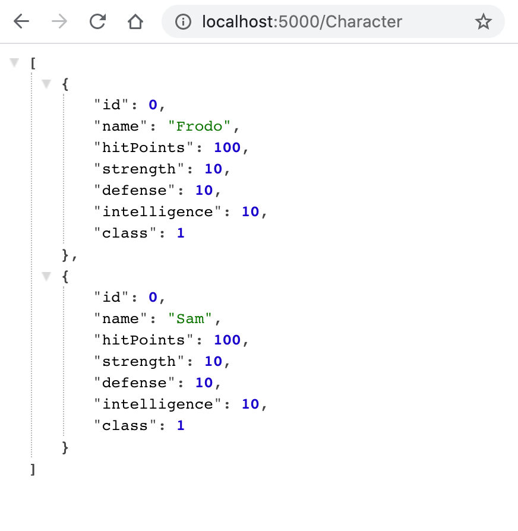
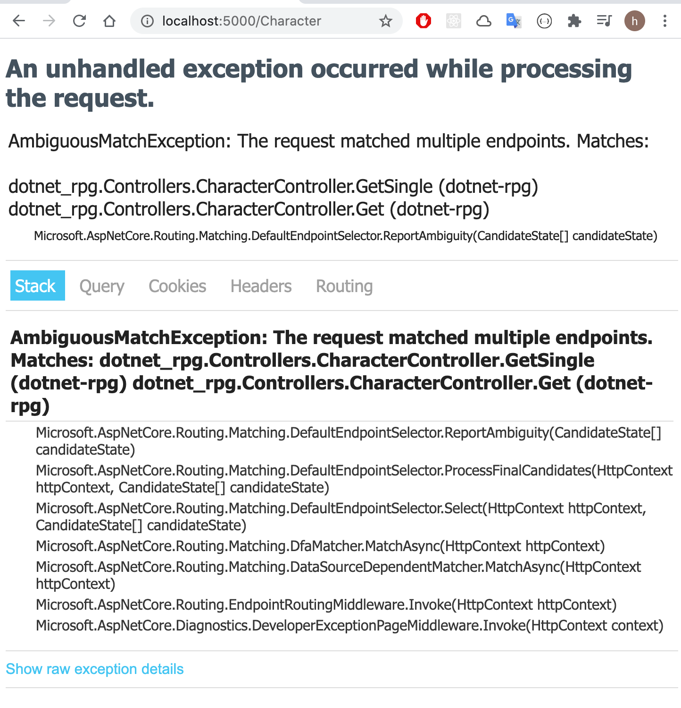

# 03 controller

Si on utilise la vue, on hérite de `Controller`, mais pour une `API` on a besoin que de `ControllerBase`.

`ControllerBase` ne contient rien pour les vues (contrairement à `Controller`).

`Controllers/CharacterController.cs`.

```cs
using dotnet_rpg.Models;
using Microsoft.AspNetCore.Mvc;

namespace dotnet_rpg.Controllers
{
    [ApiController] // automatique 404 error, httpresponse; enable routing
    [Route("[Controller]")]  // use name of controller : character
    public class CharacterController: ControllerBase
    {
        // fonctionne aussi avec un champs non static
        private Character knight = new();

        [HttpGet] // obligatoire avec swagger .net 5
        public IActionResult Get() {
            // BadRequest(); 400
            // NotFound(); 404
            return Ok(knight);  // 200
        }
    }
}
```

Si la méthode `IActionResult` porte un nom explicite de méthode `HTTP`, celle-ci est déduite, pas besoin de l'attribut `[HttpGet]` au dessus.

Maintenant l'attribut est obligatoire uniquement pour `swagger` en `.net 5`.

`[Route("[Controller]")]` signifie que le nom du contrôleur est aussi le nom de la route :

```
http://localhost:5000/character
```

#### ! ce n'est pas case sensitive pour l'url



### `[HttpGet]`

On va ajouter l'attribut `[HttpGet]` pour avoir notre route sur `Swagger`.



On a cette fois bien la route mais les schémas correspondant, pour ça il faut changer la signature de la méthode `Get` : `ActionResult<Character>`. Cela pourrait fonctionner sans mais c'est plus lisible pour le `Swagger`.

```cs
[HttpGet]
public ActionResult<Character> Get()
{
    return Ok(knight);
}
```



### `json converter`

Par contre notre schéma pour les `RpgClass` n'est pas très explicite :



On doit ajouter un `attribut` à l'`enum` : `[JsonConverter]` :

```cs
using System.Text.Json.Serialization;

namespace dotnet_rpg.Models
{
    [JsonConverter(typeof(JsonStringEnumConverter))]
    public enum RpgClass
    {
        Knight,
        Mage,
        Cleric
    }
}
```

On a maintenant un schéma plus parlant dans `Swagger` :



### Avec une liste de caractères :

```cs
using System.Collections.Generic;
using dotnet_rpg.Models;
using Microsoft.AspNetCore.Mvc;

namespace dotnet_rpg.Controllers
{
    [ApiController] // automatique 404 error, httpresponse; enable routing
    [Route("[Controller]")]  // use name of controller
    public class CharacterController: ControllerBase
    {
        public List<Character> characters = new()  // écriture par inférence de type
        {
            new(),
            new() { Name = "Sam" }
        };

        public IActionResult<List<Character>> Get() {
            return Ok(characters);  // 200
        }
    }
}
```




### Inférence de type

Si le type est déjà dans la première partie de l'instanciation (dans la déclaration à gauche), on peut utiliser les formes raccourcies `new()` et `new() { ... }` du côté droit.


### Méthode pour un seul caractère

Ajoutons une méthode qui renvoie un seul caractère :

`controllers/CharacterController.cs`

```cs
public IActionResult<Character> GetSingle() {
    return Ok(characters[0]);
}
```



On obtient une erreur de type `AmbiguousMatchException` car il y a deux méthodes `GET`.
