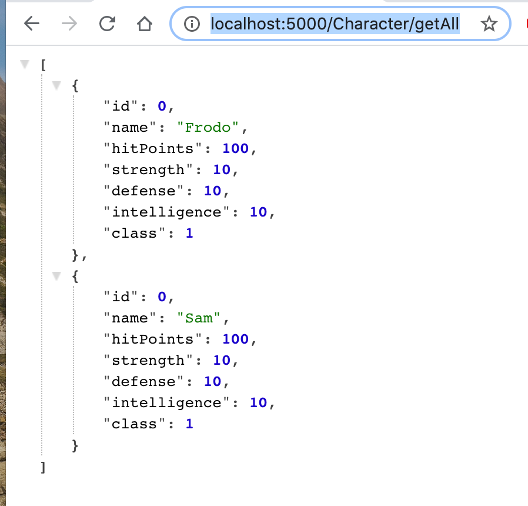
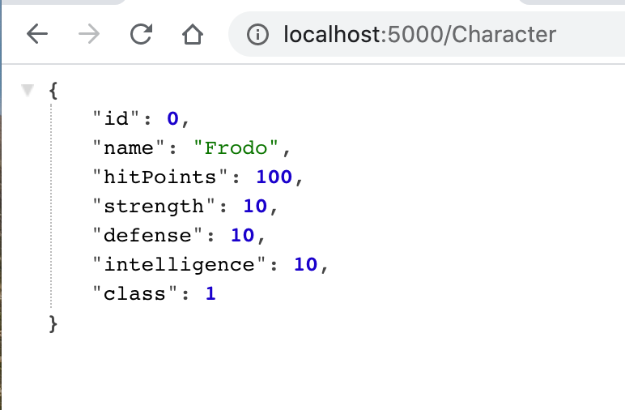
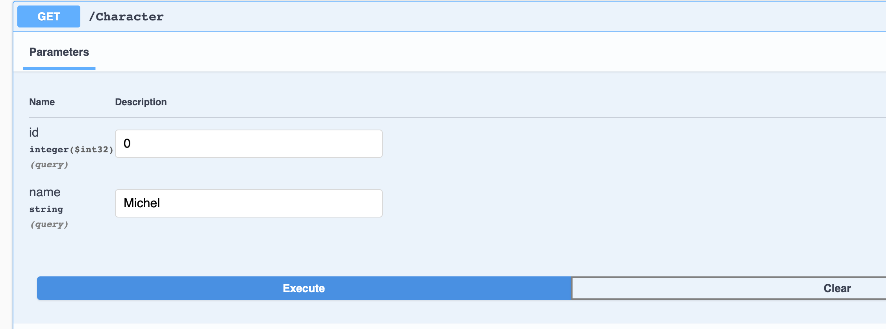
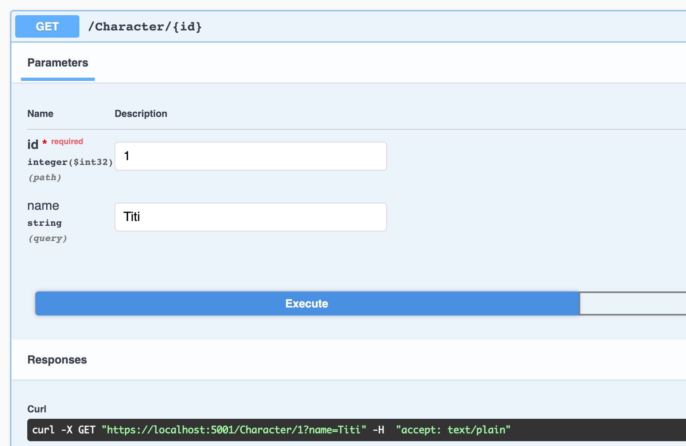

# 04 Ajouter une route

## Attribut de routage `Route("MyRoute")`

En ajoutant une route sur la première fonction `get` on résout le problème :

```cs
using System.Collections.Generic;
using dotnet_rpg.Models;
using Microsoft.AspNetCore.Mvc;

namespace dotnet_rpg.Controllers
{
    [ApiController] // automatique 404 error, httpresponse; enable routing
    [Route("[Controller]")]  // use name of controller
    public class CharacterController: ControllerBase
    {
        // ...

        [Route("GetAll")]
        public IActionResult<List<Character>> Get() {
            return Ok(characters);
        }

        public IActionResult<Character> GetSingle() {
            return Ok(characters[0]);
        }
    }
}
```

L'`url` n'est pas sensible à la casse.

`http://localhost:5000/Character/getall` :



`http://localhost:5000/Character`



On peut spécifier la méthode explicitement en fusionnant `Route` avec `HttpGet` :

### `[HttpGet("GetAll")]`

```cs
[HttpGet("GetAll")]
public IActionResult<List<Character>> Get() {
    return Ok(characters);
}
```

## Route avec paramètres : `query parameters`

`Controllers/CharacterController.cs`

```cs
// ...
using System.Linq;
// pour la méthode FirstOrDefault

// ...
        private static List<Character> characters = new() {
            new(),
            new() {
                Id = 1,
                Name = "Sam"
            }
        };
		// ...

        [HttpGet]
        public IActionResult GetSingle(int id) {
            return Ok(characters.FirstOrDefault(c => c.Id == id));
        }
```

On ajoute un `Id` au deuxième caractère pour pouvoir les retrouver par leur `Id`.

`using System.Linq;` permet d'utiliser `FirstOrDefault` (renvoie `NULL` s'il ne trouve rien).

`SingleOrDefault` lance une exception s'il y a plus d'un élément, permet de détecter les erreurs de logique (plusieurs élément avec le même `ID`).

Si on veut qu'une exception soit lancée s'il n'y a pas de valeur de retour, on utilisera plutôt `single` ou `first`.


`http://localhost:5000/Character?id=1`


### Plusieurs paramètres de route

```cs
[HttpGet]
public ActionResult<Character> Get(int id, string name)
{
    Character character = characters.FirstOrDefault(c => c.Id == id);

    if (character is null)
    {
        Console.WriteLine("character is null");
        return NotFound();
    }
    Console.WriteLine(name);

    return Ok(character);
}
```



Il est ainsi très facile de récupérer les différents `query parameters`.

```bash
https://localhost:5001/Character?id=0&name=Michel
```

Voici l'`url` généré par `Swagger`.

## Paramètre de route dans le chemin

On peut vouloir passer le paramètre à travers le chemin :

```bash
http://localhost:5000/Character/1
```

au lieu de 

```bash
http://localhost:5000/Character?id=1
```

Pour cela il faut spécifier le paramètre dans l'`attribut` de route :

```cs
[HttpGet("{id}")]
public ActionResult<Character> Get(int id, string name)
{
    Character character = characters.FirstOrDefault(c => c.Id == id);

    if (character is null)
    {
        Console.WriteLine("character is null");
        return NotFound();
    }
    Console.WriteLine(name);

    return Ok(character);
}
```

Ici on a un paramètre de route `id` et un `query parameter` :



L'`url` obtenu :

```
https://localhost:5001/Character/1?name=Titi
```

On voie que le paramètre de route est obligatoire alors que le `query parameter` ne l'est pas.