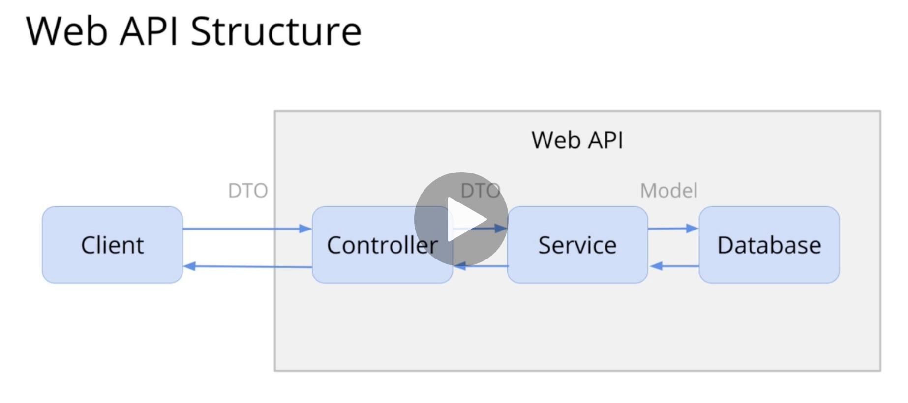
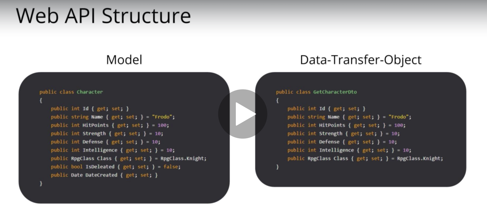
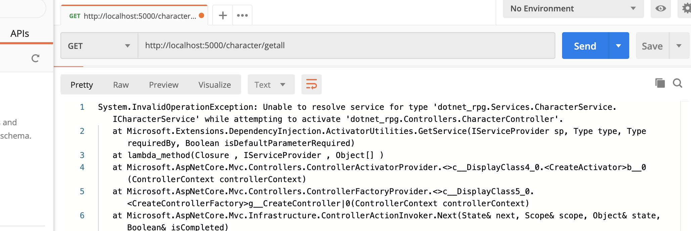

# 06 Les services : injection de dépendances

Les services sont découplés et ré-introduis dans les contrôleurs par injection de dépendance.



## Data Transfert Object : `DTO`

Il y a des propriétés comme la date de création ou un booléen `isAvailable` par exemple, qu'on veut garder en base de données mais pas forcement l'envoyer au client. C'est là que `DTO` intervient.



Les données du modèle sont _mappées_ pour ne garder que ce qu'on souhaite envoyer au client.

Un `DTO` pourrait être construit sur base de plusieurs `model`.

## Amélioration de la structure

Création des dossiers `Services/CharacterService` et dedans des fichiers `ICharacterService.cs` et `CharacterService.cs`

#### ! astuce **VSCode** : pour avoir la liste des import `cmd + shift +.`.

`.` = period en anglais.

#### ! astuce VSCode snippet : `ctor` => constructor

### Définir l'interface

`ICharacterService.cs`

```cs
using System.Collections.Generic;
using dotnet_rpg.Models;

namespace dotnet_rpg.Services.CharacterService
{
    public interface ICharacterService
    {
        List<Character> GetAllCharacters();
        Character GetCharacterById(int id);
        List<Character> AddCharacter(Character newcharacter);
    }
}
```

### Définir la classe

On reprend la logique précédemment mise dans le contrôleur.

`CharacterService.cs`

```cs
using System.Collections.Generic;
using System.Linq;
using dotnet_rpg.Models;

namespace dotnet_rpg.Services.CharacterService
{
    public class CharacterService : ICharacterService
    {
        // ici static a du sens car on veut qu'une seule liste 
        // quelque soit le nombre d'instance du service
        private static List<Character> characters = new() {
            new(),
            new() {
                Id = 1,
                Name = "Sam"
            }
        };

        public List<Character> AddCharacter(Character newCharacter)
        {
            characters.Add(newCharacter);
            return characters;
        }

        public List<Character> GetAllCharacters() => return characters;

        public Character GetCharacterById(int id) => characters.FirstOrDefault(c => c.Id == id);
    }
}
```

### Simplifier le contrôleur

`CharacetrController.cs`

```cs
using System;
using System.Collections.Generic;
using System.Linq;
using dotnet_rpg.Models;
using dotnet_rpg.Services.CharacterService;
using Microsoft.AspNetCore.Mvc;

namespace dotnet_rpg.Controllers
{

    [ApiController]
    [Route("[controller]")]
    public class CharacterController : ControllerBase
    {
        private readonly ICharacterService _characterService;
        public CharacterController(ICharacterService characterService)
        {
            _characterService = characterService;
        }

        [HttpGet("AllCharacters")]
        public ActionResult<List<Character>> GetAllCharacters()
            => Ok(_characterService.GetAllCharacters());


        [HttpGet("{id}")]
        public ActionResult<Character> Get(int id)
        {
            var character = _characterService.GetCharacterById(id);

            if (character is null)
            {
                Console.WriteLine("character is null");
                return NotFound();
            }

            return Ok(character);
        }

        [HttpPost]
        public ActionResult<List<Character>> AddCharacter(Character newCharacter)
            => Ok(_characterService.AddCharacter(newCharacter));

    }
}
```

On déclare une variable privée et en lecture seule `_characterService`.

On injecte dans le constructeur un `characterService` et on l'assigne à `_characterService`.



À ce niveau ça ne fonctionne pas encore il faut configurer le service.

### Configurer le service dans `Startup.cs`

`Startup.cs`

```cs
// ...

namespace dotnet_rpg
{
    public class Startup
    {
        // ...
        public void ConfigureServices(IServiceCollection services)
        {
            services.AddControllers();
            services.AddSwaggerGen(c =>
            {
                c.SwaggerDoc("v1", new OpenApiInfo { Title = "dotnet_rpg", Version = "v1" });
            });
            services.AddScoped<ICharacterService, CharacterService>();
        }
        // ...
    }
}
```

`AddTransient` : new instance for every controller and every services even within the same request

Une nouvelle instance pour chaque contrôleur et chaque service même dans la même requête.

`AddSingleton` : only one instance for every request

Juste une instance pour toutes les requêtes.

`AddScoped` : new instance for every request

Une nouvelle instance pour chaque nouvelle requête.

### `AddSingleton`

L'application semble aussi fonctionner si on utilise `AddSingleton` plutôt que `AddScoped` :

```cs
services.AddSingleton<ICharacterService, CharacterService>();
```

On peut retirer le mot clé `static` :

```cs
public List<Character> characters = new()
{
    new(),
    new() { Id = 1, Name = "Sam" }
};
```

 plutôt que :

```cs
public static List<Character> characters = new()
{
    new(),
    new() { Id = 1, Name = "Sam" }
};
```

Car on sait qu'il n'y a qu'une instance (donc qu'une liste) du service.