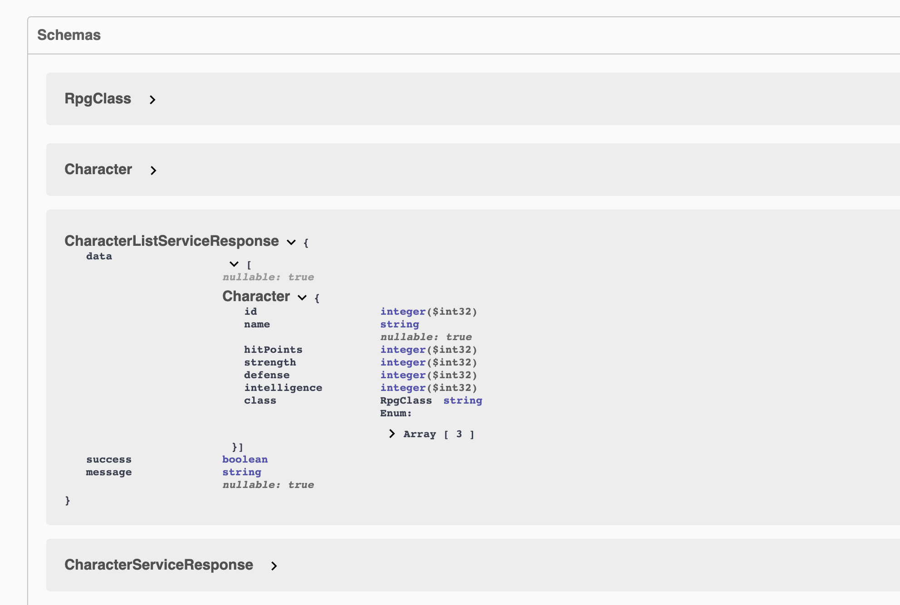

# 08 Service Response

Permet d'envoyer des métadonnées dans la réponse possiblement utiles pour le client.

## Création de `ServiceResponse.cs` dans `Models`

```csharp
namespace dotnet_rpg.Models
{
    public class ServiceResponse<T>
    {
        public T Data { get; set; }
        public bool Succes { get; set; } = true;
        public string Message { get; set; } = null;
    }
}
```

Ce n'est pas utile en soit, mais pour de grands projets, cela peut être très pratique.


## Modification de `ICharacterService` et `CharacterService`

```cs
// Services/Character/ICharacterService.cs

// ...

public interface ICharacterService
{
    Task<ServiceResponse<List<Character>>> GetAllCharacters();
    Task<ServiceResponse<Character>> GetCharacterById(int id);
    Task<ServiceResponse<List<Character>>> AddCharacter(Character newCharacter);
}
```


```cs
// Services/Character/CharacterService.cs

// ...

public async Task<ServiceResponse<List<Character>>> AddCharacter(Character newCharacter)
{
    ServiceResponse<List<Character>> serviceResponse = new();
    characters.Add(newCharacter);

    serviceResponse.Data = characters;

    return serviceResponse;
}

public async Task<ServiceResponse<List<Character>>> GetAllCharacters()
{
    ServiceResponse<List<Character>> serviceResponse = new();

    serviceResponse.Data = characters;

    return serviceResponse;
}

public async Task<ServiceResponse<Character>> GetCharacterById(int id)
{
    ServiceResponse<Character> serviceResponse = new();

    serviceResponse.Data = characters.FirstOrDefault(c => c.Id == id);

    return serviceResponse;
}
```


## Modification du contrôleur `Character.cs`

```cs
// Controllers/Character.cs

// ...

[HttpGet("AllCharacters")]
public async Task<ActionResult<ServiceResponse<List<Character>>>> GetAllCharacters()
    => Ok(await _characterService.GetAllCharacters());


[HttpGet("{id}")]
public async Task<ActionResult<ServiceResponse<Character>>> Get(int id)
{
    var character = await _characterService.GetCharacterById(id);

    if (character is null)
    {
        Console.WriteLine("character is null");
        return NotFound();
    }

    return Ok(character);
}

[HttpPost]
public async Task<ActionResult<ServiceResponse<List<Character>>>> AddCharacter(Character newCharacter)
    => Ok(await _characterService.AddCharacter(newCharacter));
```



