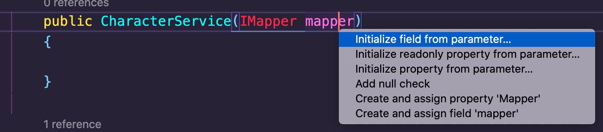
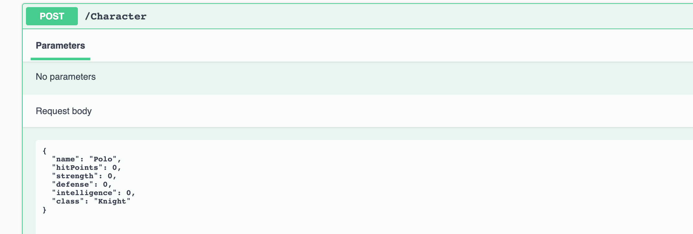
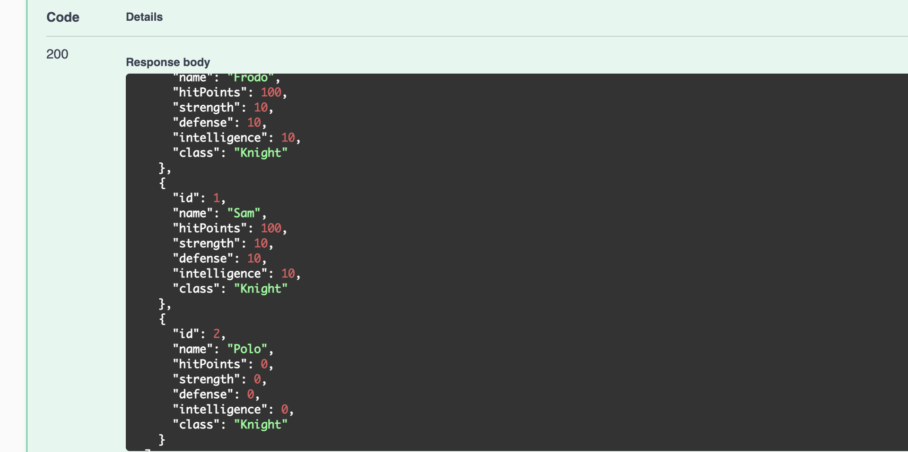
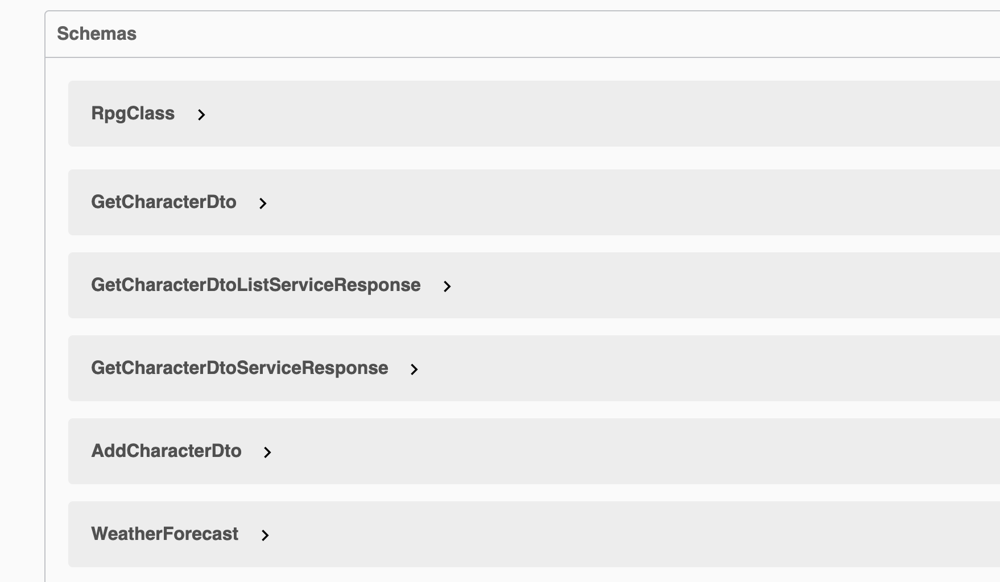

# `DTO` Data Transfer Object

On créé un nouveau dossier `Dtos`.

Puis dedans un autre dossier `Character`.

On reçoit un `Charcater` sur le serveur et on envoie un `Character` depuis le serveur, on doit donc créer **deux** `CharacterDto` :

- `GetCharacterDto.cs`
- `AddCharacterDto.cs`


## `GetCharacterDto`

`GetCharacterDto.cs` est pour le moment strictement similaire à la classe `Models/Character.cs`, il suffit de la copier :

```cs
// Dtos/Character/GetCharacterDto.cs

using dotnet_rpg.Models;

namespace dotnet_rpg.Dtos.Character
{
    public class GetCharacterDto
    {
        public int Id { get; set; }
        public string Name { get; set; } = "Frodo";
        public int HitPoints { get; set; } = 100;
        public int Strength { get; set; } = 10;
        public int Defense { get; set; } = 10;
        public int Intelligence { get; set; } = 10;
        public RpgClass Class { get; set; } = RpgClass.Knight;
    }
}
```


## `AddCharacterDto`

`AddCharacterDto` est légérement différente car on ne veut pas que l'`id` viennent de l'utilisateur :

```cs
// Dtos/Chracter/AddCharacterDto

using dotnet_rpg.Models;

namespace dotnet_rpg.Dtos.Character
{
    public class AddCharacterDto
    {
        public string Name { get; set; } = "Frodo";
        public int HitPoints { get; set; } = 100;
        public int Strength { get; set; } = 10;
        public int Defense { get; set; } = 10;
        public int Intelligence { get; set; } = 10;
        public RpgClass Class { get; set; } = RpgClass.Knight;
    }
}
```


## Utilisation du `DTO`

Pour utiliser nos classes `DTO`, on doit modifier `ICharacterService` , `CharacterService` et le contrôleur `Controllers/Charcater.cs`

### `Services/ICharacterService`

```cs
using System.Collections.Generic;
using System.Threading.Tasks;
using dotnet_rpg.Dtos.Character;
using dotnet_rpg.Models;

namespace dotnet_rpg.Services.CharacterService
{
    public interface ICharacterService
    {
        Task<ServiceResponse<List<GetCharacterDto>>> GetAllCharacters();
        Task<ServiceResponse<GetCharacterDto>> GetCharacterById(int id);
        Task<ServiceResponse<List<GetCharacterDto>>> AddCharacter(AddCharacterDto newCharacter);
    }
}
```


### `Services/CharacterService`

```cs
public async Task<ServiceResponse<List<GetCharacterDto>>> AddCharacter(AddCharacterDto newCharacter)
{
    ServiceResponse<List<GetCharacterDto>> serviceResponse = new();
    characters.Add(newCharacter);

    serviceResponse.Data = characters;

    return serviceResponse;
}

public async Task<ServiceResponse<List<GetCharacterDto>>> GetAllCharacters()
{
    ServiceResponse<List<GetCharacterDto>> serviceResponse = new();

    serviceResponse.Data = characters;

    return serviceResponse;
}

public async Task<ServiceResponse<GetCharacterDto>> GetCharacterById(int id)
{
    ServiceResponse<GetCharacterDto> serviceResponse = new();

    serviceResponse.Data = characters.FirstOrDefault(c => c.Id == id);

    return serviceResponse;
}
```


### `Controllers/Character.cs`

```cs
using dotnet_rpg.Dtos.Character;
// ...

[HttpGet("AllCharacters")]
public async Task<ActionResult<ServiceResponse<List<GetCharacterDto>>>> GetAllCharacters()
    => Ok(await _characterService.GetAllCharacters());


[HttpGet("{id}")]
public async Task<ActionResult<ServiceResponse<GetCharacterDto>>> Get(int id)
{
    var character = await _characterService.GetCharacterById(id);

    if (character is null)
    {
        Console.WriteLine("character is null");
        return NotFound();
    }

    return Ok(character);
}

[HttpPost]
public async Task<ActionResult<ServiceResponse<List<GetCharacterDto>>>> AddCharacter(AddCharacterDto newCharacter)
    => Ok(await _characterService.AddCharacter(newCharacter));
```

 Pour l'instant notre `ChracterService.cs` n'est pas content, il faut utiliser un `AutoMapper`.


## `AutoMapper`

On doit mapper notre modèle avec le `DTO`.

### Ajouter `AutoMapper`

On stop notre serveur et on tape :

```bash
dotnet add package AutoMapper.Extensions.Microsoft.DependencyInjection --version 8.1.1
```

`dotnet-rpg.csproj`

```cs
<Project Sdk="Microsoft.NET.Sdk.Web">

  <PropertyGroup>
    <TargetFramework>net5.0</TargetFramework>
    <RootNamespace>dotnet_rpg</RootNamespace>
  </PropertyGroup>

  <ItemGroup>
    <PackageReference Include="AutoMapper.Extensions.Microsoft.DependencyInjection" Version="8.1.1" />
    <PackageReference Include="Swashbuckle.AspNetCore" Version="5.6.3" />
  </ItemGroup>

</Project>
```


Dans `Startup.cs` on va inscrire notre service `AutoMapper` :

```cs
// Startup.cs

// ...

public void ConfigureServices(IServiceCollection services)
{

    services.AddControllers();
    services.AddSwaggerGen(/* ... */);
    services.AddAutoMapper(typeof(Startup));
    // services.AddScoped<ICharacterService, CharacterService>();
    services.AddSingleton<ICharacterService, CharacterService>();
}
```


### Injecter `AutoMapper` dans `Services/ChracterService.cs`

On doit créer un constructeur (`ctor`) et y injecter le service `AutoMapper`.

`initialize field from parameter` :



```cs
private readonly IMapper _mapper;
public CharacterService(IMapper mapper)
{
    _mapper = mapper;

}
```

On va maintenant modifier les différentes méthodes de `CharacterService` grâce à `_mapper.Map<T>` :

```cs
public async Task<ServiceResponse<List<GetCharacterDto>>> AddCharacter(AddCharacterDto newCharacter)
{
    ServiceResponse<List<GetCharacterDto>> serviceResponse = new();
    characters.Add(_mapper.Map<Character>(newCharacter));

    serviceResponse.Data = characters.Select(c => _mapper.Map<GetCharacterDto>(c)).ToList();

    return serviceResponse;
}

public async Task<ServiceResponse<List<GetCharacterDto>>> GetAllCharacters()
{
    ServiceResponse<List<GetCharacterDto>> serviceResponse = new();

    serviceResponse.Data = characters.Select(c => _mapper.Map<GetCharacterDto>(c)).ToList();

    return serviceResponse;
}

public async Task<ServiceResponse<GetCharacterDto>> GetCharacterById(int id)
{
    ServiceResponse<GetCharacterDto> serviceResponse = new();

    serviceResponse.Data = _mapper.Map<GetCharacterDto>(characters.FirstOrDefault(c => c.Id == id));

    return serviceResponse;
}
```

`_mapper.Map<Character>(newCharacter)` On *mappe* `AddCharacterDto` vers `Character`.

`characters.Select(c => _mapper.Map<GetCharacterDto>(c)).ToList()` ici on utilise `Select` et `ToList` de `linQ` pour *mapper* de `Character` vers `GetCharacterDto`.

À ce stade on a une erreur :

```
error CS1503: Argument 1 :
conversion impossible de 'dotnet_rpg.Dtos.Character.AddCharacterDto' en 'dotnet_rpg.Models.Character'
```


## `AutoMapperProfile`

On doit créer le mapping entre `Character` et `GetCharacterDto`

À la racine du projet, il faut ajouter une classe `AutoMapperProfile.cs` qui hérite de `profile` :

```cs
using AutoMapper;
using dotnet_rpg.Dtos.Character;
using dotnet_rpg.Models;

namespace dotnet_rpg
{
    public class AutoMapperProfile : Profile
    {
        public AutoMapperProfile()
        {
            CreateMap<Character, GetCharacterDto>();
            CreateMap<AddCharacterDto, Character>();
        }
    }
}
```


## Générer l'`Id`

On va créer l'`Id` en recherchant l'`Id` max des enregistrement et lui ajouter `1`.

`Services/CharacterService.cs`

```cs
// ...

public async Task<ServiceResponse<List<GetCharacterDto>>> AddCharacter(AddCharacterDto newCharacter)
{
    ServiceResponse<List<GetCharacterDto>> serviceResponse = new();

    var character = _mapper.Map<Character>(newCharacter);
    character.Id = characters.Max(c => c.Id) + 1;

    characters.Add(character);

    serviceResponse.Data = characters.Select(c => _mapper.Map<GetCharacterDto>(c)).ToList();

    return serviceResponse;
}
```

`Max` méthode de `linq` pour trouver une valeur maximum danbs un `IEnumerable`.





On voit qu l'`Id` a été ajoutée et est juste.



Les `schemas` de `Swagger` utilisent bien les `Dtos`.

