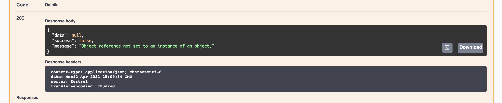
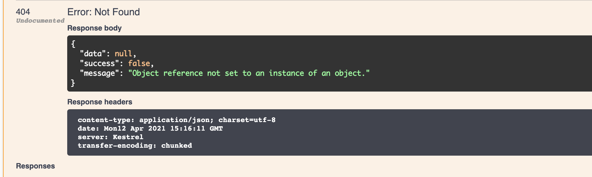

# La méthode `put`

## 1. Ajouter une entrée à l'interface `ICharacterService`

```cs
Task<SeriveResponse<GetCharacterDto>> UpdateCharacter(UpdateCharacterDto updatedCharacter);
```


## 2. Créer `UpdateCharacterDto.cs`

```cs
// Dtos/Character/UpdateCharacterDto.cs
using dotnet_rpg.Models;

namespace dotnet_rpg.Dtos.Character
{
    public class UpdateCharacterDto
    {
        public int Id { get; set; }
        public string Name { get; set; } = "Frodo";
        public int HitPoints { get; set; } = 100;
        public int Strength { get; set; } = 10;
        public int Defense { get; set; } = 10;
        public int Intelligence { get; set; } = 10;
        public RpgClass Class { get; set; } = RpgClass.Knight;
    }
}
```


## 3. On implémente la méthode dans `CharacterService`

On ajoute le mot clé `async`.

```cs
public async Task<ServiceResponse<GetCharacterDto>> UpdateCharacter(UpdateCharacterDto updatedCharacter)
{
    ServiceResponse<GetCharacterDto> serviceResponse = new();

    var character = characters.FirstOrDefault(c => c.Id == updatedCharacter.Id);

    character.Name = updatedCharacter.Name;
    character.HitPoints = updatedCharacter.HitPoints;
    character.Strength = updatedCharacter.Strength;
    character.Defense = updatedCharacter.Defense;
    character.Intelligence = updatedCharacter.Intelligence;
    character.Class = updatedCharacter.Class;

    serviceResponse.Data = _mapper.Map<GetCharacterDto>(character);

    return serviceResponse;
}
```

### Gérer les erreurs

```cs
public async Task<ServiceResponse<GetCharacterDto>> UpdateCharacter(UpdateCharacterDto updatedCharacter)
{
    ServiceResponse<GetCharacterDto> serviceResponse = new();

    try
    {
        var character = characters.FirstOrDefault(c => c.Id == updatedCharacter.Id);

        character.Name = updatedCharacter.Name;
        character.HitPoints = updatedCharacter.HitPoints;
        character.Strength = updatedCharacter.Strength;
        character.Defense = updatedCharacter.Defense;
        character.Intelligence = updatedCharacter.Intelligence;
        character.Class = updatedCharacter.Class;

        serviceResponse.Data = _mapper.Map<GetCharacterDto>(character);
    }
    catch (Exception ex)
    {

        serviceResponse.Success = false;
        serviceResponse.Message = ex.Message;
    }

    return serviceResponse;
}
```




## 4. Ajout d'une méthode dans le contrôleur

`Controllers/Character.cs`

```cs
[HttpPut]
public async Task<ActionResult<ServiceResponse<GetCharacterDto>>> UpdateCharacter(UpdateCharacterDto updatedCharacter) => Ok(await _characterService.UpdateCharacter(updatedCharacter));
```

### Modifier le contrôleur pour avoir un status `404`

```cs
// Controllers/Character.cs

[HttpPut]
public async Task<ActionResult<ServiceResponse<GetCharacterDto>>> UpdateCharacter(UpdateCharacterDto updatedCharacter)
{
    var response = await _characterService.UpdateCharacter(updatedCharacter);

    if (response.Data is null)
    {
        return NotFound(response);
    }

    return Ok(response);
}
```



