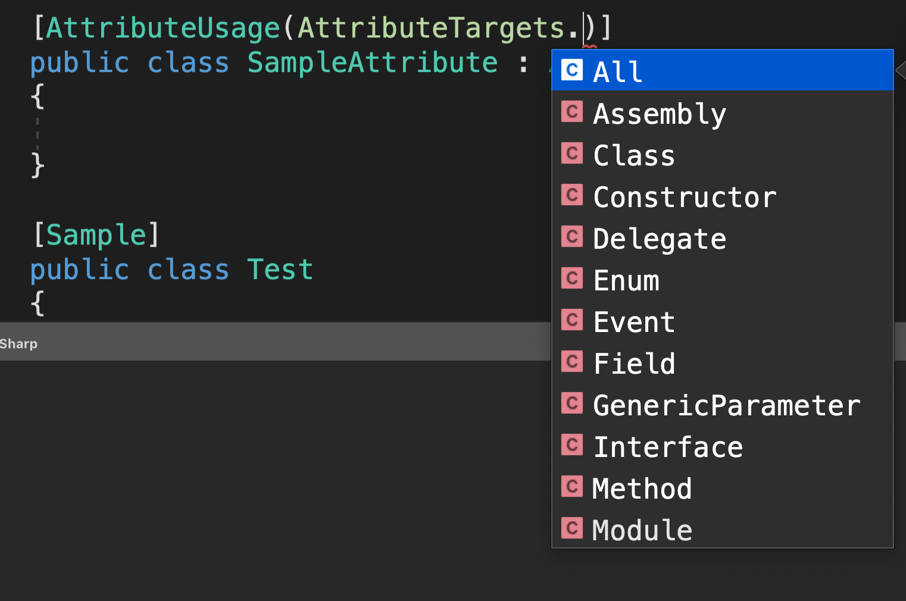
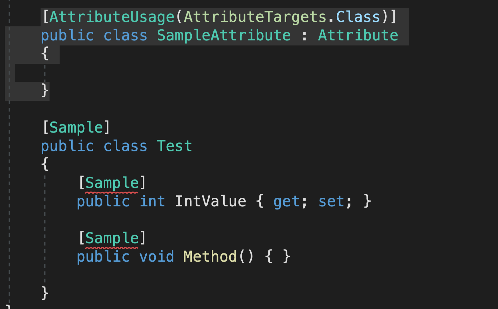

# AA Attributes

Un `attribute` est une classe.

```csharp
using System;

namespace AttributesInCSharp
{
    class Program
    {
        static void Main(string[] args)
        {
        }
    }

    public class SampleAttribute : Attribute
    {

    }

}
```

```csharp
[SampleAttribute]
public class Test
{
```

On peut simplifier la syntaxe en `[Sample]` en rognant la partie `Attribute`.

On peut décorer ce qu'on veut avec un `attribute` : classe, propriété, méthode.

```cs
[Sample]
public class Test
{
    [Sample]
    public int IntValue { get; set; }

    [Sample]
    public void Method() { }

}
```

On peut restreindre le champ d'un attribut avec un attribut : `AttributeUsage` :



```cs
[AttributeUsage(AttributeTargets.Class)]
public class SampleAttribute : Attribute
{

}
```



On peut mettre plusieurs cible (`targets`) grace à l'opérateur pipe `|`.

```csharp
[AttributeUsage(AttributeTargets.Class | AttributeTargets.Property | AttributeTargets.Method)]
public class SampleAttribute : Attribute
{

}
```

## `Attribute` de classe

```csharp
[AttributeUsage(AttributeTargets.Class)]
public class SampleAttribute : Attribute
{
    public string Name { get; set; }
    public int Version { get; set; }
}

[Sample(Name = "john", Version = 1)]
public class Test
{
    public int IntValue { get; set; }

    public void Method() { }

}
```

Les décorateurs fonctionnent avec la réflexion.

### Utilisation de `Linq`

```csharp
class Program
{
    static void Main(string[] args)
    {
        var types = from t in Assembly.GetExecutingAssembly().GetTypes()
            		where t.GetCustomAttributes<SampleAttribute>().count() > 0
            		select t;
    }
}
```

`Assembly` rassemble les informations sur le programme.

On récupère les types où un attribut `SampleAttribute` est placé.

```csharp
class Program
{
    static void Main(string[] args)
    {
        var types = from t in Assembly.GetExecutingAssembly().GetTypes()
            where t.GetCustomAttributes<SampleAttribute>().Count() > 0
            select t;
        foreach(var type in types)
        {
            Console.WriteLine(type.Name);
        }
    }
}

[AttributeUsage(AttributeTargets.Class)]
public class SampleAttribute : Attribute
{
    public string Name { get; set; }
    public int Version { get; set; }
}

[Sample(Name = "john", Version = 1)]
public class Test
{
    public int IntValue { get; set; }

    public void Method() { }

}

public class NoAttribute
{

}
```

```bash
Test
```

On récure juste la classe qui possède un attribut `Sample`.

On peut aussi grace à la réflexivité récupérer les noms de propriété de cette classe :

```csharp
foreach(var type in types)
{
    Console.WriteLine(type.Name);

    foreach (var p in type.GetProperties())
    {
        Console.WriteLine(p.Name);
    }
}
```

```bash
Test
IntValue
```
