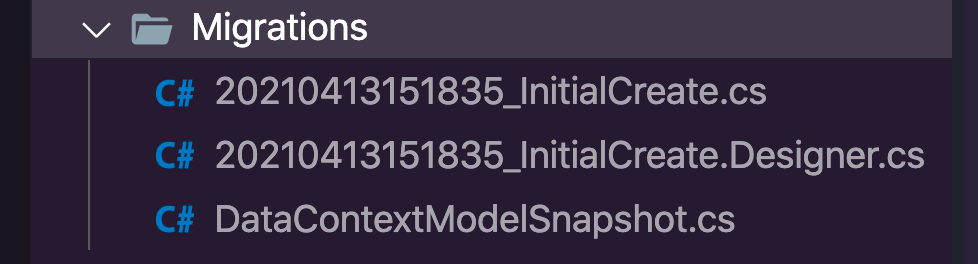
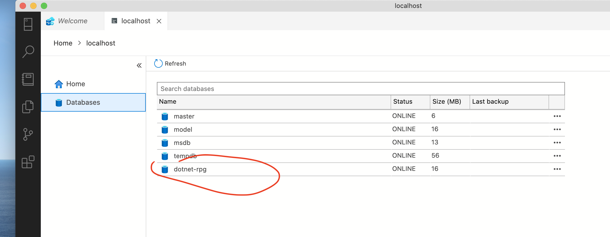

# 03 Migration

## `dotnet ef`

```bash
dotnet ef -h

Entity Framework Core .NET Command-line Tools 5.0.5

Usage: dotnet ef [options] [command]

Options:
  --version        Show version information
  -h|--help        Show help information
  -v|--verbose     Show verbose output.
  --no-color       Don't colorize output.
  --prefix-output  Prefix output with level.

Commands:
  database    Commands to manage the database.
  dbcontext   Commands to manage DbContext types.
  migrations  Commands to manage migrations.

Use "dotnet ef [command] --help" for more information about a command.
```

On va utiliser la commande `migrations` :

```bash
dotnet ef migrations add InitialCreate
```



On obtient deux méthodes : `Up` et ` Down`.

```cs
// xxx_InitialCreate.cs

public partial class InitialCreate : Migration
    {
        protected override void Up(MigrationBuilder migrationBuilder)
        {
            migrationBuilder.CreateTable(
                name: "Characters",
                columns: table => new
                {
                    Id = table.Column<int>(type: "int", nullable: false)
                        .Annotation("SqlServer:Identity", "1, 1"),
                    Name = table.Column<string>(type: "nvarchar(max)", nullable: true),
                    HitPoints = table.Column<int>(type: "int", nullable: false),
                    Strength = table.Column<int>(type: "int", nullable: false),
                    Defense = table.Column<int>(type: "int", nullable: false),
                    Intelligence = table.Column<int>(type: "int", nullable: false),
                    Class = table.Column<int>(type: "int", nullable: false)
                },
                constraints: table =>
                {
                    table.PrimaryKey("PK_Characters", x => x.Id);
                });
        }

        protected override void Down(MigrationBuilder migrationBuilder)
        {
            migrationBuilder.DropTable(
                name: "Characters");
        }
    }
```

Maintenant on lance la commande `database update` qui crée la base de données si elle n'existe pas :

```bash
dotnet ef database update
```



