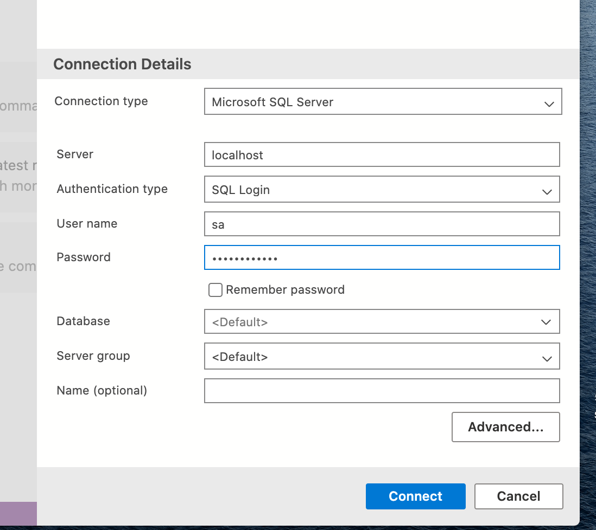

# `SQL Server` sur `Mac`

 ## Installer `Docker`


```bash
docker pull mcr.microsoft.com/mssql/server:2019-latest
```

```bash
docker run -e "ACCEPT_EULA=Y" -e "SA_PASSWORD=huk@r2Xmen99" \
   -p 1433:1433 --name sql_dotnet1 -h sql_dotnet_host1 \
   -v ~/Documents/SQLMount:/SQLMount\
   -d mcr.microsoft.com/mssql/server:2019-latest
   
80daa936f098a6dd5f8409d198f503371886395ada4d051def1dbc8df5dde649
```

#### ! le mot de passe ne doit pas être trop court (?) celui ci fonctionne

`-d` detached Docker tourne en background

`-p` port `1433`

`-e` environment variable

​	 `"ACCEPT_EULA=Y"` accepte la licence

​	`"SA_PASSWORD=huk@r2Xmen99"` : `S`ql `A`dmin = `SA` configure le mot de passe administrateur

`-v` on monte un volume où `SQL Server` : `~/Documents/SQLMount:/SQLMount` 

`--name` container name `sql_dotnet1`

`-h` container hostname `sql_dotnet_host1`

`mcr.microsoft.com/mssql/server:2019-latest` image désirée

```bash
docker ps

CONTAINER ID   IMAGE                                        COMMAND                  CREATED              STATUS          PORTS                    NAMES
99dba3cae1df   mcr.microsoft.com/mssql/server:2019-latest   "/opt/mssql/bin/perm…"   About a minute ago   Up 58 seconds   0.0.0.0:1433->1433/tcp   sql_dotnet1
```


On peut arrêter le conteneur via l'interface graphique.

## Installation de `Azure Data Studio`

On click sur `new connection`



Server : `localhost`

User name : `sa`

Password: `huk@r2Xmen99`

-> `connect`


