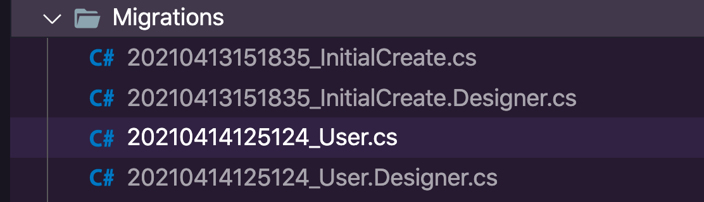
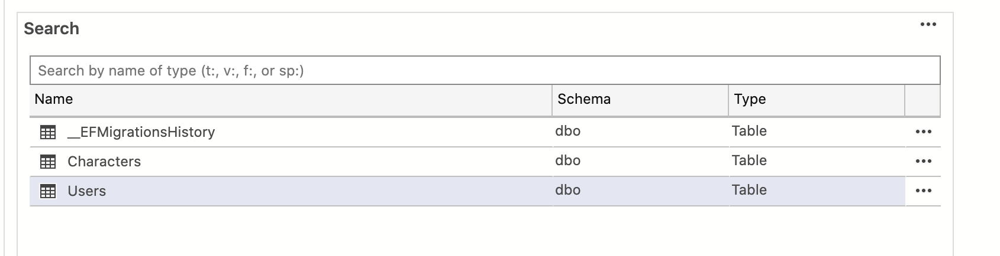
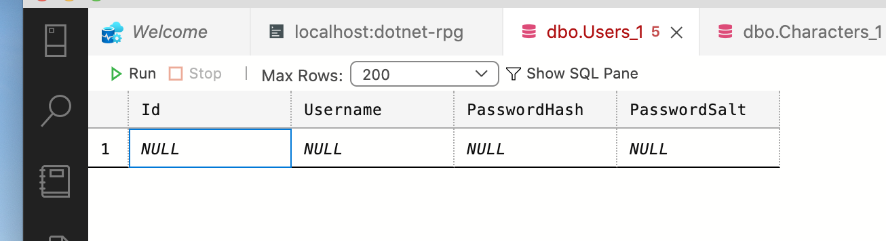

# 01 `User` Model

## Model

Dans le dossier `Model`, on crée une nouvelle classe `User.cs`.

```cs
namespace dotnet_rpg.Models
{
    public class User
    {
        public int Id { get; set; }
        public string Username { get; set; }
        public byte[] PasswordHash { get; set; }
        public byte[] PasswordSalt { get; set; }
    }
}
```


## `DbContext`

On doit maintenant ajouter un nouveau `DbSet` à notre `DataContext`.

```cs
// ...

public DbSet<User> Users { get; set; } 
```


## Créer la `migration` 

```bash
dotnet ef migrations add User
```



```cs
public partial class User : Migration
{
    protected override void Up(MigrationBuilder migrationBuilder)
    {
        migrationBuilder.CreateTable(
            name: "Users",
            columns: table => new
            {
                Id = table.Column<int>(type: "int", nullable: false)
                    .Annotation("SqlServer:Identity", "1, 1"),
                Username = table.Column<string>(type: "nvarchar(max)", nullable: true),
                PasswordHash = table.Column<byte[]>(type: "varbinary(max)", nullable: true),
                PasswordSalt = table.Column<byte[]>(type: "varbinary(max)", nullable: true)
            },
            constraints: table =>
            {
                table.PrimaryKey("PK_Users", x => x.Id);
            });
    }

    protected override void Down(MigrationBuilder migrationBuilder)
    {
        migrationBuilder.DropTable(
            name: "Users");
    }
}
```


## Mettre à jour la base de données

```bash
dotnet ef database update
```





(Azure Data Studio)