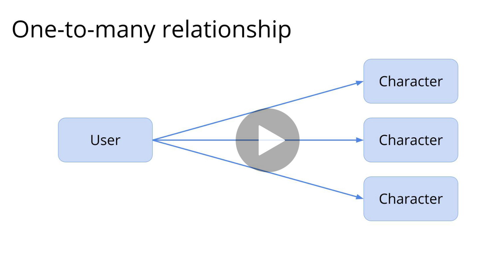
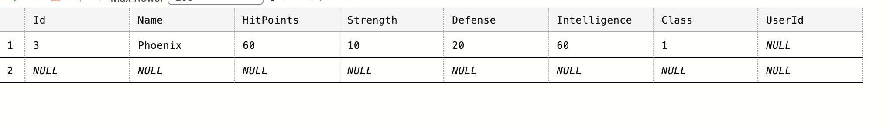

# 02 Relation entre `User` et `Character`


## One To Many



### Modifier les `Models`

On va modifier notre modèle pour lui ajouter une liste de `Character` :

```cs
// Model/User.cs
// ...
public List<Character> Characters { get; set; }
```

On doit aussi ajouter un `User` dans `Character` :

```cs
// Model/Character.cs

// ...
public User User { get; set; }
```


### Créer une migrations

```bash
dotnet ef migrations add UserCharacterRelationship
```

```cs
public partial class UserCharacterRelationship : Migration
{
    protected override void Up(MigrationBuilder migrationBuilder)
    {
        migrationBuilder.AddColumn<int>(
            name: "UserId",
            table: "Characters",
            type: "int",
            nullable: true);

        migrationBuilder.CreateIndex(
            name: "IX_Characters_UserId",
            table: "Characters",
            column: "UserId");

        migrationBuilder.AddForeignKey(
            name: "FK_Characters_Users_UserId",
            table: "Characters",
            column: "UserId",
            principalTable: "Users",
            principalColumn: "Id",
            onDelete: ReferentialAction.Restrict);
    }

    protected override void Down(MigrationBuilder migrationBuilder)
    {
        migrationBuilder.DropForeignKey(
            name: "FK_Characters_Users_UserId",
            table: "Characters");

        migrationBuilder.DropIndex(
            name: "IX_Characters_UserId",
            table: "Characters");

        migrationBuilder.DropColumn(
            name: "UserId",
            table: "Characters");
    }
}
```

Une colonne est créée dans la table `Characters` ainsi qu'un `index` et qu'une `Foreign Key`.

`onDelete: ReferentialAction.Restrict` signifie qu'on ne peut pas supprimer un `User` s'il possède encore un `Character`.

On peut aussi avoir `Referential.Cascade`, ce qui signifie que tous les `Characters` d'un `User` seront supprimés si le `User` est supprimé.


### Mettre à jour la base de données

```bash
dotnet ef database update
```



