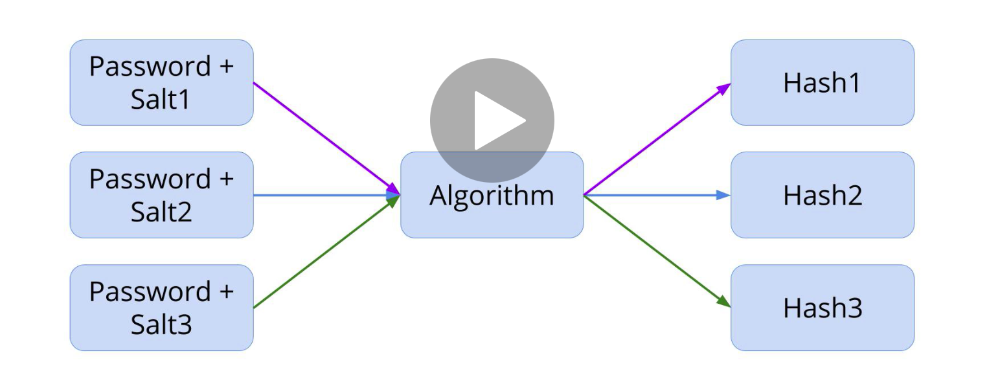
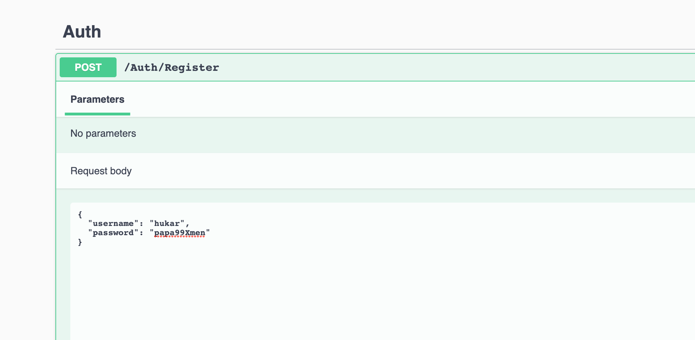
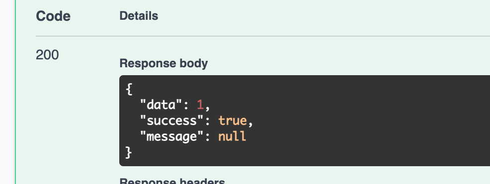
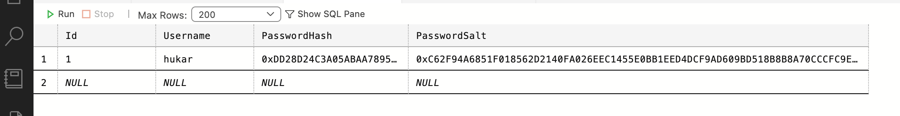
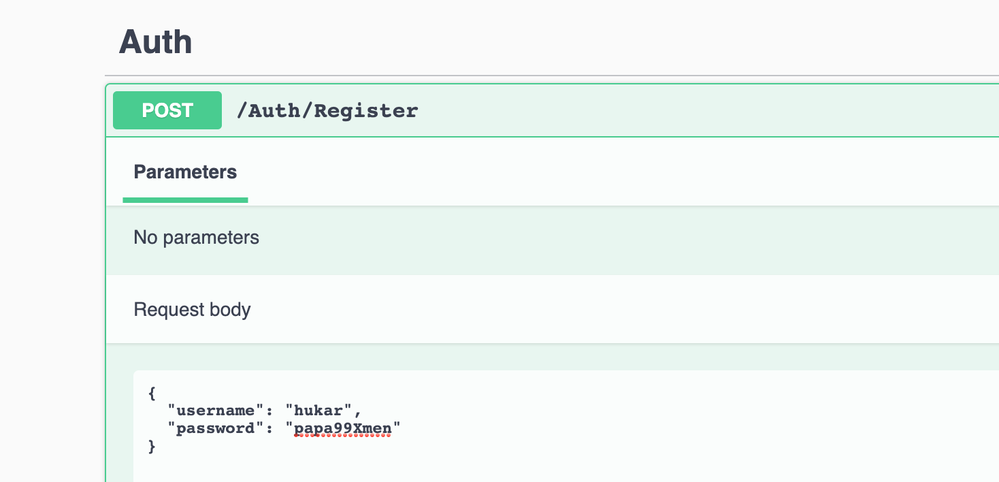

# 03 Enregistrement : `Register`



L'utilisation d'un mot de passe et d'un algorithme de hashage n'est pas suffisant, on doit aussi utilisé un `salt`, c'est à dire une séquence unique aléatoire de caractère pour s'assurer que chaque `hash` est bien unique et irreversible.


## Repository Pattern

Pour implémenter l'authentification on utilise le pattern `Repository`.


## Implémentation

Dans le dossier `Data` on crée une nouvelle interface `IAuthRepository`.

```cs
using System.Threading.Tasks;
using dotnet_rpg.Models;

namespace dotnet_rpg.Data
{
    public interface IAuthRepository
    {
        Task<ServiceResponse<int>> Register(User user, string password);
        Task<ServiceResponse<string>> Login(string username, string password);
        Task<bool> UserExists(string username);
    }
}
```

Et on implémente cette interface avec la classe `AuthRepository`

```cs
using System.Threading.Tasks;
using dotnet_rpg.Models;

namespace dotnet_rpg.Data
{
    public class AuthRepository : IAuthRepository
    {
        private readonly DataContext _context;
        
        public AuthRepository(DataContext context)
        {
            _context = context;
        }
        
        public Task<ServiceResponse<string>> Login(string username, string password)
        {
            // ...
        }

        public async Task<ServiceResponse<int>> Register(User user, string password)
        {
            // ...
        }

        public Task<bool> UserExists(string username)
        {
            // ...
        }
    }
}
```

On a besoin de `DataContext`, on va l'injecter dans le constructeur.


## Création de la méthode `CreatePasswordHash`

#### ! Un `hash` est une empreinte quasi-unique et irréversible.

On peut créer un `hash` mais on ne peut pas revenir depuis le `hash` au `password`.

```cs
private void CreatePasswordHash(string password, out byte[] passwordHash, out byte[] passwordSalt)
{
    using (var hmac = new System.Security.Cryptography.HMACSHA512())
    {
        passwordSalt = hmac.Key;
        passwordHash = hmac.ComputeHash(System.Text.Encoding.UTF8.GetBytes(password));
    }
}
```


### Mot clé `out` pour les paramètres

Modifie la valeur d'une variable à l'extérieur du scope de la fonction :

```cs
int a = 1;

int b = 1;

public void mutateNb(out int a, out int b)
{
    a = 6;

    b = 7;
}

Console.WriteLine($"{a} - {b}"); // 1 - 1

mutateNb(out a, out b);

Console.WriteLine($"{a} - {b}"); // 6 - 7
```

On peut déclarer directement la variable dans l'entrée des paramètres de la fonction :

```cs
public void mutateNb(out int a, out int b)
{
    a = 6;

    b = 7;
}

mutateNb(out int a, out int b);

Console.WriteLine($"{a} - {b}"); // 6 - 7
```


## Implémentation de `UserExists`

```cs
public async Task<bool> UserExists(string username)
{
    if(await _context.Users.AnyAsync(u => u.Username.ToLower().Equals(username.ToLower())))
    {
        return true;
    }
    
    return false;
}
```

Cette méthode peut peut-être être utilisée dans le contrôleur, c'est mieux de la garder `public`.


## Implémentation de la méthode `Register`

```cs
public async Task<ServiceResponse<int>> Register(User user, string password)
{
    ServiceResponse<int> response = new();

    if (await UserExists(user.Username))
    {
        response.Success = false;
        response.Message = "User already exists";

        return response;
    }

    CreatePasswordHash(password, out byte[] passwordHash, out byte[] passwordSalt);

    user.PasswordHash = passwordHash;
    user.PasswordSalt = passwordSalt;

    _context.Users.Add(user);
    await _context.SaveChangesAsync();


    response.Data = user.Id;
    return response;
}
```

- On test si le `user` existe déjà.
- On crée un `hash` et un `salt` pour le `password`.

- On les associe au `user`.
- On ajoute le `user` au `_context`.
- On renvoie l'`Id` du `user`.


## Création de `AuthController`

```cs
namespace dotnet_rpg.Controllers
{
    [ApiController]
    [Route("[controller]")]
    public class AuthController : ControllerBase
    {
        private readonly IAuthRepository _authRepo;
        
        public AuthController(IAuthRepository authRepo)
        {
            _authRepo = authRepo;
        }
        
        [HttpPost("Register")]
        public async Task<ActionResult<ServiceResponse<int>>> Register(UserRegisterDto request)
        {
            var response = await _authRepo.Register(
            	new User { Username = request.Username },
                request.Password
            );
            
            if(!response.Succes)
            {
                return BadRequest(response);
            }
            
            return Ok(response);
        }
    }
}
```


## Création de `UserRegisterDto`

On crée le dossier `User` dans `Dtos`.

`Dtos/User/UserRegisterDto.cs`

```cs
namespace dotnet_rpg.Dtos.User
{
    public class UserRegisterDto
    {
        public string Username { get; set; }
        publid string Password { get; set; }
    }
}    
```


## Enregistrer `AuthRepository`

On doit enregistrer notre `repository` d'authentification dans `Startup.cs`

```cs
// ...
services.AddScoped<IAuthRepository, AuthRepository>();
```


## Test dans `Swagger`





On voit que je reçois l'`Id` `1`.



Dans la `BDD` le `password` n'est pas sauvegardé *en clair* mais juste son `hash` et son `salt`.

### Si on essaie de s'enregistrer avec le même `Username`




Deux utilisateurs ne peuvent pas avoir le même `username`.