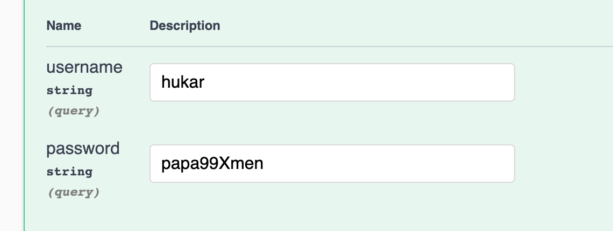
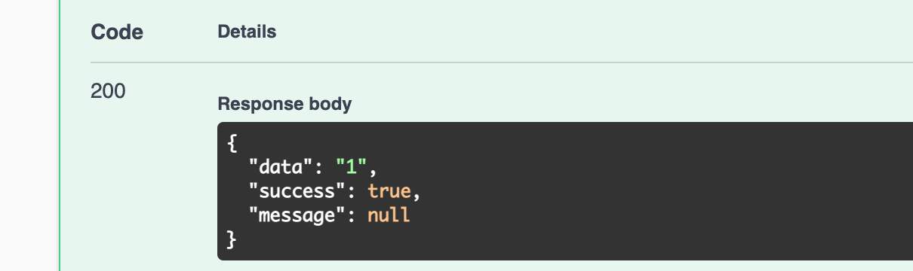
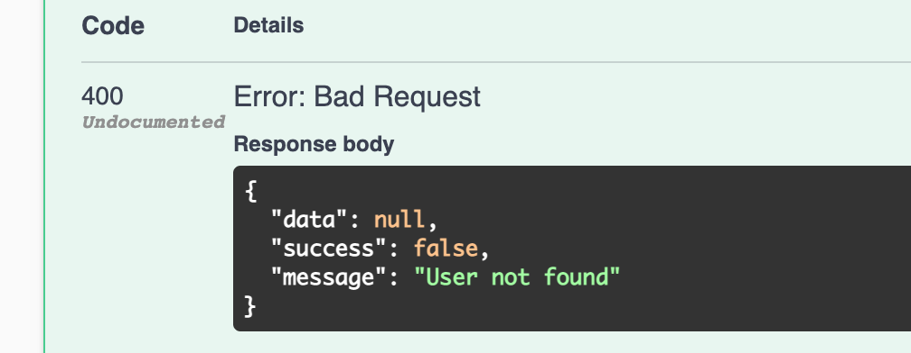
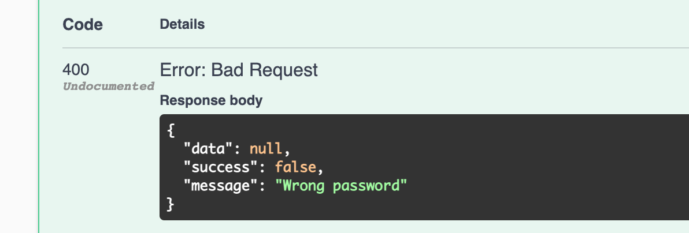

# 04 `Login`

C'est ici qu'on va vérifier le mot de passe.


## Création de la méthode `VerifyPasswordHash`

On va recalculer un `hash` grâce au password envoyé et au `passwordSalt` de la `BDD`, 

puis on va le comparer avec la valeur du `passwordHash` de la base de données.

On est toujours dans `Data/AuthRepository.cs`

```cs
private bool VerifyPasswordHash(string password, byte[] passwordHash, byte[] passwordSalt)
{
	using(var hmac = new System.Security.Cryptography.HMACSHA512(passwordSalt))
    {
        var computedHash = hmac.ComputeHash(System.Text.Encoding.UTF8.GetBytes(password));
        
        for(int i = 0, i < computedHash.length; i++)
        {
            if(computedHash[i] != passwordHash[i])
            {
                return false;
            }
        }
        
        return true;
    }
}
```

On passe `passwordSalt` au constructeur de `hmac`.

`HMACSHA512()` dans la méthode `CreatePasswordHash` va générer un `PasswordSalt`.

`HMACSHA512(passwordSalt)` va utiliser le `passwordSalt` pour générer le `hash` dans `VerifyPasswordHash`.

Dans un cas on demande de générer le `passwordSalt` (création) dans l'autre cas on lui donne pour vérifier.

On va comparer les valeurs avec une boucle `for` `byte` par `byte`.

## Implémentation de la méthode `Login`

On ajoute le mot clé `async`

```cs
public async Task<ServiceResponse<string>> Login(string username, string password)
{
    var response = new ServiceRespons<string>();
    
    var user = await _context.Users.FirstOrDefaultAsync(u => u.Username.ToLower().Equals(username.ToLower()));
    
    if(user is null)
    {
        response.Success = false;
        response.Message = "User not found";  // voire note
    }
    else if(!VerifyPasswordHash(password, userPasswordHash, user.PasswordSalt))
    {
        response.Success = false;
        response.Message = "Wrong password";
    }
    else
    {
        response.Data = user.Id.ToString()
    }
    
    return response;
}
```

Cette méthode renverra un `token`, pour l'instant elle renvoie l'`Id`.

On doit ensuite retrouver le `user` avec le `username` donné.

> **note** : (??)
>
> Envoyer `User not found` comme message est plus sécurisé que de dévoiler que le mot de passe est incorrecte.
>
> Si le mot de passe est incorrecte, cela signifie que cet `user` est bien enregistré dans le système.
>
> C'est une information qu'on veut éviter de donner à l'attaquant potentiel.
>
> C'est pour cela qu'il vaut mieux utiliser le message `User not found` même si c'est le mot de passe qui est incorrecte. 


## Création d'un `UserLoginDto`

`Dtos/UserLoginDto.cs`

```cs
namespace dotnet_rpg.Dtos.User
{
    public class UserLoginDto
    {
        public string Username { get; set; }
        public string Password { get; set; }
    }
}
```


## Ajout d'une méthode `Login` au contrôleur

```cs
[HttpPost("Login")]
public async Task<ActionResult<ServiceResponse<string>>> Login(UserLoginDto request)
{
    var response = await _authRepo.Login(request.Username, request.Password);
    
    if(!response.Success)
    {
        return BadRequest(response);
    }
    
    return Ok(response);
}
```


## Test dans `Swagger`





De même un mauvais `username` ou un mauvais `password` envoie les réponses suivantes :





