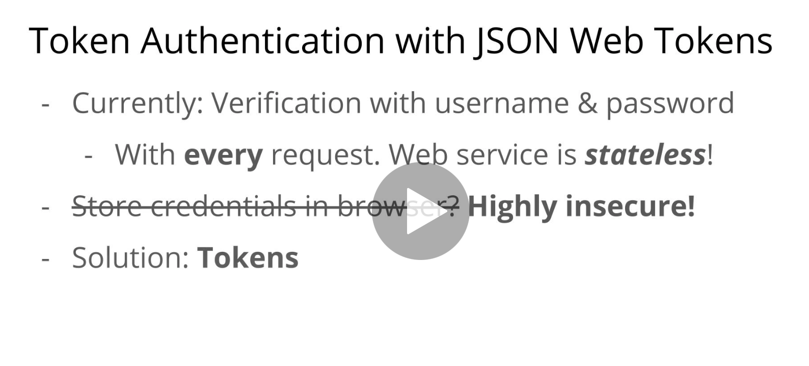
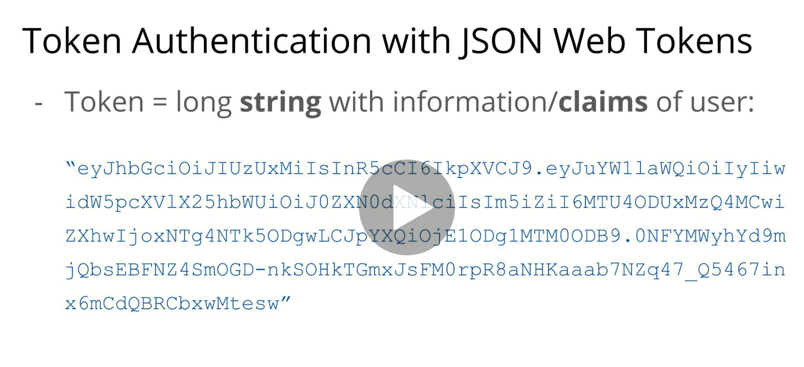
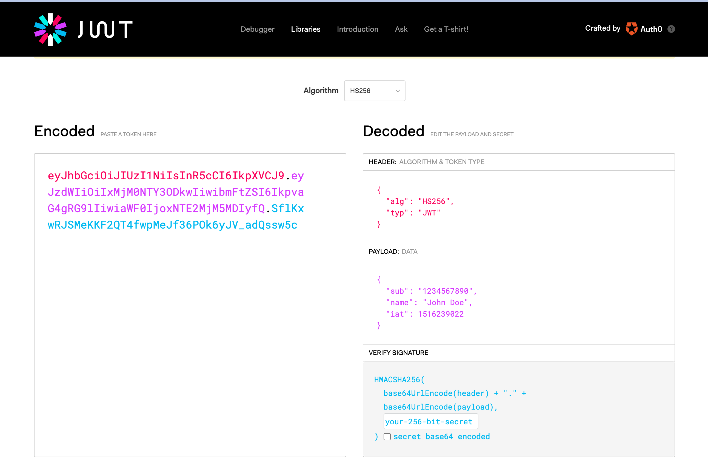

# 05 `Token`

## Théorie

Une `API REST` est `stateless`, c'est à dire qu'elle ne sait pas qui lui demande quelque chose.

Pour lancer une fonction demandant une authentification, il faudrait à chaque fois re-authentifier la personne.

Pour éviter cela on pourrait utiliser le stockage du navigateur, mais ce n'est pas assez sécurisé.

C'est là qu'interviennent les `Token`.

Le `token` est une chaîne de caractères contenant les informations et les droits sur l'utilisateur.

Il est généré grâce à la  `private key`.

Il est difficile à immiter ou à voler.

Il a une date d'expiration.

Comme il ne contient pas d'information compréhensible, il peut être stocké sur le navigateur et envoyé avec chaque requête.

Il authentifie la personne.

Le service peut renvoyer un nouveau `token` : `refresh token`.

## Jason Web Token : `JWT`

On a trois parties :

1. Le `header` informant de l'algorithme utilisé et du type de `token`
2. Le `payload` avec les `claims` (vlé propres à `JWT`) et d'autres infos
3. La signature réalisée avec la concaténation en `base64` du `header` et du `payload` et un `secret` le tout généré avec un algorithme de **hashage** `HMACSHA256`

