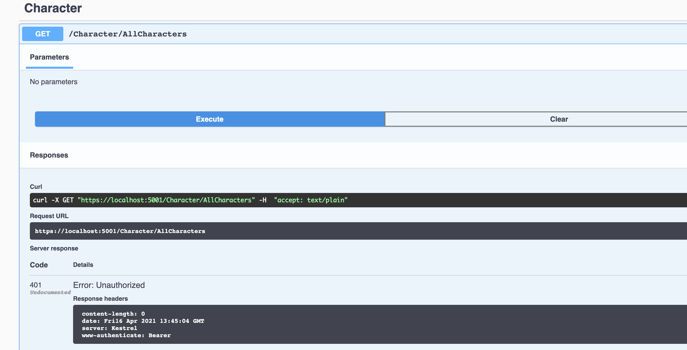
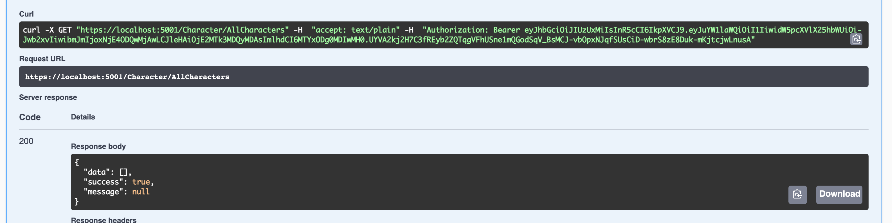
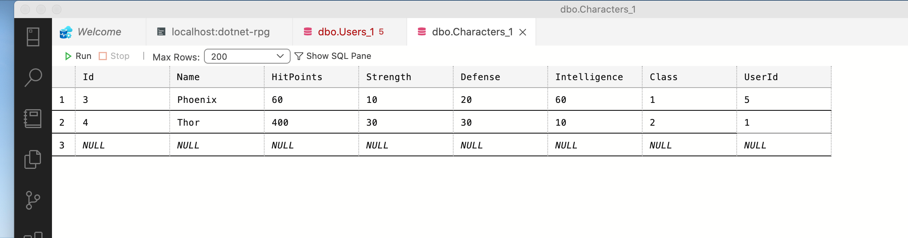
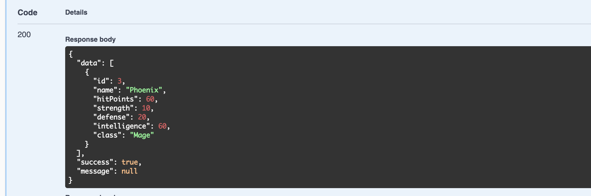

# 07 `middleware` d'authentification


## Ajouter un `scheme` d'authentification `Startup.cs`

Il faut installer le package `Microsoft.AspNetCore.Authentication.JwtBearer` :

```bash
dotnet add package Microsoft.AspNetCore.Authentication.JwtBearer --version 5.0.5
```

```cs
// dotnet-rpg.csproj

<Project Sdk="Microsoft.NET.Sdk.Web">

  <PropertyGroup>
    <TargetFramework>net5.0</TargetFramework>
    <RootNamespace>dotnet_rpg</RootNamespace>
  </PropertyGroup>

  <ItemGroup>
    <PackageReference Include="AutoMapper.Extensions.Microsoft.DependencyInjection" Version="8.1.1" />
    <PackageReference Include="Microsoft.AspNetCore.Authentication.JwtBearer" Version="5.0.5" />
    <PackageReference Include="Microsoft.EntityFrameworkCore.Design" Version="5.0.5">
      <IncludeAssets>runtime; build; native; contentfiles; analyzers; buildtransitive</IncludeAssets>
      <PrivateAssets>all</PrivateAssets>
    </PackageReference>
    <PackageReference Include="Microsoft.EntityFrameworkCore.Sqlite" Version="5.0.5" />
    <PackageReference Include="Microsoft.EntityFrameworkCore.SqlServer" Version="5.0.5" />
    <PackageReference Include="Swashbuckle.AspNetCore" Version="5.6.3" />
  </ItemGroup>

</Project>
```


```cs
using Microsoft.AspNetCore.Authentication.JwtBearer;
using Microsoft.IdentityModel.Tokens;

// ...

services.AddAuthentication(JwtBearerDefaults.AuthenticationScheme)
    .AddJwtBearer(options => {
        options.TokenValidationParameters = new TokenValidationParameters
        {
            ValidateIssuerSigningKey = true,
            IssuerSigningKey = new SymmetricSecurityKey(
                System.Text.Encoding.ASCII.GetBytes(
                    Configuration.GetSection("AppSettings:Token").Value
                )
            ),
            ValidateIssuer = false,
            ValidateAudience = false

        };
    });
}
```

C'est l'étape préliminaire pour pouvoir utiliser le `middleware` d'authentification

`System.Text.Encoding.ASCII` peut être remplacé par `System.Text.Encoding.UTF8`.

## Ajouter le `middleware` dans la méthode `Configure`

```cs
app.UseRouting();

app.UseAuthentication();

app.UseAuthorization();

app.UseEndpoints(endpoints =>
                 {
                     endpoints.MapControllers();
                 });
```

Le mettre avant `app.UseAuthorization`.

Respecter l'ordre ci-dessus.


## Attribut `[Authorize]`

On peut maintenant utiliser l'attribut `[Authorize]` dans notre contrôleur :

`Controllers/Character.cs`

```cs
using Microsoft.AspNetCore.Authorization;
// ...

namespace dotnet_rpg.Controllers
{
    [Authorize]
    [ApiController]
    [Route("[controller]")]
    public class CharacterController : ControllerBase
    {
		// ...
```




On voit dans `Swagger` que l'`API` nécessite maintenant d'être autorisé par le service pour être utilisée.


## User `Claims`

`ControllerBase` offre un objet `user`  de type `ClaimPrincipal`.

```cs
// Summary:
//     Gets the System.Security.Claims.ClaimsPrincipal for user associated with the
//     executing action.
public ClaimsPrincipal User { get; }
```


```cs
[HttpGet("AllCharacters")]
public async Task<ActionResult<ServiceResponse<List<GetCharacterDto>>>> GetAllCharacters()
{
    Console.WriteLine(user);
    return Ok(await _characterService.GetAllCharacters())
}
```

```
System.Security.Claims.ClaimsPrincipal
```

On va récupérer l'`Id` du `user` :

```cs
[HttpGet("AllCharacters")]
public async Task<ActionResult<ServiceResponse<List<GetCharacterDto>>>> GetAllCharacters()
{
    int id = int.Parse(User.Claims.FirstOrdefault(c => c.Type == ClaimTypes.NameIdentifier).value);
    return Ok(await _characterService.GetAllCharacters())
}
```

```
User id : 5
```

Cela va nous permettre de ne renvoyer que les `characters` associés à cet `id`.

## Modification de `ICharacterService` et `CharacterService`

On va modifier notre service pour qu'il renvoie les `characters` associés à un `userId` :

`ICharacterService`

```cs
public interface ICharacterService
{
    Task<ServiceResponse<List<GetCharacterDto>>> GetAllCharacters(int userId);
    // ...
```


`CharacterService`

```cs
public async Task<ServiceResponse<List<GetCharacterDto>>> GetAllCharacters(int userId)
{
    ServiceResponse<List<GetCharacterDto>> serviceResponse = new();

    var dbCharacters = await _context.Characters.Where(c => c.User.Id == userId).ToListAsync();

    serviceResponse.Data = dbCharacters.Select(c => _mapper.Map<GetCharacterDto>(c)).ToList();

    return serviceResponse;
}
```

On utilise la clause `Where` : `Where(c => c.User.Id == userId)`.

## Modification du contrôleur `Controllers/Character.cs`

```cs
[HttpGet("AllCharacters")]
public async Task<ActionResult<ServiceResponse<List<GetCharacterDto>>>> GetAllCharacters()
{
    int userId = int.Parse(User.Claims.FirstOrDefault(c => c.Type == ClaimTypes.NameIdentifier).Value);
    Console.WriteLine($"User id : {userId}");

    return Ok(await _characterService.GetAllCharacters(userId));
}
```



On ne récupère rien, car il n'y a pas encore de relation entre les `characters` et les `users`.

On va en créer en base de données :



On ré-exécute `Swagger` :



