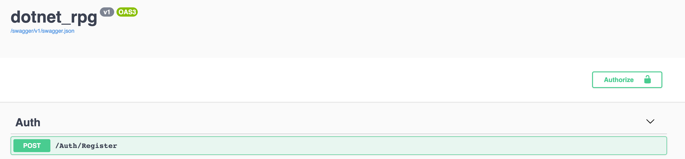
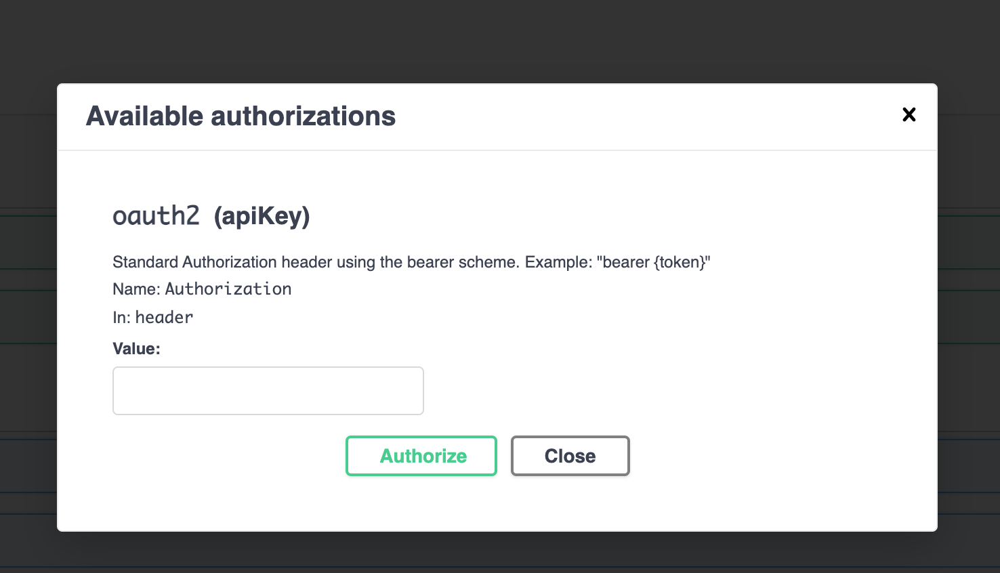
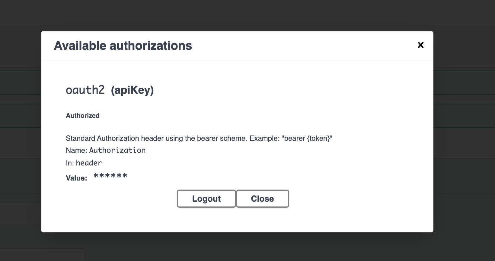
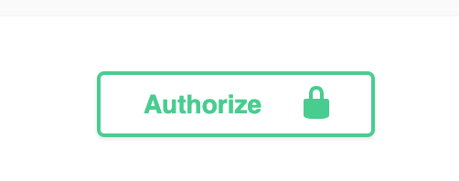
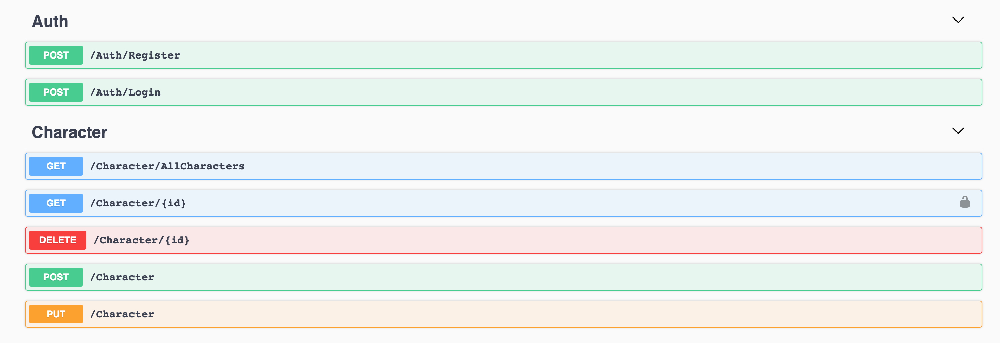
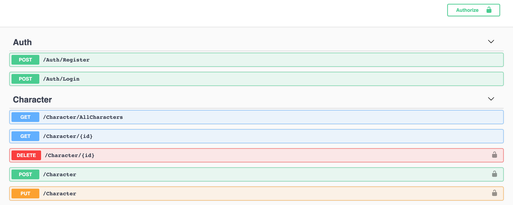
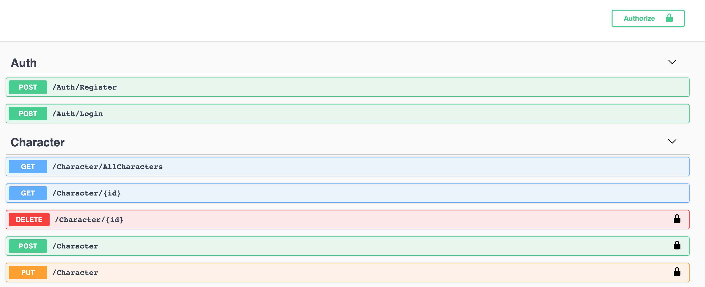

# 08 Tester les méthodes sécurisées avec `Swagger`

On doit ajouter un `package` :

```bash
dotnet add package Swashbuckle.AspNetCore.Filters --version 7.0.2
```

`dotnet-rpg.csproj`

```cs
		// ...
		<PackageReference Include="Swashbuckle.AspNetCore" Version="5.6.3" />
    	<PackageReference Include="Swashbuckle.AspNetCore.Filters" Version="7.0.2" />
    </ItemGroup>

</Project>
```

On peut maintenant l'utiliser dans `Startup.cs` :

```cs
using Swashbuckle.AspNetCore.Filters;
// ...

services.AddSwaggerGen(c =>
{
    c.SwaggerDoc("v1", new OpenApiInfo { Title = "dotnet_rpg", Version = "v1" });
    c.AddSecurityDefinition("oauth2", new OpenApiSecurityScheme
    {
        Description = "Standard Authorization header using the bearer scheme. Example: \"bearer {token}\"",
        In = ParameterLocation.Header,
        Name = "Authorization",
        Type = SecuritySchemeType.ApiKey
    });
    c.OperationFilter<SecurityRequirementsOperationFilter>();
});
```

Cela va ajouter un bouton et une boîte de dialogue ayant comme nom `oath2`, la description renseignée et va ajouter 

l'`ApiKey` dans le `header` de la requête (`IN = `).


## `Swagger` authorize

Avec cette configuration un nouveau bouton apparaît dans `Swagger` :



En cliquant dessus on peut insérer notre `token` :



On voit le `Name` et la `Description` renseignés plus haut.

Il suffit de récupérer son `token` en s'authentifiant, et de le coller ici : `bearer <token>`



On a maintenant un joli cadenas fermé :



Il est de nouveau possible d'utiliser l'`API` avec `Swagger`.


## Attribut `[Authorize]`

On peut plutôt mettre cet attribut seulement sur les méthodes désirées :

```cs
[Authorize]
[HttpGet("{id}")]
public async Task<ActionResult<ServiceResponse<GetCharacterDto>>> Get(int id)
{
    // ...
```



On a le petit cadenas que sur une méthode.


## Attribut `[AllowAnonymous]`

On peut aussi autoriser seulement une méthode avec l'attribut `[AllowAnonymous]`.

```cs
[Authorize]
[ApiController]
[Route("[controller]")]
public class CharacterController : ControllerBase
{
    private readonly ICharacterService _characterService;
    public CharacterController(ICharacterService characterService)
    {
        _characterService = characterService;
    }

    [AllowAnonymous]
    [HttpGet("AllCharacters")]
    public async Task<ActionResult<ServiceResponse<List<GetCharacterDto>>>> GetAllCharacters()
        => Ok(await _characterService.GetAllCharacters());


    [AllowAnonymous]
    [HttpGet("{id}")]
    public async Task<ActionResult<ServiceResponse<GetCharacterDto>>> Get(int id)
    {
```

Ici l'ensemble du contrôleur demande d'être autorisé, **sauf** `GetAllCharacters` et `Get`.





