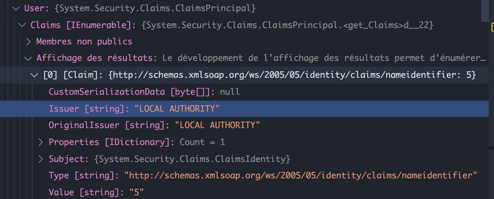
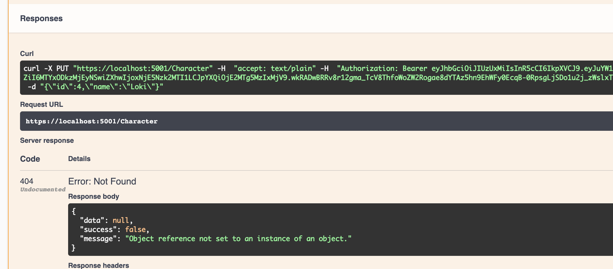
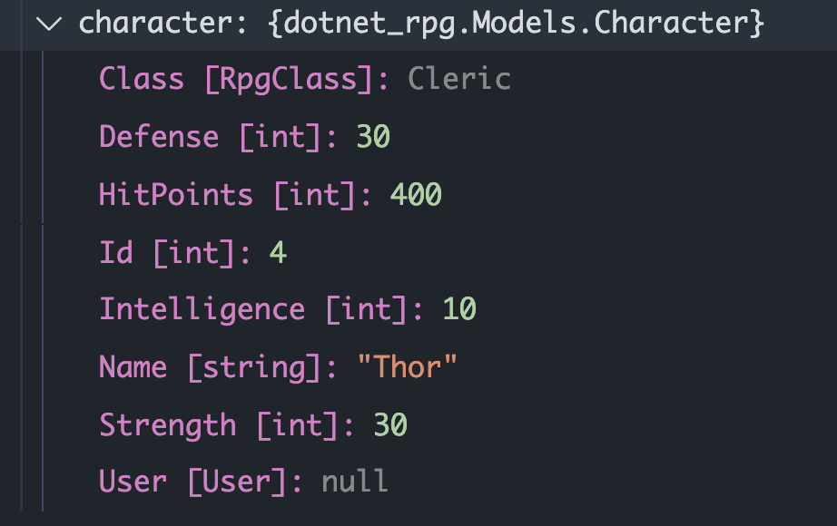
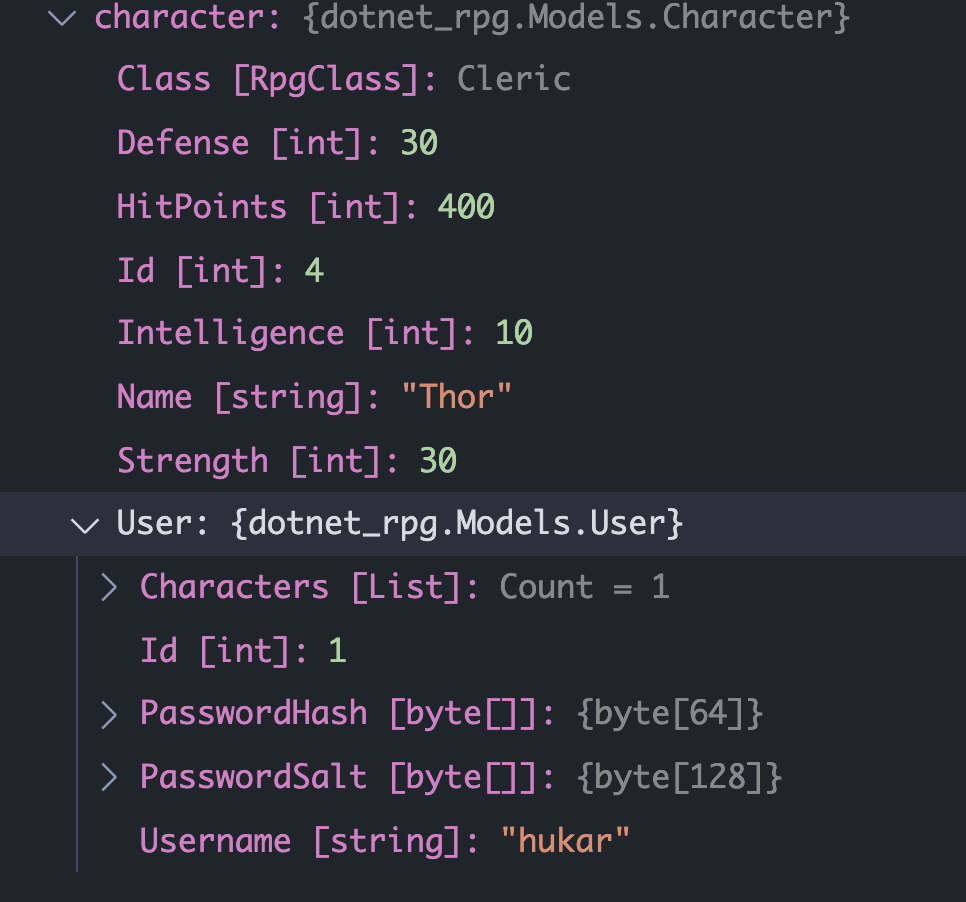
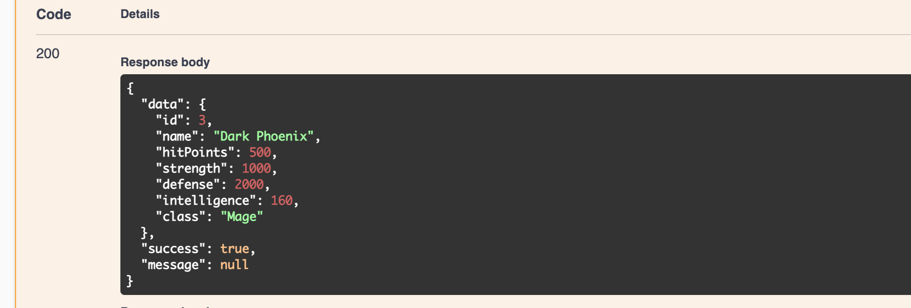

# 01 Relation entre le `user` et les `characters`

On a besoin de savoir qui est le `user` dans chacunes des méthodes du `Controller/Character.cs`.

## `HttpContext`

Dans un contrôleur, on peut accéder à la propriété `HttpConetxt :`


Dans ce context on a accès au `User` identifié :



On y accédait précédemment grâce à :

```cs
User.Claims.FirstOrdefault(c => c.Type == ClaimTypes.NameIdentifier).value
```


## `HttpContextAccessor`

On va utiliser `HttpContextAccessor` pour accéder au `userId` de puis les contrôleur.

Au lieu de passer le `userId` à chaque méthode, on va injecter le service `HttpContext` au constructeur de notre `CharacterService`.

On va enregistrer le service :

`Startup.cs`

On va enregistrer le service `HttpContextAccessor` , il permet d'accéder à `HttpContext` an dehors d'un contrôleur.

```cs
using Microsoft.AspNetCore.Http;
// ...
services.AddSingleton<IHttpContextAccessor, HttpContextAccessor>();
```

On va injecter le service via le constructeur dans `CharacterService` :

```cs
private readonly IMapper _mapper;
private readonly DataContext _context;
private readonly IHttpContextAccessor _httpContextAccessor;

public CharacterService(IMapper mapper, DataContext context, IHttpContextAccessor httpContextAccessor)
{
    _httpContextAccessor = httpContextAccessor;
    _context = context;
    _mapper = mapper;
}
```

Comme on aura besoin souvent de `userId`, on va créer une méthode dans `CharacterService` :

```cs
private int GetUserId => int.Parse(_httpContextAccessor.HttpContext.User.FindFirstValue(ClaimTypes.NameIdentifier));
```

> `string ClaimsPrincipal.FindFirstValue(string claimType)`
> Renvoie la valeur de la première `claim` du type spécifié, sinon `null` si la `claim` n'est pas présente.


## Modification (encore !) de la méthode `GetAllCharacters`

On ne passe plus le `userId` en paramètre.

```cs
public async Task<ServiceResponse<List<GetCharacterDto>>> GetAllCharacters()
{
    ServiceResponse<List<GetCharacterDto>> serviceResponse = new();

    var userId = GetUserId;

    var dbCharacters = await _context.Characters.Where(c => c.User.Id == userId).ToListAsync();

    serviceResponse.Data = dbCharacters.Select(c => _mapper.Map<GetCharacterDto>(c)).ToList();

    return serviceResponse;
}
```


### On modifie `ICharacterService`

```cs
public interface ICharacterService
{
    Task<ServiceResponse<List<GetCharacterDto>>> GetAllCharacters();
    // ...
```

### On modifie aussi le contrôleur

```cs
// Controller/Character.cs

[HttpGet("AllCharacters")]
public async Task<ActionResult<ServiceResponse<List<GetCharacterDto>>>> GetAllCharacters() => Ok(await _characterService.GetAllCharacters());
```


## Modification de la méthode `AddCharacter`

On veut ajouter le `user` identifié au nouveau `character` enregistré.

```cs
public async Task<ServiceResponse<List<GetCharacterDto>>> AddCharacter(AddCharacterDto newCharacter)
{
    ServiceResponse<List<GetCharacterDto>> serviceResponse = new();

    var character = _mapper.Map<Character>(newCharacter);
    character.User = await _context.Users.FirstOrDefaultAsync(u => u.Id == GetUserId);

    _context.Characters.Add(character);

    await _context.SaveChangesAsync();

    serviceResponse.Data = await _context.Characters
        .Select(c => _mapper.Map<GetCharacterDto>(c))
        .ToListAsync();

    return serviceResponse;
}
```

#### `character.User = await _context.Users.FirstOrDefaultAsync(u => u.Id == GetUserId);`

On a en retour la liste de tous les `characters`, on voudrait seulement ceux du `user` identifié.

On doit ajouter une clause `Where` à `_context.Characters` :

```cs
public async Task<ServiceResponse<List<GetCharacterDto>>> AddCharacter(AddCharacterDto newCharacter)
{
    ServiceResponse<List<GetCharacterDto>> serviceResponse = new();

    var character = _mapper.Map<Character>(newCharacter);
    character.User = await _context.Users.FirstOrDefaultAsync(u => u.Id == GetUserId);

    _context.Characters.Add(character);

    await _context.SaveChangesAsync();

    serviceResponse.Data = await _context.Characters
        .Where(c => c.User.Id == GetUserId)
        .Select(c => _mapper.Map<GetCharacterDto>(c))
        .ToListAsync();

    return serviceResponse;
}
```


Ici on a bien **juste** la liste de `character` du `user` identifié.


## Modification de GetCharacterByID

Il suffit d'ajouter une condition au prédicat passé à `FirstOrDefaultAsync` :

#### `c => c.Id == id && c.User.Id == GetUserId`

```cs
public async Task<ServiceResponse<GetCharacterDto>> GetCharacterById(int id)
{
    ServiceResponse<GetCharacterDto> serviceResponse = new();

    var dbCharacter = await _context.Characters.FirstOrDefaultAsync(c => c.Id == id && c.User.Id == GetUserId);

    serviceResponse.Data = _mapper.Map<GetCharacterDto>(dbCharacter);

    return serviceResponse;
}
```


## Modification de `DeleteCharacter`

On doit tester si le `character` est `null`.

```cs
public async Task<ServiceResponse<List<GetCharacterDto>>> DeleteCharacter(int id)
{
    ServiceResponse<List<GetCharacterDto>> serviceResponse = new();

    try
    {
        var character = await _context.Characters.FirstOrDefaultAsync(c => c.Id == id && c.User.Id == GetUserId);

        if (character is not null)
        {
            _context.Characters.Remove(character);

            await _context.SaveChangesAsync();

            serviceResponse.Data = _context.Characters
                .Where(c => c.User.Id == GetUserId)
                .Select(c => _mapper.Map<GetCharacterDto>(c)).ToList();
        }
        else
        {
            serviceResponse.Success = false;
            serviceResponse.Message = "Character not found";
        }
    }
    catch (Exception ex)
    {

        serviceResponse.Success = false;
        serviceResponse.Message = ex.Message;
    }

    return serviceResponse;
}
```


## Modification de `UpdateCharacter`

On peut tester si le `character` a bien un `userId` identique au `user` identifier.

Si ce n'est pas le cas on renvoie un `success = false`.

```cs
public async Task<ServiceResponse<GetCharacterDto>> UpdateCharacter(UpdateCharacterDto updatedCharacter)
{
    ServiceResponse<GetCharacterDto> serviceResponse = new();

    try
    {
        var character = await _context.Characters.FirstOrDefaultAsync(c => c.Id == updatedCharacter.Id);

        if (character.User.Id == GetUserId)
        {
            character.Name = updatedCharacter.Name;
            character.HitPoints = updatedCharacter.HitPoints;
            character.Strength = updatedCharacter.Strength;
            character.Defense = updatedCharacter.Defense;
            character.Intelligence = updatedCharacter.Intelligence;
            character.Class = updatedCharacter.Class;

            await _context.SaveChangesAsync();

            serviceResponse.Data = _mapper.Map<GetCharacterDto>(character);
        }
        else
        {
            serviceResponse.Success = false;
            serviceResponse.Message = "Character not found";
        }

    }
    catch (Exception ex)
    {

        serviceResponse.Success = false;
        serviceResponse.Message = ex.Message;
    }

    return serviceResponse;
}
```

On obtient une exception de type `Null Pointer Exception` :



En utilisant le `debugger` de `VSCode` on s'aperçoit que `character.User` est à `null`.



`Entity Framework` ne lie pas le `User` au `character`.

Cela fonctionne pourtant dans `FirstOrDefault` :

```cs
var character = await _context.Characters
    .FirstOrDefaultAsync(c => c.Id == id && c.User.Id == GetUserId);
```

Mais ici c'est en fait parceque `FirstOrDefault` a accès à tout le `context`.

On doit ajouter une clause `Include` :

```cs
var character = await _context.Characters
                    .Include(c => c.User)
                    .FirstOrDefaultAsync(c => c.Id == updatedCharacter.Id);
```

Maintenant on a bien le `User` :



Maintenant cela fonctionne :



#### ! Bien penser à ajouter la clause `Include`

