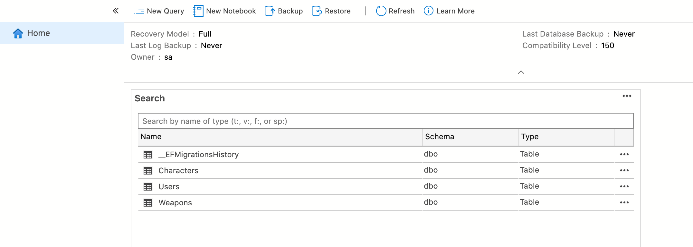

# 02 relation `one-to-one`


## Créer le `Model`

`Models/Weapon.cs`

```cs
namespace dotnet_rpg.Models
{
    public class Weapon
    {
 		public int Id { get; set; }
        public string Name { get; set; }
        public int Damage { get; set; }
        public Character Character { get; set; }
    }
}
```

Et dans `Models/Character.cs` on va ajouter une `Weapon` :

```cs
public class Character
{
    // ...
    
    public Weapon weapon { get; set; }
}
```


## L'ajouter au `context`

Dans `Data/DataContext`

```cs
public class DataContext : DbContext
{
    // ...
    
    public DbSet<Weapon> Weapons { get; set; } 
}
```


## Créer la `Migration`

```bash
dotnet ef migrations add Weapon
```

On obtient une erreur :

```bash
The dependent side could not be determined for the one-to-one relationship between 'Character.Weapon' and 'Weapon.Character'. To identify the dependent side of the relationship, configure the foreign key property. If these navigations should not be part of the same relationship, configure them independently via separate method chains in 'OnModelCreating'. See http://go.microsoft.com/fwlink/?LinkId=724062 for more details.
```

> Le côté dépendant n'a pas pu être déterminé pour la relation `one to one` entre `Character.Weapon` et `Weapon.Character`. Pour identifier le côté dépendant de la relation, configurez la propriété de la **clé étrangère**. Si ces navigations ne doivent pas faire partie de la même relation, configurez-les indépendamment via des chaînes de méthodes distinctes dans `OnModelCreating`. Voir http://go.microsoft.com/fwlink/?LinkId=724062 pour plus de détails.
>
> Traduit avec www.DeepL.com/Translator (version gratuite)

On doit déclaré explicitement une `foreign key`.

La `weapon` ne peut pas exister sans que le `character` associé existe.

Par contre le `character` existe même si la `weapon` n'existe pas.

On doit ajouter l'`Id` du `character` dans `weapon`.

Par convention de nommage, `characterId` `EF Core` sait que c'est une clé étrangère.

```cs
public class Weapon
{
    // ...
    public Character Character { get; set; }
    
    public int characterId { get; set; }
}
```

Maintenant l'ajout de `migration` fonctionne.


On peut trouver la relation ainsi que le comportement pour une suppression dans `XXX_weapon.designer.cs` :

```cs
modelBuilder.Entity("dotnet_rpg.Models.Weapon", b =>
                    {
                        b.HasOne("dotnet_rpg.Models.Character", "Character")
                            .WithOne("Weapon")
                            .HasForeignKey("dotnet_rpg.Models.Weapon", "characterId")
                            .OnDelete(DeleteBehavior.Cascade)
                            .IsRequired();

                        b.Navigation("Character");
                    });

modelBuilder.Entity("dotnet_rpg.Models.Character", b =>
                    {
                        b.Navigation("Weapon");
                    });
```

Le comportement au `Delete` est `cascade`.


## Exécuter la migration

```bash
dotnet ef database update
```

