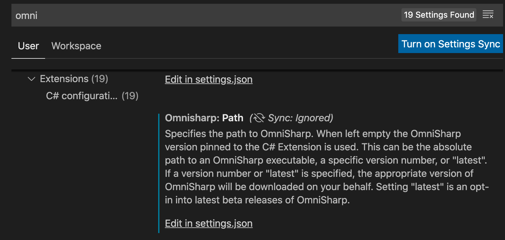
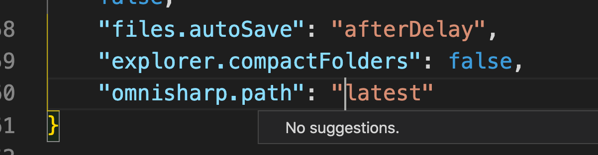

# Problèmes rencontrés

## Passage à `.net 5`

Problème dans VSCode avec `Omnisharp` :

```bash
[fail]: OmniSharp.MSBuild.ProjectManager
        Attempted to update project that is not loaded: /Users/kar/Documents/programmation/dotnet/DatingApp/API/API.csproj
```

### Résolution

il faut régler la verion d'`omnisharp path` dans `VSCode` à `"latest"`.





Cela n'a pas résolu le problème, j'ai supprimé `Visual Studio Mac` :

https://docs.microsoft.com/en-us/visualstudio/mac/uninstall?view=vsmac-2019#visual-studio-for-mac-and-xamarin-script
