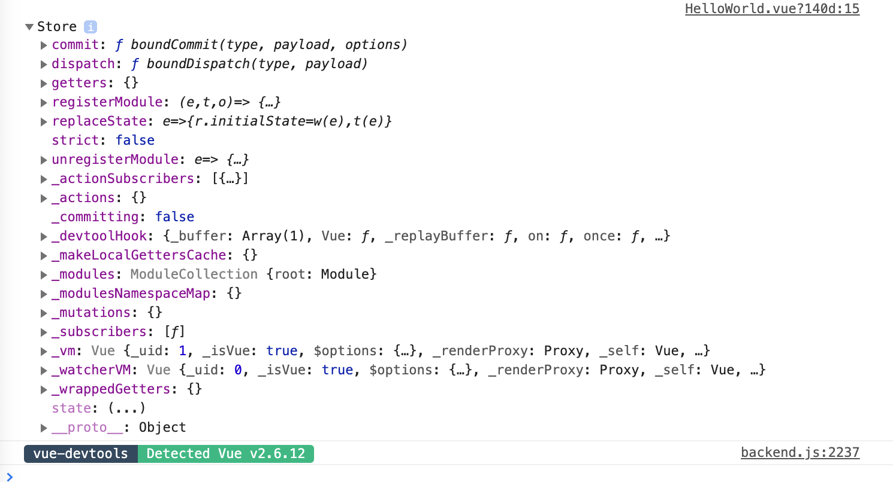
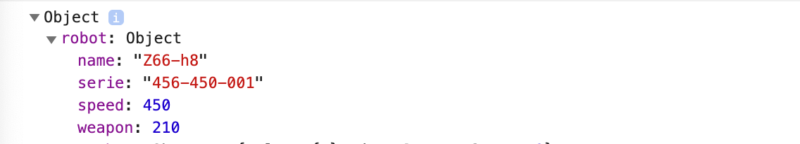

# 00 `Vuex` (refresh)

5 acteurs :

1. le `component` qui appelle une `action` (`dispatch`) ou utilise un `getter`
2. Une `action` qui peut être asynchrone et appelle une `mutation` (`commit`)
3. Une `mutation` qui est synchrone et qui modifie le `state`
4. Le `state` qui est la seule source de vérité de l'application
5. Les `getters` qui utilise le `state` pour retourner des données au `component`


## `$store`

la propriété `$store` est accessible dans tous les composants :

```vue
<script>
export default {
  name: 'HelloWorld',
  mounted() {
    console.dir(this.$store)
  }
}
</script>
```



Et le `$store` contient le `state` (dans `__proto__`) :

```js
export default {
  name: 'HelloWorld',
  mounted() {
    console.dir(this.$store.state)
  }
}
```



## Récupérer le `state`

On récupère le `state` dans un `computed` :

```js
computed: {
    robot() {
      return this.$store.state.robot
    }
  }
```


## `mapState`

On peut utiliser `mapState`  pour simplifier l'écriture :

```js
import { mapState } from 'vuex'

export default {
  computed: mapState({ rbt: 'robot' })
}
```

Utiliser un objet permet de renommer les propriété du `state`.

Si on n'a pas besoin de renommer les propriété on peut utiliser un tableau :

```js
computed: mapState(['robot'])
```

`computed` prend un unique objet, si on a besoin de créer d'autre propriété calculée on utilise l'opérateur de décomposition `...` :

```js
computed: {
  ...mapState(['robot']),
    randomNumber() {
    return Math.floor(Math.random() * 10)
  }
}
```

```html
<h4>Robot {{randomNumber}}</h4>
<p v-for="(value, key) in robot" :key="key">{{key}} -> {{value}}</p>
```


## Getters

Si on a besoin de modifier le `state` pour obtenir une valeur et que plusieurs composants se servent de cette valeur, il est intéressant de centraliser la logique de transformation dans les `getters`.

dans le `store/index.js`

```js
export default new Vuex.Store({
  state: {
    robot: {
      name: "Z66-h8",
      serie: "456-450-001",
      speed: 450,
      weapon: 210,
    },
    weapons: [
      'missile',
      'laser',
      'rocket',
      'power punch',
    ]
  },
  getters: {
    nbOfWeapons: state => state.weapons.length,
    firstWeapon: state => state.weapons[0],
    lastWeapon: (state, getters) => state.weapons[getters.nbOfWeapons - 1]
  },
})
```

Pour récupérer un `getters` dans un `getters` :

```js
(state, getters) => state.weapons[getters.nbOfWeapon - 1]
```

Dans le composant :

```js
computed: {
    ...mapState(['robot']),
    nbOfWeapons() {
      return this.$store.getters.nbOfWeapons
    },
    firstWeapon() {
      return this.$store.getters.firstWeapon
    },
    lastWeapon() {
      return this.$store.getters.lastWeapon
    }
  }
```


## `getters` dynamique

On peut vouloir passer un numéro d'ordre ou une `id` à un `getter`.

Dans le `store/index.js`

```js
import { mapState, mapGetters } from 'vuex'

getters: {
    nbOfWeapons: state => state.weapons.length,
    getRankedWeapon: (state, getters) => rank => {
      if(rank < 0 || rank >= getters.nbOfWeapons) {
        return "Bull Shiiit"
      }
      return state.weapons[rank]
    }
  },
```

On renvoie non pas une valeur mais une fonction avec un argument.

Utilisation dans le composant :

```js
computed: {
    getRankedWeapon() {
      return this.$store.getters.getRankedWeapon
    }
  }
```

```html
<ul>
  <li>weapon -1 : {{getRankedWeapon(-1)}}</li>
  <li>weapon 2 : {{getRankedWeapon(2)}}</li>
  <li>weapon 7 : {{getRankedWeapon(7)}}</li>
</ul>
```


## `mapGetters`

On va simplifier la syntaxe avec `mapGetters` :

Si on veut modifier le nom des `getters` dans son composant on utilise un objet :

```js
import { mapState, mapGetters } from 'vuex'

computed: {
    ...mapState(['robot']),
    ...mapGetters({
      nb: "nbOfWeapons",
      firstOne: "firstWeapon",
      lastChance: "lastWeapon",
      numeroW: "getRankedWeapon"
    })
  }
```

```html
<ul>
  <li>nb of weapons : {{nb}}</li>
  <li>first weapons : {{firstOne}}</li>
  <li>last weapons : {{lastChance}}</li>
</ul>

<ul>
  <li>weapon -1 : {{numeroW(-1)}}</li>
  <li>weapon 2 : {{numeroW(2)}}</li>
  <li>weapon 7 : {{numeroW(7)}}</li>
</ul>
```

Sinon le plus court est d'utilisé un tableau :

```js
 computed: {
    ...mapState(['robot']),
    ...mapGetters(["nbOfWeapons", "firstWeapon", "lastWeapon", "getRankedWeapon"])
  }
```


## Les `mutations`

Elles modifie le `state` et sont obligatoirement **synchrone**.

On peut voire les mutations comme une sorte d'événement, le nom de la mutation étant le nom de l'événement.

On `commit` une mutation :

```js
/* Store */

mutations: {
    incrementByTenSpeed: state => {
      state.robot.speed += 10
    },
    decrementByTenSpeed: state => {
      if (state.robot.speed > 0) {
        state.robot.speed -= 10
      }
    }
  },
```

On pourrait utiliser une fonction anonyme classique car une `mutation` ne renvoie rien, il faut donc garder les accolades.

### `$store.commit('maMutation')`

```js
/* Component */

methods: {
    incrementSpeed() {
      this.$store.commit('incrementByTenSpeed')
    },
    decrementSpeed() {
      this.$store.commit('decrementByTenSpeed')
    }
  },
```

```html
<p>
  <button @click="incrementSpeed">Increment Speed</button> | 
  <button @click="decrementSpeed">Decrement Speed</button>
</p>
```


### Mutation avec `payload` : `$store.commit('maMutation', valeur)`

```js
/* Store */

mutations: {
    incrementSpeed: (state, payload) => {
      state.robot.speed += payload
    },
    decrementSpeed: (state, payload) => {
      if (state.robot.speed > 0) {
        state.robot.speed -= payload
      }
    }
  },
```

```js
/* Component */

methods: {
    incrementSpeed() {
      this.$store.commit('incrementSpeed', 15)
    },
    decrementSpeed() {
      this.$store.commit('decrementSpeed', 5)
    }
  },
```

