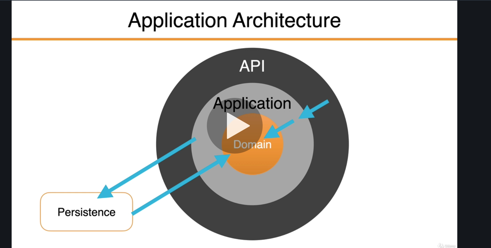
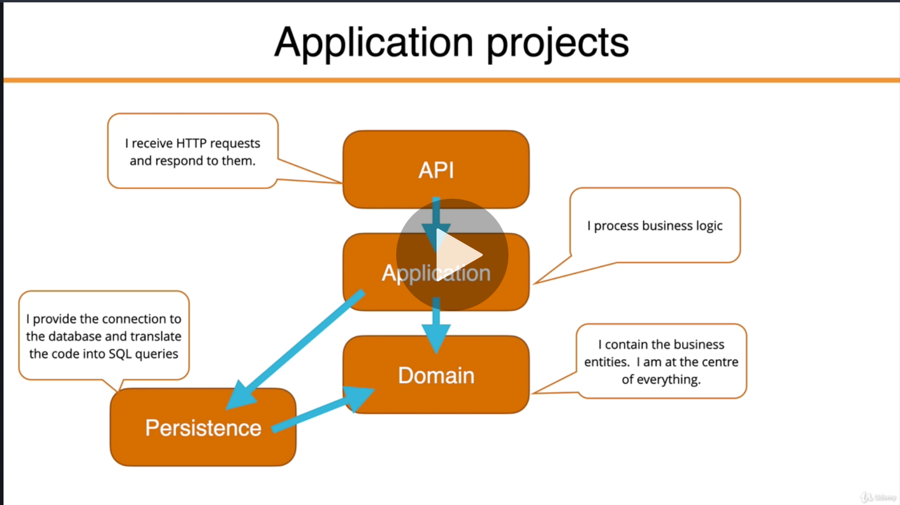
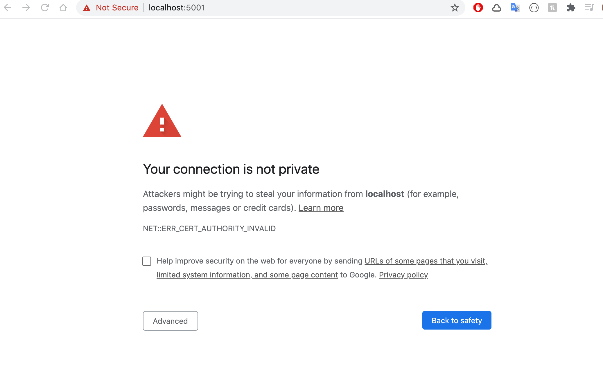
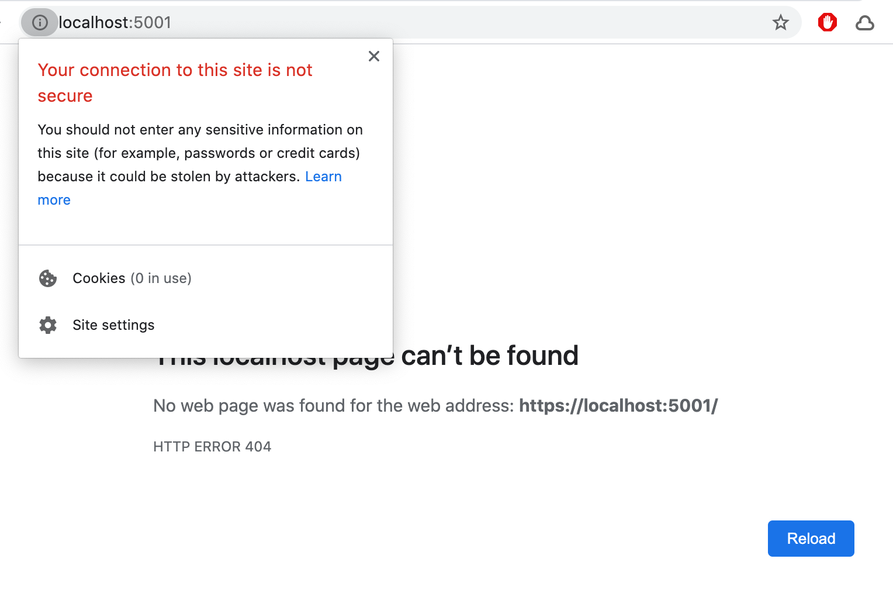
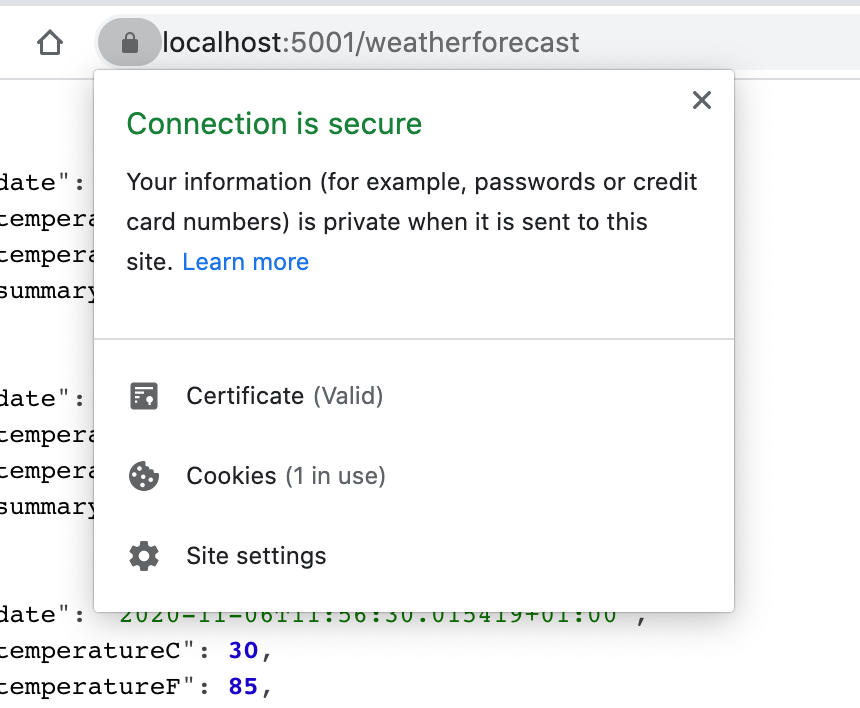

# 00. `HTTPS`

## Walking Skeleton

C'est une petite implémentation du système. Elle n'a pas besoin d'avoir l'architecture finale, mais juste relier les principales fonctionnalités entre elles.

`L'architecture` et les `fonctionnalités` peuvent évoluer ainsi en parallèle.

**Alistair Cockburn** (agile)


## Architecture



Le `Domain` (les `entities`) est au centre de l'architecture, il n'a pas de dépendances.



Chaque projet a sa propre responsabilité.


## Création du projet

### Créer la solution (le conteneur )

```bash
mkdir Reactivities && cd Reactivities

dotnet new sln
```

### Créer les différents projets
```bash

dotnet new webapi -n API

dotnet new classlib -n Application

dotnet new classlib -n Domain

dotnet new classlib -n Persistence

## Ou bien

for p in Application Domain Persistence
do
dotnet new classlib -n $p
done
```

### Ajouter les projets à la solution
```bash

# Ajouter les projets à la solution
dotnet sln add API Domain Application Persistence
# ou
dotnet sln add * ## **/ de manière récursive

dotnet sln -list
```

```
Projet(s)
---------
Application/Application.csproj
Domain/Domain.csproj
Persistence/Persistence.csproj
API/API.csproj
```

### Créer les références (les dépendances)

```bash
dotnet add API reference Application
dotnet add Application reference Domain Persistence
dotnet add Persistence reference Domain
```


## Lancement de l'application

```bash
dotnet run -p API/
```

Il demande la première fois un accès au `keychain`.

En `HTTPS` on obtient l'écran suivant :





## Générer un certificats

```bash
🦄 DatingApp dotnet dev-certs https --trust

Trusting the HTTPS development certificate was requested. If the certificate is not already trusted we will run the following command:
'sudo security add-trusted-cert -d -r trustRoot -k /Library/Keychains/System.keychain <<certificate>>'
This command might prompt you for your password to install the certificate on the system keychain.
Password:
A valid HTTPS certificate is already present.
```



Voila maintenant le certificat est trouvé.