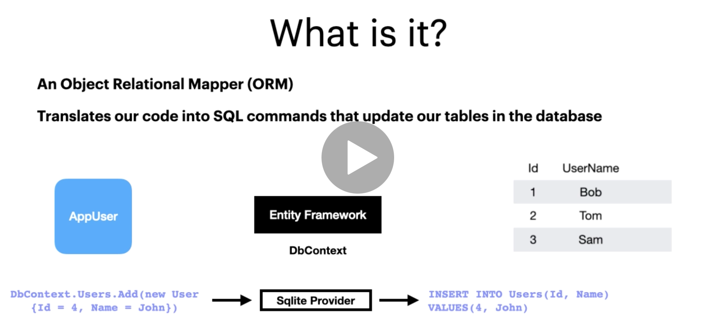

# 02. entities

Une `entity` est un abstraction d'une entité du monde physique.

`Entity Framework` utilise des conventions de nomage pour reconnaitre certain éléments :

## Création de la classe `Activity` dans le projet `Domain`

```csharp
using System;

namespace Domain
{
    public class Activity
    {
        public Guid Id { get; set; }
        public string Title { get; set; }
        public DateTime Date { get; set; }
        public string Description { get; set; }
        public string Category { get; set; }
        public string City { get; set; }
        public string Venue { get; set; }

    }
}
```

`Guid Id` générer l'identifiant unique côté code plutôt que côté base de données, permet au code de ne pas avoir à attendre que la base de données ai généré et renvoyé cet `Id`.


## Introduction à `Entity Framework`



`Entity Framework` est un pont entre les classes du `Domain` et la base de données.

Les classes du `Domain` sont les `entities`.

La classe la plus importante de `Entity Framewoork` est `DbContext`.

`Entity Framework` offre des méthodes qui abstraient le `SQL` nécessaire.

Le provider ici `Sqlite Provider` va traduire dans le langage `SQL` compatible avec la `DB`.

## Fonctionnalités d'`EF`

- Utilisation de `Linq` pour les requêtes.
- Guette les changements.
- Sauve les objets en `BD`.
- Utilise automatiquement la concurrence.
- Utilise les transactions.
- Possède du cache (si une même requête est soumise deux fois, conserve les données dans un cache).
- Intègre des conventions (comme pour `Id`).
- Ces conventions sont configurables.
- Permet de créer des migrations (`code first`) pour créer des `DB` à partir du code pré-existant.

## Installer `EF`

On doit ajouter `EF Core` à la couche `Persistence`

```bash
dotnet add Persistence package Microsoft.EntityFrameworkCore.Sqlite --version 5.0.4
```

Attention que la version de `EF` corresponde bien à celle de `.net`.

`Persistence.csproj`

```csharp
<Project Sdk="Microsoft.NET.Sdk">

  <ItemGroup>
    <ProjectReference Include="..\Domain\Domain.csproj" />
  </ItemGroup>

  <ItemGroup>
    <PackageReference Include="Microsoft.EntityFrameworkCore.Sqlite" Version="5.0.4" />
  </ItemGroup>

  <PropertyGroup>
    <TargetFramework>net5.0</TargetFramework>
  </PropertyGroup>

</Project>

```

