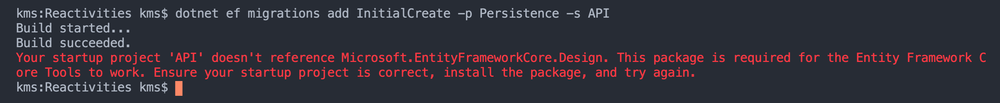
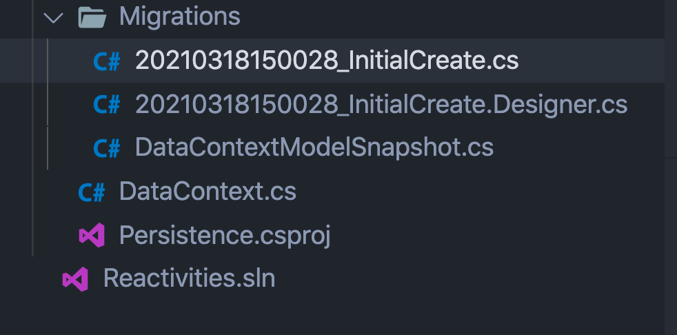

# 04. Migrations

## Créer une migration

Il faut d'abord éteindre le serveur.

### On check si l'outil de migration `dotnet-ef` est bien installé

```bash
dotnet tool list --global

ID de package                    Version      Commandes                  
-------------------------------------------------------------------------
dotnet-aspnet-codegenerator      5.0.2        dotnet-aspnet-codegenerator
```

Je n'ai que `dotnet-aspnet-codegenerator` d'installé.

On va sur `nuget.org` pour rechercher l'outil.

On obtient la ligne de commande suivante :

```bash
dotnet tool install --global dotnet-ef --version 5.0.4

Vous pouvez appeler l'outil à l'aide de la commande suivante : dotnet-ef
L'outil 'dotnet-ef' (version '5.0.4') a été installé correctement.

dotnet tool list --global

ID de package                    Version      Commandes                  
-------------------------------------------------------------------------
dotnet-aspnet-codegenerator      5.0.2        dotnet-aspnet-codegenerator
dotnet-ef                        5.0.4        dotnet-ef 
```

#### ! de bien prendre le même numéro de version (`5`) que `.net`.

### Mettre à jour `dotnet-ef`

```bash
dotnet tool update --global dotnet-ef --version 5.0.4
```


### Créer une `migration`

Pour avoir les infos sur `dotnet-ef` :

```bash
dotnet-ef -h

Entity Framework Core .NET Command-line Tools 5.0.4

Usage: dotnet ef [options] [command]

Options:
  --version        Show version information
  -h|--help        Show help information
  -v|--verbose     Show verbose output.
  --no-color       Don't colorize output.
  --prefix-output  Prefix output with level.

Commands:
  database    Commands to manage the database.
  dbcontext   Commands to manage DbContext types.
  migrations  Commands to manage migrations.

Use "dotnet ef [command] --help" for more information about a command.
```

On voit qu'il y a la commande `migrations` avec un `s`.

```bash
dotnet ef migrations add InitialCreate -p Persistence -s API
```



Le message d'erreur est explicite, il faut installer `Microsoft.EntityFrameworkCore.Design`  dans `API`.

### Ajout de `Microsoft.EntityFrameworkCore.Design` à `API`

```bash
dotnet add API package Microsoft.EntityFrameworkCore.Design --version 5.0.4
```


### On relance la migration

```bash
dotnet ef migrations add InitialCreate -p Persistence -s API

Build started...
Build succeeded.
Done. To undo this action, use 'ef migrations remove'
```



Un dossier `migrations` est créé.

Il contient un historique des migrations.

dans `Persistence/Migrations/20210318150028_InitialCreate.cs` on peut voire comment la table est construite :

```csharp
using System;
using Microsoft.EntityFrameworkCore.Migrations;

namespace Persistence.Migrations
{
    public partial class InitialCreate : Migration
    {
        protected override void Up(MigrationBuilder migrationBuilder)
        {
            migrationBuilder.CreateTable(
                name: "Activities",
                columns: table => new
                {
                    Id = table.Column<Guid>(type: "TEXT", nullable: false),
                    Title = table.Column<string>(type: "TEXT", nullable: true),
                    Date = table.Column<DateTime>(type: "TEXT", nullable: false),
                    Description = table.Column<string>(type: "TEXT", nullable: true),
                    Category = table.Column<string>(type: "TEXT", nullable: true),
                    City = table.Column<string>(type: "TEXT", nullable: true),
                    Venue = table.Column<string>(type: "TEXT", nullable: true)
                },
                constraints: table =>
                {
                    table.PrimaryKey("PK_Activities", x => x.Id);
                });
        }

        protected override void Down(MigrationBuilder migrationBuilder)
        {
            migrationBuilder.DropTable(
                name: "Activities");
        }
    }
}
```

On voit que par convention `Id` est bien retenu comme `primary key`.

Il y a deux méthodes :

- `Up` pour créer la table
- `Down` pour supprimer la table


