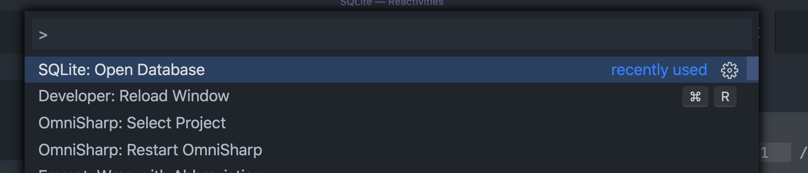
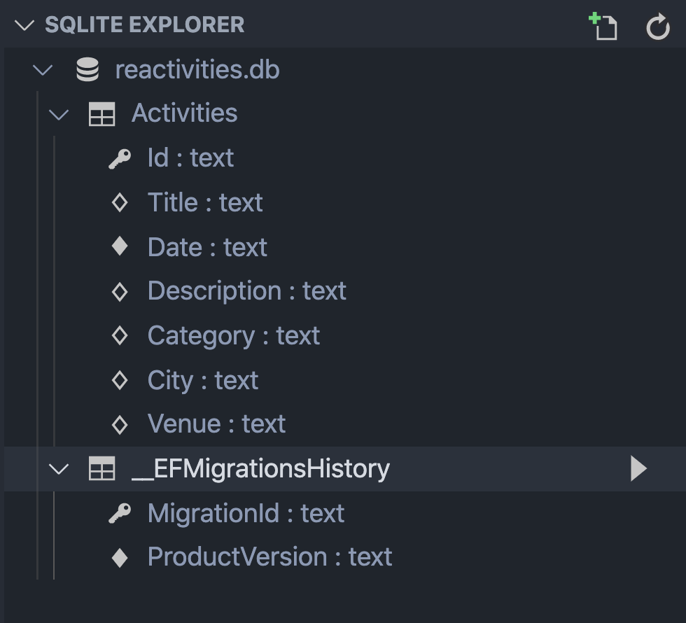
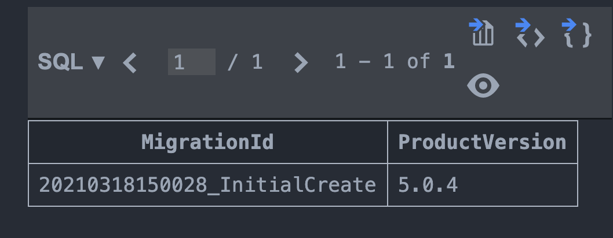
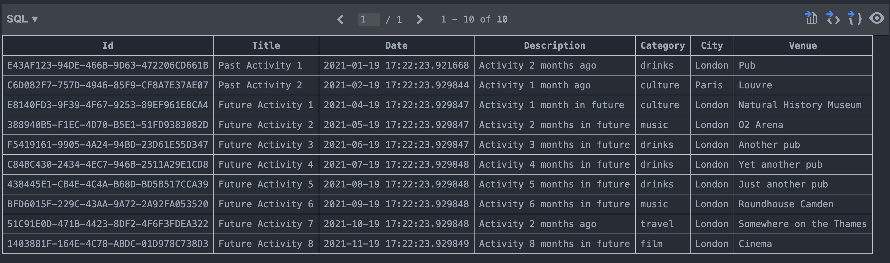

# 05 Créer une base de données

Pour avoir des infos sur la commande :

```bash
dotnet ef database -h
```

```bash
# ...
Commands:
  drop    Drops the database.
  update  Updates the database to a specified migration.
```

On a `drop` et `update` comme commandes.

On voudrait que le code regarde s'il y a déjà une base de données, sinon la créer.

On va modifier `Program.cs`

```csharp
public static void Main(string[] args)
{
  var host = CreateHostBuilder(args).Build();
  
  using var scope = host.Services.CreateScope();
  
  var services = scope.ServiceProvider;
  
  try
  {
    var context = services.GetRequiredService<DataContext>();
    context.Database.Migrate();
  }
  catch (Exception ex)
  {
    var logger = services.GetRequiredService<ILogger<Program>>();
    logger.LogError(ex, "An error occured during migration");
  }
  
  host.Run();
}
```

Cela crée un fichier `reactivities.db` à la racine du projet `API`.

### Ouvrir Sqlite

Dans la palette de commande :



Ensuite dans l'explorateur de fichier de `VSCode` on a :



`_EFMigrationsHistory` est une table avec l'historique des migrations :




## Créer des données

Dans `Persistence` on va créer une classe `Seed.cs`.

```csharp
using System;
using System.Collections.Generic;
using System.Linq;
using System.Threading.Tasks;
using Domain;

namespace Persistence
{
    public class Seed
    {
        public static async Task SeedData(DataContext context)
        {
            if (context.Activities.Any()) return;
            
            var activities = new List<Activity>
            {
                new Activity
                {
                    Title = "Past Activity 1",
                    Date = DateTime.Now.AddMonths(-2),
                    Description = "Activity 2 months ago",
                    Category = "drinks",
                    City = "London",
                    Venue = "Pub",
                },
                // ...
            };

            await context.Activities.AddRangeAsync(activities);
            await context.SaveChangesAsync();
        }
    }
}
```

### `Any()` 

`if (context.Activities.Any()) return;` regarde s'il y a des enregistrements dans la table `activities` en base de données.

### `AddMonths(<int>)`

`Date = DateTime.Now.AddMonths(-2)` permet d'ajouter des dates dans le passé ou dans le futur.

Dans `Program.cs` on va appeler cette méthode.

```csharp
public static async Task Main(string[] args)
{
  var host = CreateHostBuilder(args).Build();

  using var scope = host.Services.CreateScope();

  var services = scope.ServiceProvider;

  try
  {
    var context = services.GetRequiredService<DataContext>();
    await context.Database.MigrateAsync();
    await Seed.SeedData(context);
  }
  catch (Exception ex)
  {
    var logger = services.GetRequiredService<ILogger<Program>>();
    logger.LogError(ex, "An error occured during migration");
  }

  await host.RunAsync();
}
```

Comme `Seed.SeedData` est `async` on doit modifier un peu le `Main`.

Ce code n'a pas d'obligation à être asynchrone, mais cela ne pose pas non plus de problème comme de toutes façons, il renvoie une `async Task`.

Après un `dotnet run --project API/` on obtient :

