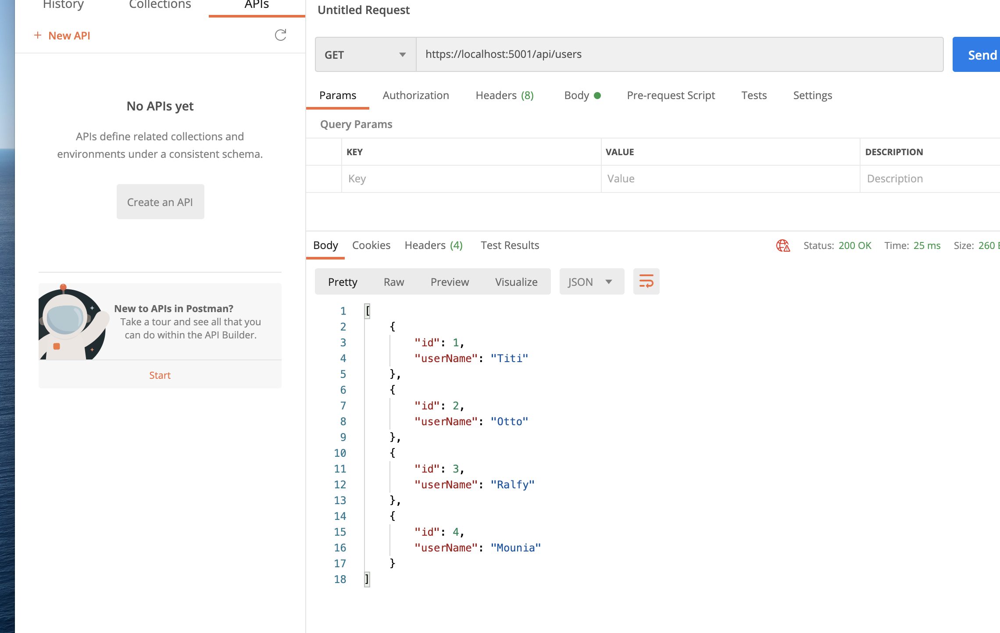
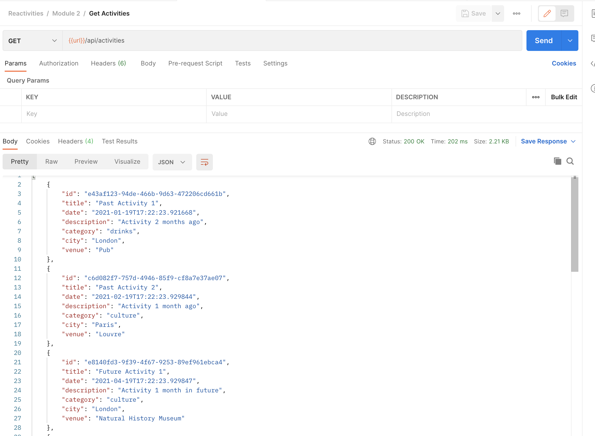
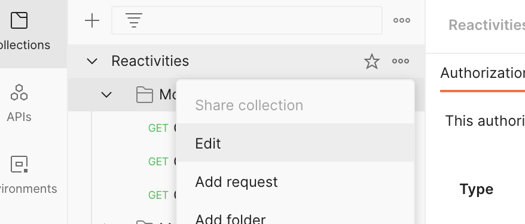
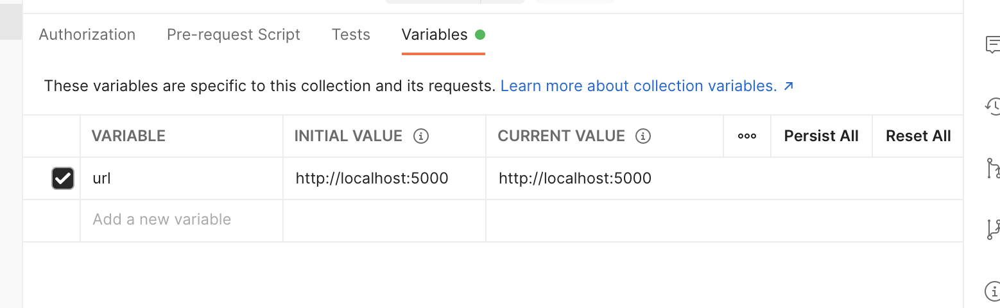

# 05. Controller

## Anatomie (legacy)

```csharp
using System.Collections.Generic;
using API.Data;
using API.Entities;
using Microsoft.AspNetCore.Mvc;
using System.Linq;

namespace API.Controllers
{
    [ApiController]
    [Route("api/[controller]")]
    public class UsersController : ControllerBase
    {
        private readonly DataContext _context;
        public UsersController(DataContext context)
        {
            _context = context;
        }

        // api/users
        [HttpGet]
        public ActionResult<IEnumerable<AppUser>> GetUsers() => _context.Users.ToList();

        // api/users/3
        [HttpGet("{id}")]
        public ActionResult<AppUser> GetUser(int id) => _context.Users.Find(id);

    }
}
```

Un contrôleur hérite de `ControllerBase` du `namespace` `Microsoft.AspNetCore.Mvc`.

On utilise un décorateur `[ApiController]` pour lui donner les pouvoirs d'un contrôleur d'`API`.

`[Route("api/[controller]")]` défini la route où joindre ce contrôleur.

`[controller]` le nom en minuscule de la classe sans le suffixe `Controller` ici : `users`.

`UsersController` => pluriel de `Users` car on veut une route `/users`.

On récupère le `DataContext` par injection de dépendances dans le constructeur.

`[HttpGet]` attend une requête `GET`.

`[HttpGet({param})]` attend une requête `Get` avec un paramètre `param` dans l'`URL`.

Une méthode décorée avec `[HttpMethod]` renvoie un `ActionResult<Type>`.

`Users` est un `DbSet<AppUsers>` défini dans `Data/DataContext.cs`.

`Tolist` et `Find` sont des méthodes de `System.Linq`.



`.net 5` renvoie du `json` en `camelCase` et non en `PascalCase` pour respecter les conventions en `json` `javascript`.


## créer un `controller`

Contrôleur de base : `BaseApiController.cs`

```csharp
namespace API.Controllers
{
  [ApiController]
  [Route("api/[controller]")]  // /api/activities/{id} par exemple
  public class BaseApiController : ControllerBase
  {
    
  }
}

```

Contrôleur pour `Activities` : `ActivitiesController.cs`

```csharp
namespace API.Controllers
{
  puclic class ActivitiesController : BaseApiController
  {
    private readonly DataContext _context;
    
    public ActivitiesController(DataContext context)
    {
      _context = context;
    }
    
    [HttpGet]
    public async Task<ActionResult<List<Activity>>> GetActivities()
    {
      return await _context.Activities.ToListAsync();
    }
    
    [HttpGet("{id}")]
    public async Task<ActionResult<Activity>> GetActivity(Guid id)
    {
      return await _context.Activities.FindAsync(id);
    }
  }
}
```


## Test avec `Postman`



`{{url}}` est une variable définie dans `Postman` ici :





