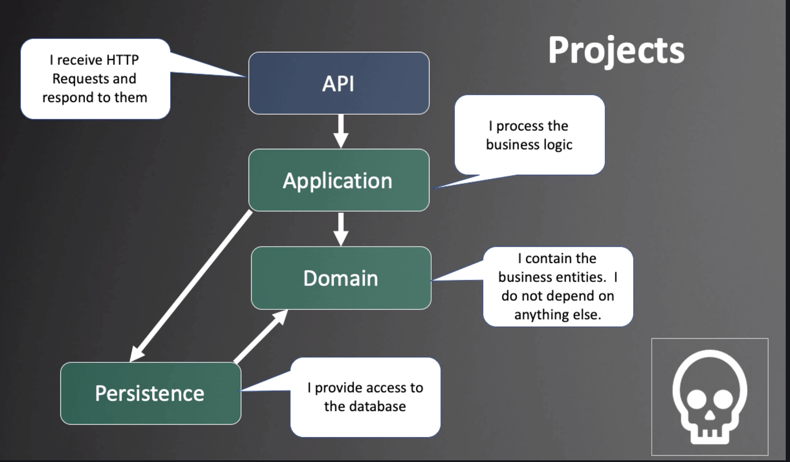
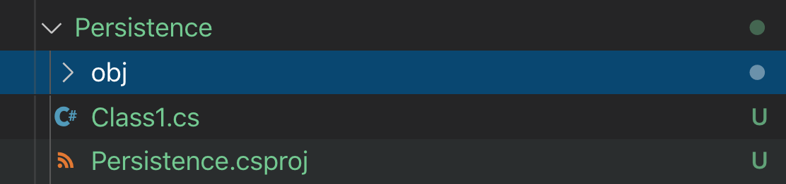

# Walking skeleton partie 1

## Architecture générale



On divise les responsabilité pour organiser son application.

`API` reçoit et renvoie les requête `HTTP`.

`Application` Exécute la logique de l'application (logique business).

`Domain` contient les schémas de données.

`Persistence` gère l'accès à la base de données.

## .net core

```bash
dotnet --version # donne la version en usage

dotnet --info # donne toutes les versions installées

dotnet -h # donne toutes les commandes dispo

dotnet new -h # affiche le manuel de dotnet new
```


## Créer un fichier `sln` Solution File

C'est un **conteneur** pour les projets.

Dans un dossier `Reactivities` faire :

```bash
kar : Reactivities $ dotnet new sln
The template "Solution File" was created successfully.
kar : Reactivities $ ls
Reactivities.sln
```

Par défaut, le fichier prend le nom du dossier qui le contient.

## Créer les `classlib` Domain, Persistence et Application

```bash
dotnet new classlib -n Domain
dotnet new classlib -n Persistence
dotnet new classlib -n Application
```

`-n` pour name



Voici le contenu d'une classe librairie

`obj` va servir pour le `build`.

`Class1.cs` est une classe exemple.

`*.csproj` est un fichier de projet.

## Créer API

C'est un projet `webapi` de `dotnet` :

```bash
dotnet new webapi -n API
```

## Relier les projets entre eux

C'est dans la Solution File que les projets sont relié.

On le fait en ligne de commande :

```bash
dotnet sln -h

Commands:
  add <PROJECT_PATH>      Add one or more projects to a solution file.
  list                    List all projects in a solution file.
  remove <PROJECT_PATH>   Remove one or more projects from a solution file.
```

On va utiliser `add`

> **Tips** : Pour mettre tous les projets dans le fichier de solution on fait :
>
> ```bash
> 🦄 Reactivities dotnet sln add **/
> 
> Project `API/API.csproj` added to the solution.
> Project `Application/Application.csproj` added to the solution.
> Project `Domain/Domain.csproj` added to the solution.
> Project `Persistence/Persistence.csproj` added to the solution.
> ```
>
> 

```bash
dotnet sln add Domain/

Project `Domain/Domain.csproj` added to the solution.

kar : Reactivities $ dotnet sln add Application/
Project `Application/Application.csproj` added to the solution.
```

La commande cherche automatiquement un fichier `.csproj` dans le dossier spécifié

cela ajoute une entrée au fichier `Reactivities.sln`

```
...
Project("{FAE04EC0-301F-11D3-BF4B-00C04F79EFBC}") = "Application", "Application\Application.csproj", "{D9CAB6E0-F7EC-47E2-AC5F-289ADBA84F58}"
EndProject
...
```

```bash
kar : Reactivities $ dotnet sln add Persistence/
Project `Persistence/Persistence.csproj` added to the solution.

kar : Reactivities $ dotnet sln add API/
Project `API/API.csproj` added to the solution.

kar : Reactivities $ dotnet sln list
Project(s)
----------
Domain/Domain.csproj
Application/Application.csproj
Persistence/Persistence.csproj
API/API.csproj
```

`dotnet sln list`  donne la liste des projets liés.

## Ajouter des références

### `Application` doit avoir la référence de `Domain` et de `Persistence` .

```bash
kar : Reactivities $ cd Application/

kar : Application $ dotnet add reference ../Domain/
Reference `..\Domain\Domain.csproj` added to the project.

kar : Application $ dotnet add reference ../Persistence/
Reference `..\Persistence\Persistence.csproj` added to the project.

```

> On peut rester dans le dossier `root` et ajouter plusieurs références à la fois
>
> `dotnet add <Project> reference <Project_path_1> <Project_path_2> ...`
>
> ```bash
> 🦄 Reactivities dotnet add Application/ reference Domain/ Persistence/
> 
> Reference `..\Domain\Domain.csproj` added to the project.
> Reference `..\Persistence\Persistence.csproj` added to the project.
> ```
>
> 

`dotnet add reference <PATH>`

Les références sont incluses dans `Application.csproj` :

### Avant

```xml
<Project Sdk="Microsoft.NET.Sdk">

  <PropertyGroup>
    <TargetFramework>netstandard2.0</TargetFramework>
  </PropertyGroup>

</Project>
```

### Après

```xml
<Project Sdk="Microsoft.NET.Sdk">

  <ItemGroup>
    <ProjectReference Include="..\Domain\Domain.csproj" />
    <ProjectReference Include="..\Persistence\Persistence.csproj" />
  </ItemGroup>

  <PropertyGroup>
    <TargetFramework>netstandard2.0</TargetFramework>
  </PropertyGroup>

</Project>
```


### `API` doit avoir une référence vers `Application`

Par transitivité `API` a aussi une référence vers `Domain` et `Persistence`

```bash
cd ../API
dotnet add reference ../Application/
Reference `..\Application\Application.csproj` added to the project.
```

### `Persistence`  doit avoir une référence vers `Domain`

```bash
cd ../Persitence
dotnet add reference ../Domain/
Reference `..\Domain\Domain.csproj` added to the project.
```

? Pourquoi `Application` ne reçoit pas par transitivité une référence vers `Domain` ? à tester.

> J'ai retiré la référence vers `Domain` pour tester.