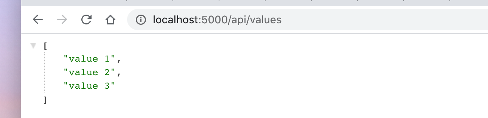
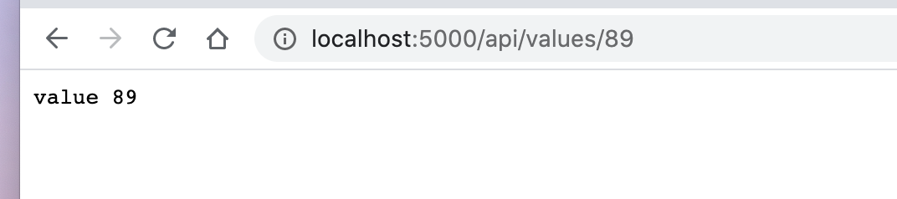

# 04. `Controller`

On va créer dans `API` un `ValuesController.cs` :

```csharp
using System.Collections.Generic;
using Microsoft.AspNetCore.Mvc;

namespace API.Controllers
{
    [Route("api/[controller]")]
    [ApiController]
    public class ValuesController : ControllerBase
    {
        // GET api/values
        [HttpGet]
        public ActionResult<IEnumerable<string>> Get()
        {
            return new string[] { "value 1", "value 2", "value 3" };
        }

        // GET api/values/5
        [HttpGet("{id}")]
        public ActionResult<string> Get(int id)
        {
            return $"value {id}";
        }

        // POST api/values
        [HttpPost]
        public void Post([FromBody] string value)
        {

        }
    }
}
```

`[Route("api/[controller]")]` Défini la route pour accéder à ce contrôleur.

`[controller]` est un placeholder qui prendra la partie préfixe en minuscule du nom du contrôleur ici `values`.

`[HttpGet]` spécifie la méthode `HTTP`

`[HttpGet("{id}")]` ajoute un paramètre à la route, on le récupère comme argument de la méthode `GET(type param)`.

## Lancer `API`

```bash
🦄 Reactivities dotnet run -p API/
```

`-p` cible un projet, plutôt que d'aller dans son repertoire.




