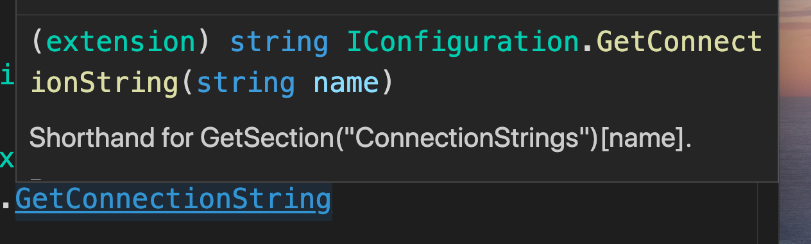

# 05. `Entity framework` : DB context

## Création d'une `entity`

Dans `API/`

`Value.cs`

```csharp
using System;

namespace Domain
{
    public class Value
    {
        // convention permettant de créer une clé primaire
        // auto incrémentée dans la BD
        public int Id { get; set; }
        public string Name { get; set; }
    }
}

```

`Id` convention permettant de créer une clé primaire auto- implémentée en Base de Données.

> ### Propriété auto-implémentée ou champs `public`
>
> Une propriété auto-implémentée réagira différemment avec la reflection.
>
> Elle pourra être `binder` (cf `databinding` en `c#`).
>
> Elle pourra être ré-implémentée.

## `DbContext`

On va maintenant créer un `context` avec `entity framework`.

### Ajouter `entity framework core`

```bash
🦄 Reactivities dotnet add Persistence/ package Microsoft.EntityFrameworkCore.Sqlite --version 3.1.9
```

dans `Persistence/`

`DataContext.cs`

```csharp
using System;
using Domain;
using Microsoft.EntityFrameworkCore;

namespace Persistence
{
    public class DataContext : DbContext
    {
        public DataContext(DbContextOptions options) : base(options)
        {

        }

        public DbSet<Value> Values { get; set; }
    }
}
```

## transformation en service : injection de dépendances

On veut rendre `DataContext` accessible partout dans l'application, on va le tranformer en `service`.

Dans `Application/Startup.cs`

```csharp
// This method gets called by the runtime. Use this method to add services to the container.
public void ConfigureServices(IServiceCollection services)
{
    services.AddDbContext<DataContext>(options =>
                                       options.UseSqlite(Configuration.GetConnectionString("DefaultConnection")));
    services.AddControllers();
}
```

C'est le conteneur d'injection de dépendances.



`UseSqlite` prends un `connection string` en option, on va utiliser notre fichier de **configuration** plutôt que de le **_hard-coder_**.

### renseigner le `connection string` dans `appsettings.json` :

```json
{
  "ConnectionStrings": {
    "DefaultConnection": "Data source=entities.db"
  },
  "Logging": { // ...
```
