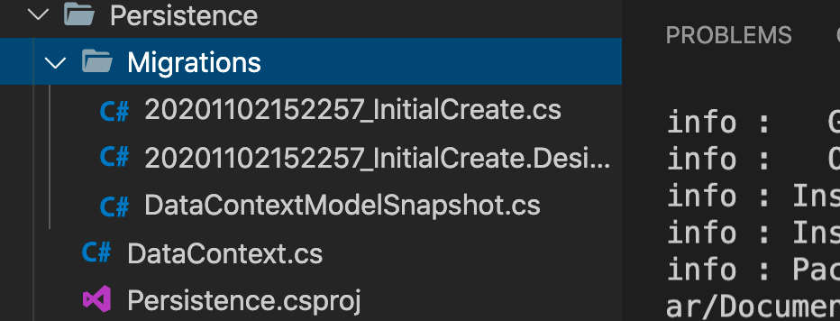

# 06. Migration

Élaborer la base de données.

## Installation des outils en ligne de commande `CLI`

```bash
🦄 Reactivities dotnet tool install --global dotnet-ef

You can invoke the tool using the following command: dotnet-ef
Tool 'dotnet-ef' (version '3.1.9') was successfully installed.
```

## Création de la migration

```bash
🦄 Reactivities dotnet ef migrations add InitialCreate -p Persistence/ -s API/

Build started...
Build succeeded.
Your startup project 'API' doesn't reference Microsoft.EntityFrameworkCore.Design. This package is required for the Entity Framework Core Tools to work. Ensure your startup project is correct, install the package, and try again.
```

`-p` le projet.

`-s` startup le projet de départ contenant la configuration de connexion.

Il faut ajouter un `Nuget Package` : `Microsoft.EntityFrameworkCore.Design`

```bash
dotnet add API/ package Microsoft.EntityFrameworkCore.Design --version 3.1.9
```

```bash
🦄 Reactivities dotnet ef migrations add InitialCreate -p Persistence/ -s API/

Build started...
Build succeeded.
Done. To undo this action, use 'ef migrations remove
```

On obtient un répertoire `Migrations` dans le projet `Persistence` :



On obtient deux fichiers commençant par un `timestamp` et un fichier `snapshot`.

On va s'intéresser à `20201102152257_InitialCreate.cs`

```csharp
using Microsoft.EntityFrameworkCore.Migrations;

namespace Persistence.Migrations
{
    public partial class InitialCreate : Migration
    {
        protected override void Up(MigrationBuilder migrationBuilder)
        {
            migrationBuilder.CreateTable(
                name: "Values",
                columns: table => new
                {
                    Id = table.Column<int>(nullable: false)
                        .Annotation("Sqlite:Autoincrement", true),
                    Name = table.Column<string>(nullable: true)
                },
                constraints: table =>
                {
                    table.PrimaryKey("PK_Values", x => x.Id);
                });
        }

        protected override void Down(MigrationBuilder migrationBuilder)
        {
            migrationBuilder.DropTable(
                name: "Values");
        }
    }
}
```

Deux méthode une `Up` pour créer la table et l'autre `Down` pour la retirer (`drop table`).

`EF` fonctionne avec des conventions et lorsqu'un champs s'appelle `Id` de type `int`, il est auto-incrémenté et devient la clé primaire.
