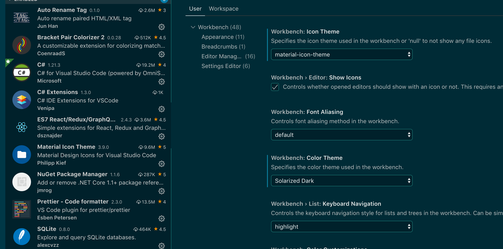
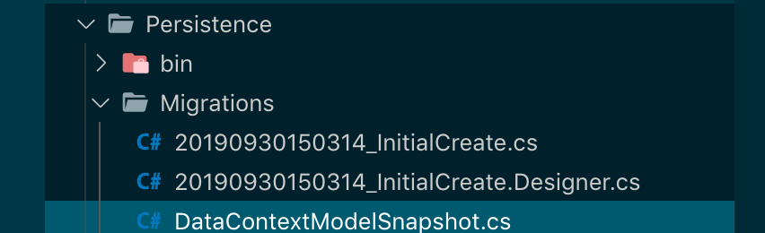
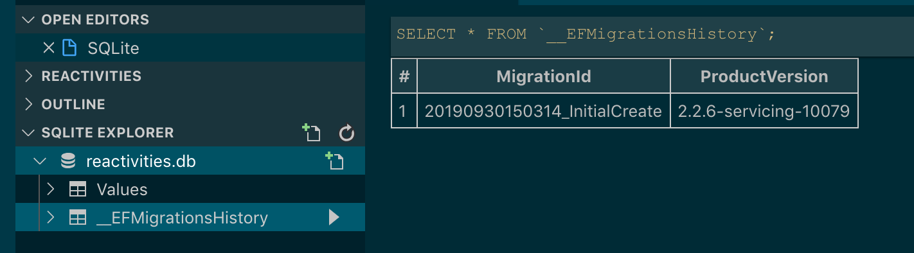
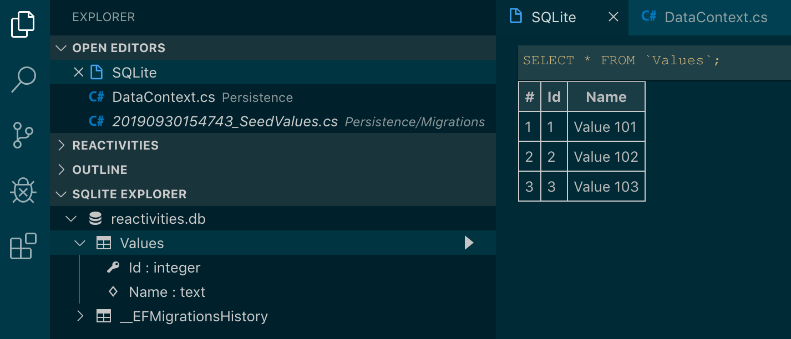

# 02 bis skeleton walking api

extension `vscode` :



Pour activer les icône material il faut dans `settings` régler `workbench.iconTheme`.

Ou bien dans code/Preferences/File Icon Theme

## Supprimer `HTTPS`

Pour des raisons de commodités, On désactive `HTTPS` :

dans `API/Startup.cs`  :

```csharp
    if (env.IsDevelopment())
            {
                app.UseDeveloperExceptionPage();
            }
            else
            {
                // The default HSTS value is 30 days. You may want to change this for production scenarios, see https://aka.ms/aspnetcore-hsts.
              // on commente ci-dessous  
              // app.UseHsts();
            }
						// on commente ci-dessous
            // app.UseHttpsRedirection();
            app.UseMvc();
        }
```

Dans `API/Properties/launchSetting.json`

```json
"API": {
      "commandName": "Project",
      "launchBrowser": true,
      "launchUrl": "api/values",
      "applicationUrl": "http://localhost:5000", // ici au lieu de
  	//"applicationUrl": "https://localhost:50001;http://localhost:5000",
      "environmentVariables": {
        "ASPNETCORE_ENVIRONMENT": "Development"
      }
```


## Lancer l'application `dotnet run`

Pour lancer l'application il faut être dans le dossier parent  de API :

```bash
dotnet run -p API/
```

`-p` : project

## Créer une entité de Domain

`Domain/Value.cs`

```csharp
namespace Domain
{
    public class Value
    {
        public int Id { get; set; }
        public string Name { get; set; }
    }
}
```

## Créer DbContext et le service

Dans Persistence :

`Persistence/DataContext.cs` 

Avec `nuget package manager` installer `Microsoft.EntityFrameworkCore` et `Microsoft.EntityFrameworkCore.Sqlite` .

Il faut faire attention à la version du package, elle doit être identique au runtime, puis faire un restore.

### ! tips `cmd` + `shift` + `.`  => équivalent à la petite lampe : propose des fix aux problèmes

```csharp
using System;
using Domain;
using Microsoft.EntityFrameworkCore;

namespace Persistence
{
    public class DataContext : DbContext
    {
        public DataContext(DbContextOptions options) : base(options) { }
        
        public DbSet<Value> Values { get; set; }
    }
}
```

Maintenant on va "configurer" le service :

`API/Startup.cs` :

```csharp
 public void ConfigureServices(IServiceCollection services)
{
   services.AddDbContext<DataContext>(opt => {
			opt.UseSqlite(Configuration.GetConnectionString("DefaultConnection"));
   });
   
   services.AddMvc().SetCompatibilityVersion(CompatibilityVersion.Version_2_2);
}
```

On va définir `DefaultConnection` dans le fichier de configuration `appsettings.json`

```json
{
  // ici 
  "connectionStrings": {
    "DefaultConnection": "Data source=reactivities.db"
  },
  "Logging": {
    "LogLevel": {
      "Default": "Warning"
    }
  },
  "AllowedHosts": "*"
}
```

## Créer une migration

Il faut veiller à ce que le serveur d'API soit éteint

```bash
dotnet ef migrations add InitialCreate -p Persistence/ -s API/
```



Cela a créer trois fichier pour gérer la migration.

Dans `***_initialCreate.cs`  on trouve une méthode pour créer la base :

```csharp
protected override void Up(MigrationBuilder migrationBuilder)
{
  migrationBuilder.CreateTable(
    name: "Values",
    columns: table => new
    {
      Id = table.Column<int>(nullable: false)
        .Annotation("Sqlite:Autoincrement", true),
      Name = table.Column<string>(nullable: true)
    },
    constraints: table =>
    {
      table.PrimaryKey("PK_Values", x => x.Id);
    });
}
```

## Créer la table

On peut le faire avec les commandes CLI `dotnet`.

```bash
kms: Reactivities $ dotnet ef database -h

Commands:
  drop    Drops the database.
  update  Updates the database to a specified migration.
```

On va le faire dans le code, dans la méthode `Main` du fichier `API/Program.cs`

```csharp
public static void Main(string[] args)
{
  var host = CreateWebHostBuilder(args).Build();

  using(var scope = host.Services.CreateScope())
  {
    var services = scope.ServiceProvider;

    try
    {
      var context = services.GetRequiredService<DataContext>();
      context.Database.Migrate();
    }
    catch(Exception ex)
    {
      var logger = services.GetRequiredService<ILogger<Program>>();
      logger.LogError(ex, "An error occured during migration");
    }
  }

  host.Run();
}
```

Maintenant on lance le code (dans le repertoire approprié avec l'option `watch`)

```bash
cd API/
dotnet watch run
```

On voit dans la console la création de la table :

```bash
...
Executed DbCommand (0ms) [Parameters=[], CommandType='Text', CommandTimeout='30']
      CREATE TABLE "Values" (
          "Id" INTEGER NOT NULL CONSTRAINT "PK_Values" PRIMARY KEY AUTOINCREMENT,
          "Name" TEXT NULL
      );
...
```

On peut voire les tables créée grace à l'extension `vscode sqlite`.



Click droit `show table`

## Créer des valeurs `SeedValues`

On veut créer des valeurs dans notre table `Value`, pour ça on va dans le fichier `Persistence/DataContext.cs` :

```csharp
namespace Persistence
{
    public class DataContext : DbContext
    {
        public DataContext(DbContextOptions options) : base(options) { }
        
        public DbSet<Value> Values { get; set; }

        // protected himself and descendant
        protected override void OnModelCreating(ModelBuilder builder)
        {
            builder.Entity<Value>()
                .HasData(
                    new Value {Id = 1, Name = "Value 101"},
                    new Value {Id = 2, Name = "Value 102"},
                    new Value {Id = 3, Name = "Value 103"}
                );
        }
    }
}

```

`protected`  : sa classe et ses descendant.

Maintenant on va utiliser la ligne de commande :

```bash
cd ..
dotnet ef migrations add SeedValues -p Persistence/ -s API/
```

`-p`  : project

`-s` : startup project

On obtient une nouvelle classe `Persistence/Migrations/SeedValues` :

```csharp
using Microsoft.EntityFrameworkCore.Migrations;

namespace Persistence.Migrations
{
    public partial class SeedValues : Migration
    {
        protected override void Up(MigrationBuilder migrationBuilder)
        {
            migrationBuilder.InsertData(
                table: "Values",
                columns: new[] { "Id", "Name" },
                values: new object[] { 1, "Value 101" });

            migrationBuilder.InsertData(
                table: "Values",
                columns: new[] { "Id", "Name" },
                values: new object[] { 2, "Value 102" });

            migrationBuilder.InsertData(
                table: "Values",
                columns: new[] { "Id", "Name" },
                values: new object[] { 3, "Value 103" });
        }

        protected override void Down(MigrationBuilder migrationBuilder)
        {
            migrationBuilder.DeleteData(
                table: "Values",
                keyColumn: "Id",
                keyValue: 1);

            migrationBuilder.DeleteData(
                table: "Values",
                keyColumn: "Id",
                keyValue: 2);

            migrationBuilder.DeleteData(
                table: "Values",
                keyColumn: "Id",
                keyValue: 3);
        }
    }
}
```

On relance l'application

```bash
cd API/
dotnet watch run
```

On peut voire avec `sqlite`  :



