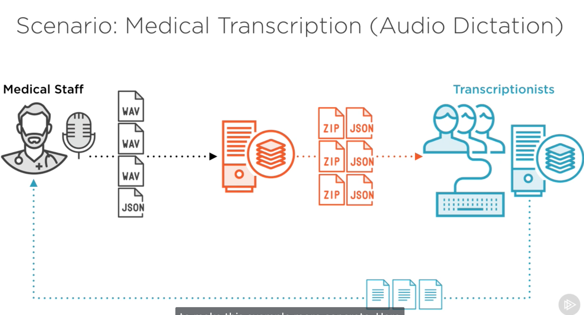
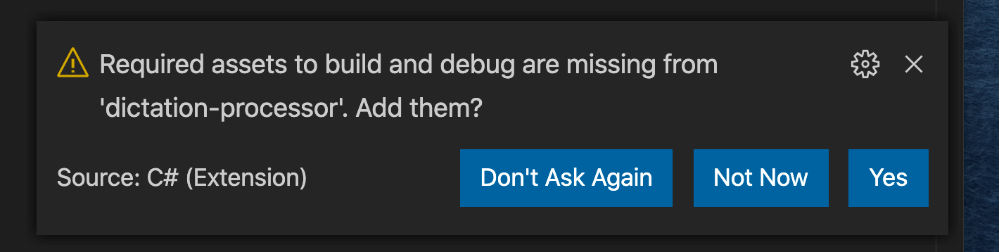
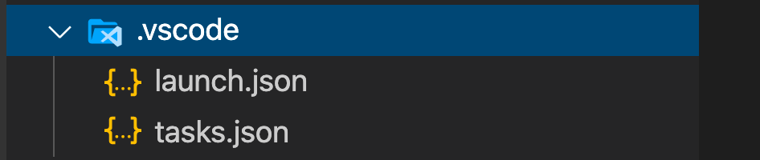
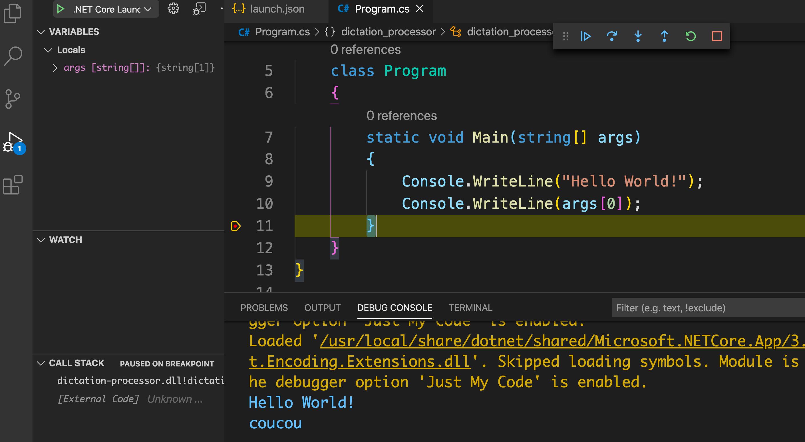
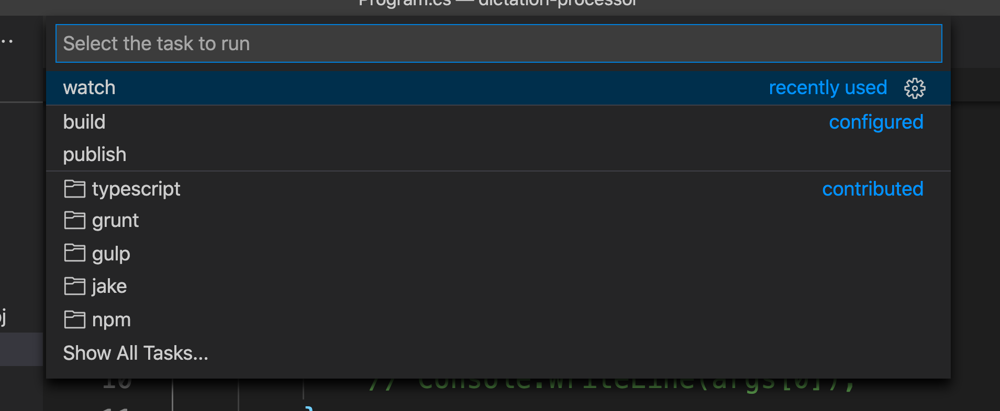

# 02 `VSCode` : Assets



```bash
🦄 dotnet-mac dotnet new console -o dictation-processor
The template "Console Application" was created successfully.

Processing post-creation actions...
Running 'dotnet restore' on dictation-processor/dictation-processor.csproj...
  Determining projects to restore...
  Restored /Users/kar/Documents/programmation/dotnet/dotnet-mac/dictation-processor/dictation-processor.csproj (in 126 ms).

Restore succeeded.
```

On voit que le `restore` est lancé automatiquement.

## `Assets`

`VSCode` crée deux fichiers.

### `launch.json`

### est utile pour le debug :





On peut ajouter des arguments dans `launch.json`

```json
{
  // Use IntelliSense to find out which attributes exist for C# debugging
  // Use hover for the description of the existing attributes
  // For further information visit https://github.com/OmniSharp/omnisharp-vscode/blob/master/debugger-launchjson.md
  "version": "0.2.0",
  "configurations": [
    {
      "name": ".NET Core Launch (console)",
      "type": "coreclr",
      "request": "launch",
      "preLaunchTask": "build",
      // If you have changed target frameworks, make sure to update the program path.
      "program": "${workspaceFolder}/bin/Debug/netcoreapp3.1/dictation-processor.dll",
      "args": ["coucou"], // ici on ajoute des arguments
      "cwd": "${workspaceFolder}",
      // For more information about the 'console' field, see https://aka.ms/VSCode-CS-LaunchJson-Console
      "console": "internalConsole",
      "stopAtEntry": false
    },
    {
      "name": ".NET Core Attach",
      "type": "coreclr",
      "request": "attach",
      "processId": "${command:pickProcess}"
    }
  ]
}
```



### `tasks.json`

### Configure des tâches automatisées.

On y a accès avec la palette de commandes :

```
>run tasks
```


