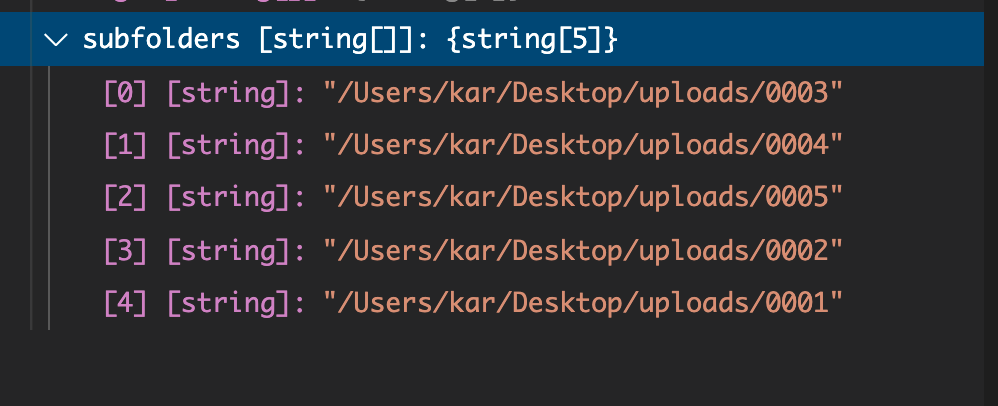
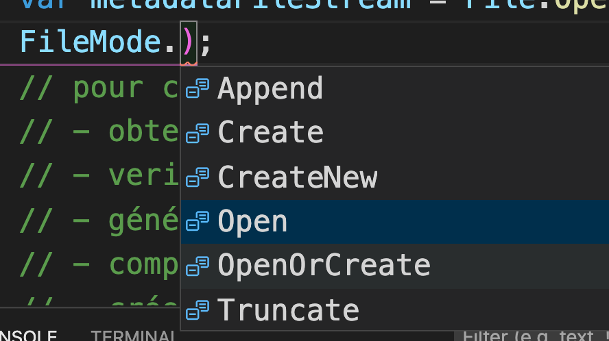

# 05 Fichier et répertoire

```csharp
using System;
using System.IO;

namespace dictation_processor
{
    class Program
    {
        static void Main(string[] args)
        {

            var subfolders = Directory.GetDirectories("/Users/kar/Desktop/uploads");
            // iterer à travers le sous-dossier uploads
            foreach(var subfolder in subfolders)
            {
                // obtenir le fichier des meta-données
                var metadataFilePath = Path.Combine(subfolder,"metadata.json");
                System.Console.WriteLine(metadataFilePath);
                // extraire les meta-données
                var metadataFileStream = File.Open(metadataFilePath, FileMode.Open);
                // ...
            }
        }
    }
}
```

## `Directory.GetDirectories(Path)`

Retourne un tableau de chaine de caractère avec le chemin vers les répertoires internes :



## `Path.combine(params string[])`

Prends une liste d'arguments pour construire un chemin.

## `File.Open(path, Mode)`

Ouvre un fichier dans un mode particulier sous la forme d'un stream.


