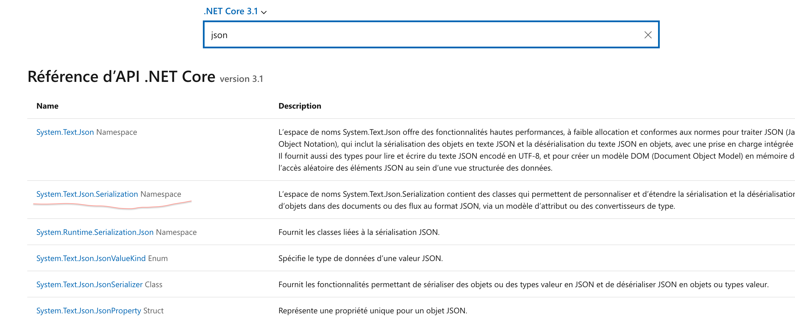

# 06 `json` sérialisation

## Documentation

https://docs.microsoft.com/fr-fr/dotnet/api/?view=netcore-3.1



https://michaelscodingspot.com/the-battle-of-c-to-json-serializers-in-net-core-3/

> `Newtonsoft.Json` (également connu sous le nom de `Json.NET`) - Le sérialiseur standard actuel de l'industrie. A été intégré à `ASP.NET` même s'il s'agissait d'une tierce partie. #Le premier paquet `NuGet` de tous les temps. Bibliothèque primée (probablement, je ne sais pas).
>
> `System.Text.Json` - Le tout nouveau sérialiseur de Microsoft. Soi-disant plus rapide et meilleur que `Newtonsoft.Json`. Intégré par défaut avec les nouveaux projets `ASP.NET Core 3`. Il fait partie du framework `.NET` lui-même, il n'y a donc pas besoin de dépendances `NuGet` (et plus de conflits de versions non plus).
>
> `DataContractJsonSerializer` - Un ancien sérialiseur développé par Microsoft qui était intégré dans les versions `ASP.NET` précédentes jusqu'à ce que `Newtonsoft.Json` le remplace.
>
> Traduit avec www.DeepL.com/Translator (version gratuite)

```csharp
static List<Metadata> GetMetadata(string filePath)
{
    var metadataFileStream = File.Open(filePath, FileMode.Open);
    var settings = new DataContractJsonSerializerSettings
    {
        DateTimeFormat = new DateTimeFormat("yyyy-MM-dd'T'HH:mm:ssZ")
    };
    var serializer = new DataContractJsonSerializer(typeof(List<Metadata>), settings);
    return (List<Metadata>)serializer.ReadObject(metadataFileStream);
}
```

## Création d'un fichier `json`

```cs
static void SaveSingleMetadata(Metadata metadata, string metadataFilePath)
{
    Console.WriteLine($"Creating {metadataFilePath}");

    var metadataFileStream = File.Open(metadataFilePath, FileMode.Create);
    var settings = new DataContractJsonSerializerSettings
    {
        DateTimeFormat = new DateTimeFormat("yyyy-MM-dd'T'HH:mm:ssZ")
    };
    var serializer = new DataContractJsonSerializer(typeof(Metadata), settings);
    serializer.WriteObject(metadataFileStream, metadata);
}
```

On ouvre un stream en création : `File.Open(metadataFilePath, FileMode.Create)`

On ajoute le réglage pour la date.

Cette fois on sérialise en écriture `serializer.WriteObject(createStream, objectData)`.

## Le `main`

```csharp
static void Main(string[] args)
{

    var subfolders = Directory.GetDirectories("/Users/kar/Desktop/uploads");
    // iterer à travers le sous-dossier uploads
    foreach(var subfolder in subfolders)
    {

        // obtenir le fichier des meta-données
        var metadataFilePath = Path.Combine(subfolder,"metadata.json");
        System.Console.WriteLine(metadataFilePath);
        // extraire les meta-données
        var metadataCollection = GetMetadata(metadataFilePath);
        // pour chaque fichier audio
        foreach(var metadata in metadataCollection)
        {
            // - obtenir le chemin absolu
            var audioFilePath = Path.Combine(subfolder, metadata.File.FileName);
            // - verifier la checksum
            var md5Checksum = GetChecksum(audioFilePath);
            if(md5Checksum.Replace("-", "").ToLower() != metadata.File.Md5Checksum)
            {
                throw new Exception("Checksum not verified! File corrupted ?");
            }
            // - générer un identifiant unique
            var uniqueId = Guid.NewGuid();
            metadata.File.FileName = uniqueId + ".WAV";
            var newPath = Path.Combine("/Users/kar/Desktop/ready_for_transcription", metadata.File.FileName);
            // - compresser le fichier
            CreateCompressedFile(audioFilePath, newPath);
            // - créer un fichier de méta-données par fichier audio
            SaveSingleMetadata(metadata, newPath + ".json");
        }
    }
}
```
