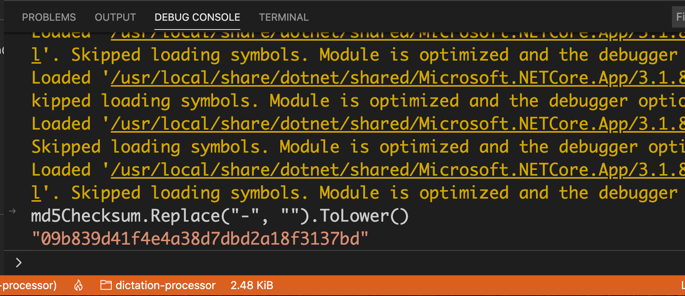

# 06 `MD5`

On va créer une méthode pour calculer le `MD5Checksum` du fichier.

```csharp
using System.Security.Cryptography;

static string GetChecksum(string filePath)
{
    var fileStream = File.Open(filePath, FileMode.Open);
    var md5 = MD5.Create();
    var md5Bytes = md5.ComputeHash(fileStream);
    fileStream.Dispose();
    return BitConverter.ToString(md5Bytes);
}
```

On ouvre un `stream` en lecture avec `File.Open(filePath, FileMode.Open)`.

Le système d'exploitation ajoute un `lock` au fichier jusqu'à la fin de l'exécution du programme,

comme on a encore besoin de travailler sur ce fichier on doit le libérer avec `fielStream.Dispose()`.

On utilise `MD5.Create()` pour avoir un objet `md5`, puis `md5.ComputeHash(fileStream)`.

Cela retourne un tableau de `byte`.

Pour le convertir en `string` on utilise `BitConverter.ToString(md5Bytes)`.

## Dans `Program.cs`

```csharp
static void Main(string[] args)
{
    var subfolders = Directory.GetDirectories("/Users/kar/Desktop/uploads");
    // iterer à travers le sous-dossier uploads
    foreach(var subfolder in subfolders)
    {
        // obtenir le fichier des meta-données
        var metadataFilePath = Path.Combine(subfolder,"metadata.json");
        // extraire les meta-données
        var metadataCollection = GetMetadata(metadataFilePath);
        // pour chaque fichier audio
        foreach(var metadata in metadataCollection)
        {
            // - obtenir le chemin absolu
            var audioFilePath = Path.Combine(subfolder, metadata.File.FileName);
            // - verifier la checksum
            var md5Checksum = GetChecksum(audioFilePath);
            if(md5Checksum != metadata.File.Md5Checksum)
            {
                throw new Exception("Checksum not verified! File corrupted ?");
            }
            // - générer un identifiant unique
            // - compresser le fichier
            // - créer un fichier de méta-données par fichier audio
        }
```

On va avoir une exception car le format n'est pas le même :

`md5Checksum` => `"09-B8-39-D4-1F-4E-4A-38-D7-DB-D2-A1-8F-31-37-BD"`

`metadata.File.Md5Checksum` => `"09b839d41f4e4a38d7dbd2a18f3137bd"`

Pour corriger le problème il suffit d'utiliser `Replace` et `ToLower` :

```csharp
if(md5Checksum.Replace("-", "").ToLower() != metadata.File.Md5Checksum)
{
    throw new Exception("Checksum not verified! File corrupted ?");
}
```

## Tester son code

On peut tester un morceau de code dans le bas de la console de `debug` :


